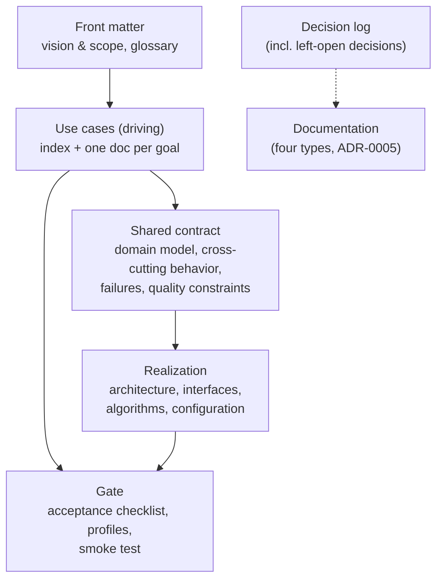

# The Spec Model: Use Cases and Supporting Structure

*Reshaped 2026-07-06 per the owner's review decisions, recorded as
[ADR-0001](../docs/adr/0001-use-cases-are-the-driving-artifact.md),
[ADR-0002](../docs/adr/0002-dry-is-a-guideline-linted-duplication-allowed.md),
[ADR-0003](../docs/adr/0003-open-choices-are-recorded-decisions-not-a-freedom-register.md),
[ADR-0004](../docs/adr/0004-support-both-rebuild-and-repair.md), and
[ADR-0005](../docs/adr/0005-documentation-deliverables-default-on-deferrable.md).
The original sixteen-artifact model (task-01, issue #22) is in git history; the gold-spec
decomposition evidence in [`profiles/`](profiles/) still stands (see §10).*

**Alignment note.** [`process.md`](process.md) is aligned with this version.
[`README.md`](README.md) §3 (the checklist) and [`hardening/`](hardening/) are **not
yet realigned** — that is review round two. Where they conflict with this document,
this document and the ADRs control.

Contents:

1. [What changed and why](#1-what-changed-and-why)
2. [The shape of a spec](#2-the-shape-of-a-spec)
3. [The use case document](#3-the-use-case-document)
4. [Maturity levels L0–L3](#4-maturity-levels-l0l3)
5. [Shared sections](#5-shared-sections)
6. [Consistency rules](#6-consistency-rules)
7. [IDs and tags (the machine layer)](#7-ids-and-tags-the-machine-layer)
8. [Compilation](#8-compilation)
9. [Documentation homes](#9-documentation-homes)
10. [What the gold-spec study still teaches](#10-what-the-gold-spec-study-still-teaches)
11. [Mapping from the old model](#11-mapping-from-the-old-model)

---

## 1. What changed and why

The earlier model factored a spec into sixteen normalized artifacts, each holding one
kind of information, joined by citation tags. That factoring optimized for machine
checking and against drift — and it made human review impractical: judging "is this
the right thing to build?" required joining information across many files by hand.
Humans are the ultimate arbiter and approver of these artifacts, so the review
surface is now first-class:

- **Use cases drive.** One authored document per user goal, in the traditional,
  human-reviewable shape. The owner reviews and approves use cases directly
  (ADR-0001).
- **The rigor is retained; the homes move.** Typed data, complete enumerations, total
  state machines, precedence rules, failure semantics, and mechanically checkable
  acceptance criteria all keep their structured forms. Information that belongs to
  one use case lives in that use case; information that spans use cases lives in a
  shared section, and linters keep the two consistent.
- **DRY is a guideline.** Load-bearing information may appear in more than one place
  when a deterministic check covers the duplication (ADR-0002). Duplication without a
  covering check is still a defect.
- **No freedom register.** An open choice is a defect until resolved. "The owner
  explicitly decides not to decide" is a legal resolution, recorded as a decision so
  later feedback traces back to it (ADR-0003).
- **Specs serve living implementations, not just one-shot builds.** The spec is the
  source of truth; implementations are repaired or rebuilt as a tactical, per-change
  choice (ADR-0004). One-shot buildability remains the completeness bar because it is
  exactly what makes small repairs safe.
- **Documentation has homes.** The four Diátaxis documentation types are supported
  first-class, default-on, explicitly deferrable per project (ADR-0005).

## 2. The shape of a spec

A spec is authored as separate files (the units of authorship, review, and checking)
and compiled into one distributable file for the implementer (§8).



| Piece | What it holds | Files |
|---|---|---|
| Front matter | Problem, goals, non-goals, boundaries, external dependencies, deliverables selection; term definitions and notation conventions | `shared/vision-scope.md`, `shared/glossary.md` |
| Use cases | The index (actors, goals, one line each) and one document per use case | `use-cases/index.md`, `use-cases/UC-NNN-slug.md` |
| Shared contract | Domain model; cross-cutting behavior (state machines, invariants, formulas); failure taxonomy; quality constraints | `shared/domain-model.md`, `shared/behavior.md`, `shared/failures.md`, `shared/quality.md` |
| Realization | Architecture sketch; interface surface; reference algorithms; configuration & defaults | `shared/architecture.md`, `shared/interfaces.md`, `shared/algorithms.md`, `shared/configuration.md` |
| Gate | Assembled acceptance checklist; conformance profiles (conditional); smoke test | `gate/checklist.md`, `gate/profiles.md`, `gate/smoke-test.md` |
| Shared examples | Complete inputs for format surfaces that span use cases (per-flow pairs live in each use case) | `shared/examples.md` |
| Records | Question queue, decision log, defect queue, duplication register, metrics — the process side ([process.md](process.md) §4) | `records/*.md` |

The split rule between use cases and shared sections is ownership by reach:
**information used by exactly one use case lives in that use case; information used
by two or more lives in a shared section and is referenced.** Either way the form is
the same structured form — moving content between a use case and a shared section
changes its address, never its rigor.

## 3. The use case document

One file per user goal. The traditional shape, structured so it can be linted from
maturity level L1 (§4). Sections, in order:

1. **Identity.** ID (`UC-NNN`), name (a verb phrase: "Review this week's interest
   queue"), primary actor, maturity level (honestly scored, §4), status
   (`DRAFT | CONTROLLED`).
2. **Narrative.** Freeform prose: context, trigger, why this goal matters to this
   actor. This section is *never* load-bearing — it orients the reader; obligations
   live in the structured sections below. At L0 the narrative may be the whole
   document.
3. **Preconditions and guarantees.** What must be true before the scenario starts;
   what is guaranteed after it succeeds; the minimal guarantee if it fails partway.
4. **Main success scenario.** Numbered steps (`S1, S2, …`), each one line in the form
   *actor does X / system does Y*. Steps reference domain-model entities by name and
   (from L2) map to interface elements. Steps that traverse a shared state machine
   name the machine and the transition.
5. **Extensions.** Per-step branches (`S3.E1, S3.E2, …`): what can go wrong or vary
   at that step, and what happens. Each extension is handled inline, cites a shared
   failure class, or is an explicit `N/A — <reason>`.
6. **Data.** The entities, fields, and enum values this use case reads and writes —
   references into the domain model, with any per-use-case constraints stated here.
7. **Acceptance criteria.** Numbered (`A1, A2, …`), each mechanically checkable — a
   test could assert it. These are assembled into the system checklist at gate time
   (§5, Acceptance Checklist), and phrased so that two implementations differing only in left-open
   choices (ADR-0003) pass or fail identically.
8. **Open items.** Question records targeting this use case (IDs only — the queue is
   the source of truth).
9. **Decisions.** Decision records that shaped this use case, including any
   **left-open** decisions ("builder picks and documents"), so a reviewer sees what
   was deliberately not chosen without leaving the document.
10. **Examples.** At least one concrete input→output pair per format boundary this
    use case touches (promotable into smoke-test vectors).

A compact example of the structured core (browser-history flavor):

```markdown
## UC-003: Review this week's interest queue          [#UC-003]
Actor: owner · Level: L1 · Status: CONTROLLED

### Main success scenario
- S1  owner requests the current queue / system renders the queue sorted by
      interest score, then domain, then first-seen date            [uses: QueueEntry]
- S2  owner marks an entry "pursue" / system moves it to the pursue list and
      records the decision date          [machine: QueueEntry.lifecycle, QUEUED→PURSUED]
- S3  owner marks an entry "dismiss" / system archives it and suppresses the
      source domain for 90 days                                    [uses: DomainSuppression]

### Extensions
- S1.E1  queue is empty → system says so and shows the last non-empty date
- S2.E1  entry was already pursued on another device → shared failure class
         CONCURRENT_EDIT [uses: C-FM-004]: last write wins, both actions recorded
- S3.E1  N/A — dismiss cannot fail observably; suppression is idempotent

### Acceptance criteria
- A1  rendering 100 seeded entries produces the documented sort order   [#UC-003.A1]
- A2  a pursued entry never reappears in the queue                      [#UC-003.A2]
```

## 4. Maturity levels L0–L3

Every use case carries an honestly scored level. Parts may remain incomplete while
being worked out — incompleteness is allowed; *claiming a level the checks don't
support* is not. Freeform text is fine at L0 and while drafting toward L1; from L1
on, load-bearing content must be structured, because consistency cannot be
maintained over freeform prose.

| Level | Name | What must hold | Checked by |
|---|---|---|---|
| **L0** | Sketch | Identity + narrative exist; actor and goal named | file/section presence |
| **L1** | Contracted | Scenario steps structured; every step's extensions resolved (handled, cited failure class, or explicit N/A); data references resolve against the domain model; preconditions/guarantees explicit; acceptance criteria drafted and mechanically checkable; no BLOCKER/MAJOR question open against this use case | rules C1–C4, C8 (§6) |
| **L2** | Realized | Every system-side step maps to named interface/algorithm elements; every configuration knob the use case touches has a default; every choice it raises is decided or left open on record | rules C5–C6 |
| **L3** | Gated | Acceptance criteria assembled into the system checklist; covered by the smoke test or a conformance-profile cell where applicable; examples present at every format boundary it touches | rule C7 |

The levels deliberately mirror the authoring stages: the contract loop drives use
cases to L1, realization to L2, gate construction to L3
([process.md](process.md) §6). A spec is **ready** when every in-scope use case (every use case in the
owner-approved index) is at L3, shared sections are complete, and the compiled file is lint-clean (C1–C10).

**TODO (recorded in ADR-0001):** thorough per-level validation checklists — the
detailed check items that decide whether a use case has genuinely reached a claimed
level. Until they exist, the table above is the checklist.

## 5. Shared sections

Each entry below names the section, the workspace file that holds it (the same
names [process.md](process.md) uses in its stage cards and production map — the two
documents describe the same pieces), and, in parentheses, its **tag prefix**: the
legacy artifact ID that survives inside element tags (`[#C-DM-004]`, §7) and in
`hardening/` until round two. Prose uses the plain names; prefixes exist for the
machine layer. Element IDs inside surviving sections remain valid. Each entry gives
contents, boundary, and the consistency link tying it to use cases.

**Vision & Scope** (`shared/vision-scope.md`; tag prefix `A-VS`). Problem statement; goals as named
principles; non-goals, each mapped to the extension point where it would attach;
boundary notes; the external-dependency register (scope of reliance, version pin or
discovery procedure, conflict-resolution rule); reference implementations marked
inspiration-only or pinned-oracle; and the **deliverables selection** (ADR-0005):
which documentation types this project includes or explicitly defers, with reasons.
*Boundary:* scope, not feature description — features live in use cases.
*Link:* every use case in the index serves a stated goal; a use case serving no goal
is scope creep; a goal served by no use case is unrealized intent (checked under C7).

**Glossary & Conventions** (`shared/glossary.md`; `A-GL`). Normative-keyword convention;
type-notation legend; one authoritative definition per term.
*Link:* every term used normatively in a use case or shared section resolves here or
in the domain model (C1).

**Domain Model** (`shared/domain-model.md`; `C-DM`). Every entity as a typed field list; every enum enumerated
completely, each value with semantics; field constraints inline.
*Boundary:* abstract — no wire formats, no defaults (those live in Configuration & Defaults), no
interface names.
*Link:* use case Data sections reference entities/fields/enums by name; every
reference resolves (C1); every entity is referenced by ≥1 use case or explicitly
marked `internal` with the mechanism that needs it (C5).

**Cross-cutting Behavior** (`shared/behavior.md`; `C-BC`). Behavior that spans use cases: shared state
machines with **total** transition tables (state machines stay exactly as rigorous as
before — they are precise *and* readable); system-wide ordering and idempotency
guarantees; precedence rules as total orderings with deterministic tie-breaks;
numbered invariants; observable numeric behavior as exact formulas.
*Boundary:* if a behavior belongs to exactly one use case, it lives in that use
case's scenario or extensions, not here.
*Link:* a scenario step that traverses a shared machine names the machine and
transition; the named states/transitions must exist, and every machine transition is
reachable from ≥1 use case or marked internal (C3).

**Failure Taxonomy** (`shared/failures.md`; `C-FM`). Named failure classes; retryable-vs-terminal
classification; per-class blast radius; timeout semantics.
*Boundary:* failure *classes* are shared; where a failure lands in a specific flow is
the owning use case's extension.
*Link:* extensions cite classes by ID; every class is cited by ≥1 extension or marked
internal (C4).

**Quality Constraints** (`shared/quality.md`; `C-QC`). Concurrency guarantees (what is serialized or
atomic, cancellation semantics, result ordering), safety invariants with validation
predicates, portability and resource constraints.
*Link:* realization elements and use case guarantees cite the constraints they
discharge (C5).

**Architecture Sketch** (`shared/architecture.md`; `R-AS`). The implementer's map:
a suggested decomposition into components with one-line responsibilities, a small
interaction diagram, a note of which component discharges which obligation, and the
porting seams — which parts can be swapped independently, citing the quality
constraints they serve.
*Why advisory:* the gate observes the system only through its public surface, so
internal structure is precisely what acceptance criteria cannot distinguish — an
implementation organized differently that passes the full gate conforms. Structural
requirements the owner actually cares about (library vs. service, what must be
deployable or replaceable separately) are observable at the boundary and belong in
Quality Constraints, which bind. So the sketch's *normative* force is exhausted by
the obligations its components cite — while its practical force is real: the
delivery build follows it, repairs live inside it, and all four gold specs carried
such a section as orientation and porting advice.

**Interface Surface** (`shared/interfaces.md`; `R-IS`). Exact names, typed parameters, return types;
per-tool/endpoint `parameters / returns / errors` blocks; concrete grammars; wire
formats; built-in catalogues.
*Link:* from L2, every system-side scenario step maps to the interface elements that
carry it; every interface element serves ≥1 step or shared obligation — an element
serving none is over-specification (C5).

**Reference Algorithms** (`shared/algorithms.md`; `R-RA`). Step-numbered, language-agnostic pseudocode for
deterministic procedures — witnesses, not mandates; implementations may substitute
anything observably identical. Pseudocode may call only helpers defined here or in the
Interface Surface, or obligations stated in Cross-cutting Behavior or a use case
(C1).

**Configuration & Defaults** (`shared/configuration.md`; `R-CD`). Every knob defaulted at its point of
definition; resolution chains as total orders. The consolidated cheat-sheet is a
derived view (§8).
*Link:* every knob is a domain-model field; every knob a use case touches has a
default by that use case's L2 (C5). A deliberately open default is a **left-open
decision**, cited inline (`[left-open: DEC-NNN]`), not a register entry (ADR-0003).

**Acceptance Checklist** (`gate/checklist.md`; `G-AC`; assembled). The system checklist is assembled
from every use case's acceptance criteria plus criteria for shared normative elements
(invariants, machines, quality constraints). Assembly is generation with attribution —
each item keeps a citation to its source. One item per left-open decision: "the
implementation documents its choice per DEC-NNN."
*Boundary:* mechanically checkable items only; the gate never creates obligations.

**Conformance Profiles** (`gate/profiles.md`; `G-CM`; conditional). Required exactly when the spec
declares a variation axis (providers, platforms, optional features); waived
consciously otherwise, with the waiver in the ledger.

**Smoke Test** (`gate/smoke-test.md`; `G-ST`). Executable end-to-end script with concrete ASSERTs and
expected values, covering the **primary use case** — the one that realizes the idea's
success statement. Vectors promote from use case Examples sections.

**Rationale Annex** (compiled into `dist/spec.md` appendices from the decision log; `X-DR`). Generated from the decision log at
assembly: the why behind decisions, rejected alternatives, left-open reasoning. Zero
normative force (C8).

**Shared Examples** (`shared/examples.md`; `X-WE`). Complete, realistic, copy-pasteable inputs for format
surfaces that span use cases (a full config file, a full input document). Per-flow
input→output pairs live in the owning use case's Examples section instead.

**Retired: `R-FR` (Freedom Register)** — removed by ADR-0003; the ID is never
reused. Its live content becomes left-open decision records; its checks become
rule C6.

## 6. Consistency rules

The linter contract — what "consistent" means, stated as invariants. Deterministic
procedures for these land in [`hardening/`](hardening/) in round two; the old rules
T1–T7 map onto these (table below). Humans are not expected to verify these by eye —
that is the point of having them.

- **C1 — Reference closure.** Every name used anywhere resolves to exactly one
  definition in the section that owns names of its kind: entities/fields/enums → the
  domain model; terms → the glossary; pseudocode helpers → algorithms/interfaces;
  config keys → domain-model field + default; external names → the dependency
  register; use case references → the index.
- **C2 — Contract purity.** Scenario steps, extensions, and shared contract sections
  contain no realization vocabulary: no interface names (the L2 step-mapping is an
  annotation, not the step text), no wire literals, no default values, no pseudocode.
- **C3 — Scenario–machine consistency.** Every lifecycle a scenario traverses names
  the shared machine and transition; the named states and transitions exist; every
  machine is total over state × event; every transition is reachable from ≥1 use case
  or marked internal.
- **C4 — Extension coverage.** Every scenario step has its extensions resolved:
  handled inline, citing a failure class, or explicit `N/A` with a reason. Every
  shared failure class is cited by ≥1 extension or marked internal.
- **C5 — Realization coverage, both directions.** At L2: every system-side step maps
  to ≥1 interface/algorithm element; every interface/algorithm/configuration element
  serves ≥1 step or shared obligation; every knob touched by a use case has a
  default. An element serving nothing is over-specification; a step realized by
  nothing is an unbuilt promise.
- **C6 — Open-choice hygiene** *(ADR-0003)*. Hedge words ("appropriately",
  "reasonable", "leniently" — the canonical lexicon lives with the checks) outside a
  left-open decision citation are defects. Every left-open decision record names the
  choice, the owner's ruling, why acceptance criteria cannot distinguish compliant
  options, and the implementer's documentation obligation.
- **C7 — Gate coverage and checkability.** Every acceptance criterion is mechanically
  checkable; the assembled checklist covers every use case's criteria and every
  shared normative element; every goal in Vision & Scope is served by ≥1 use case
  whose criteria are in the checklist; every smoke-test ASSERT cites the obligation
  it exercises. Gate ⊆ spec, and normative spec ⊆ gate.
- **C8 — Conflict rule.** Two statements assigning conflicting values to the same
  element form a defect wherever they live. Until fixed, triage precedence: shared
  structured contract > use case scenario > realization > gate > narrative prose >
  annex/documentation. The gate never creates obligations; annex and documentation
  carry zero normative force. Precedence is triage, not resolution — the conflict
  still gets fixed.
- **C9 — Covered duplication** *(ADR-0002)*. Any load-bearing statement that appears
  in more than one place is listed in the **duplication register** (a workspace
  table: statement, locations, covering check). Duplication with a covering check is
  legal; duplication without one is a defect. Derived views (§8) are exempt — they
  are regenerated, never edited.
- **C10 — Level honesty.** A use case's claimed level implies that level's checks
  pass (§4). Claiming L1 with unresolved extensions, or L2 with unmapped steps, is a
  defect in the claim, not the content.

Mapping from the old rules, for round two's realignment of `hardening/`:

| Old | New home |
|---|---|
| T1 (realization grounded) | C5 (serving direction) |
| T2 (contract closure) | C5 (realized direction) + C6 (left-open path) |
| T3 (layer purity) | C2 |
| T4 (precedence & conflict) | C8 |
| T5 (gate coverage/checkability) | C7 |
| T6 (reference closure) | C1 |
| T7 (freedom hygiene) | C6 |
| — (new) | C3, C4 (were closure metrics in process.md), C9, C10 |

## 7. IDs and tags (the machine layer)

IDs and tags exist so linters can verify the joins. **They are not the human review
surface** — the owner reads use cases and the compiled spec; the machine reads tags.

- Use cases: `UC-NNN`; steps `UC-NNN.S<k>`; extensions `UC-NNN.S<k>.E<j>`;
  acceptance criteria `UC-NNN.A<k>`.
- Shared elements: `<ARTIFACT>-<NNN>` as before (`C-DM-004`, `R-CD-007`). IDs are
  assigned once and never reused; gaps stay gaps.
- Tags, all surviving compilation verbatim:

| Tag | Written on | Meaning |
|---|---|---|
| `[#C-DM-004]`, `[#UC-003]` | the defining line | declares the element |
| `[uses: QueueEntry]` | a scenario step or Data row | reference into the domain model or failure taxonomy (C1) |
| `[machine: <name>, <from>→<to>]` | a scenario step | traversal of a shared state machine (C3) |
| `[realizes: UC-003.S2, C-QC-001]` | a realization element | what it exists to carry (C5) |
| `[checks: UC-003.A1]` | a checklist item or smoke ASSERT | gate citation (C7) |
| `[left-open: DEC-017]` | the site of a deliberately open choice | points at the owner's ruling (C6) |

Grep surface: `\[(#|uses:|machine:|realizes:|checks:|left-open:)` — one expression
covers all forms. The old `[freedom: …]` tag is retired with R-FR. Hardening's
tag-syntax check realigns to this grammar in round two.

## 8. Compilation

Authoring and review happen on the separate files; the implementer receives **one
compiled file**. Use cases compile in — the implementer gets them (ADR-0001): they
carry the "who wants this and why" that disambiguates small repairs.

| # | Compiled section | Source |
|---|---|---|
| 0 | Title, status banner, linked ToC | generated |
| 1 | Conventions (keywords, notation) | A-GL |
| 2 | Vision & scope, deliverables selection | A-VS |
| 3 | Use cases: index, then every use case | `use-cases/` |
| 4 | Architecture overview | R-AS |
| 5 | Domain model | C-DM (+ attached R-CD defaults, R-IS mapping fragments) |
| 6 | Cross-cutting behavior & quality | C-BC, C-QC (+ attached R-RA witnesses) |
| 7 | Interfaces & integration | R-IS (+ attached C-FM per-interface error contracts) |
| 8 | Configuration | R-CD |
| 9 | Failure semantics | C-FM (+ attached R-IS wire mappings) |
| 10 | Shared examples | X-WE |
| 11 | Conformance: checklist, profiles, smoke test | G-AC, G-CM, G-ST |
| 12 | Appendices: rationale, derived consolidations | X-DR (from the decision log) + derived views |

**Attachment rule** (unchanged): a realization fragment may compile adjacent to the
contract element it realizes, keeping its ID and tags — tags, not positions, carry
the structure.

**Derived views** are regenerated every compile and never hand-edited: the ToC, the
config cheat-sheet, consolidated reference tables. Everything else that restates
content is authored duplication and belongs in the duplication register with a
covering check (C9).

**Mass.** The gold envelope (1,400–2,200 lines) calibrated slots 4–11 for
system-scale specs; use cases add mass proportional to goal count. The signal to
heed is proportion (a failure section thin relative to the body it serves), and any
deviation is justified in the ledger, not ignored.

## 9. Documentation homes

Per ADR-0005: supported first-class, default-on, deferrable per project (the switch
lives in A-VS's deliverables selection). The homes:

| Documentation type | Drawn from |
|---|---|
| How-to guides | One per use case (unless deferred): the scenario supplies the steps, extensions supply troubleshooting, Data + interfaces supply the commands |
| Tutorial | The newcomer actor in the index; the owner's designated first-success goal; Examples sections supply copy-pasteable inputs and expected outputs |
| Reference | Domain model, interfaces, configuration, failure taxonomy — plus the implementer's documented left-open choices, merged per implementation |
| Explanation | The decision log: decisions with rationale and alternatives, left-open rulings and their reasons; Vision & Scope's problem statement and non-goals |

The decision log is exported whole as documentation feedstock at assembly; only the
curated rationale annex compiles into the spec. Under ADR-0004, documentation
belongs to the living implementation and is repaired alongside it.

## 10. What the gold-spec study still teaches

The four gold specs ([`profiles/`](profiles/)) were decomposed against the earlier
sixteen-artifact factoring; those decomposition tables (in git history) remain valid
evidence about those documents. The durable findings transfer, because the
information kinds are unchanged — only their homes moved:

1. **A binary, mechanically checkable definition of done** is the single strongest
   shared attribute — now assembled from use case criteria rather than authored
   free-hand.
2. **Deterministic behavior** — total state machines, exact formulas, precedence
   chains with tie-breaks — is what lets an implementer proceed without asking.
3. **A complete typed data model with defaults at the point of definition**
   eliminates a whole class of silent divergence.
4. **Declared scope with boundary notes** pre-empts predictable misreadings.
5. **Systematic failure coverage** (taxonomy, retryability, blast radius) is where
   implementations go thin when the spec is silent.
6. **Examples at format boundaries** carry what prose carries worst.
7. **The observed leak patterns hold**: behavior hiding inside pseudocode
   (contract-inside-realization), gate items contradicting the body, undefined
   terms, and hand-maintained copies rotting — each reappears as a consistency rule
   (C2, C8, C1, C9 respectively).

Genre note, now resolved by mandate rather than hedged: all four gold specs are
headless developer infrastructure, which is why the corpus contains no use cases and
no documentation. The owner's requirements supply both (ADR-0001, ADR-0005); the
gold specs are a start, not the finish.

## 11. Mapping from the old model

For continuity, and for round two's realignment of the checklist and checks. Element
IDs inside surviving artifacts remain valid.

| Old artifact | Disposition |
|---|---|
| A-VS Vision & Scope | Survives (front matter) + gains the deliverables selection |
| A-GL Glossary & Conventions | Survives (front matter) |
| C-DM Domain Model | Survives (shared) |
| C-BC Behavioral Contract | **Split**: per-goal behavior → use case scenarios/extensions; cross-cutting machines, invariants, formulas → shared C-BC |
| C-FM Failure Model | **Split**: classes/taxonomy → shared C-FM; where failures land per flow → use case extensions |
| C-QC Quality Constraints | Survives (shared) |
| R-AS Architecture Sketch | Survives (realization) |
| R-IS Interface Surface | Survives (realization); gains the step-mapping link (C5) |
| R-RA Reference Algorithms | Survives (realization) |
| R-CD Configuration & Defaults | Survives (realization); open defaults now cite left-open decisions |
| R-FR Freedom Register | **Retired** (ADR-0003) → left-open decision records + rule C6 |
| G-AC Acceptance Checklist | Survives, now **assembled** from use case criteria + shared criteria |
| G-CM Conformance Matrix & Profiles | Survives (conditional, unchanged trigger) |
| G-ST Smoke Test | Survives; its spine is the primary use case |
| X-DR Design Rationale | Survives as a **compiled** annex (from the decision log) |
| X-WE Worked Examples | **Split**: per-flow pairs → use case Examples; format-surface inputs → shared X-WE |
| — | **New**: `use-cases/index.md` and `UC-NNN` documents (ADR-0001) |
