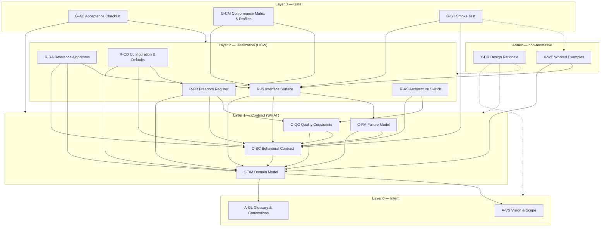

# The One-Shot Spec Artifact Model

*Task-01 deliverable for [issue #22](https://github.com/lago-morph/idea-pipeline/issues/22).
Builds on the commonality findings and checklist in [README.md](README.md); its artifact
IDs are the working vocabulary for task-02 (authoring process) and task-03 (hardened
checks). Compiled 2026-07-05.*

A gold one-shot spec is distributed as a single file, but it is not a homogeneous blob:
the four gold examples all contain the same recurring kinds of content, arranged the same
way, failing in the same places when a kind is thin or missing. This document names those
kinds as a set of **artifacts** with dependency and traceability rules, so that a spec can
be authored artifact-by-artifact, checked artifact-by-artifact, and compiled into the
single-file shape the gold examples use.

The precedent is the Rational Unified Process artifact set (Vision document, use-case
model, supplementary specification, glossary, test plan). The vocabulary is reused only
where it genuinely fits (Vision & Scope, Glossary); everything else is derived from what
actually appears in the four gold specs — nothing is included because RUP has it, and
nothing RUP lacks is excluded on that ground.

Contents:

1. [The layering principle](#1-the-layering-principle-what--how)
2. [The artifact set](#2-the-artifact-set)
3. [Dependency graph](#3-dependency-graph)
4. [Traceability rules](#4-traceability-rules)
5. [Element IDs and citation tags](#5-element-ids-and-citation-tags)
6. [Compilation scheme](#6-compilation-scheme)
7. [Coverage of the README findings](#7-coverage-of-the-readme-findings)
8. [Validation: decomposing the four gold specs](#8-validation-decomposing-the-four-gold-specs)
9. [Validation: the audited defects as model violations](#9-validation-the-audited-defects-as-model-violations)
10. [Best-of-breed references](#10-best-of-breed-references)
11. [What the decomposition shows](#11-what-the-decomposition-shows)
12. [Vocabulary note for task-02 and task-03](#12-vocabulary-note-for-task-02-and-task-03)

---

## 1. The layering principle (WHAT / HOW)

The model's central structural commitment, and the owner's central requirement: a spec
contains both a description of **what** the system is and does, and a description of
**how** an implementation should render that — but never mixed.

**The WHAT (Layer 1, the "contract" artifacts, prefix `C-`)** covers domain concepts,
observable behavior, failure semantics, and quality constraints. It is written
generically and implementation-free. The acid test is the **rewrite test**: *if every
Layer-2 artifact were deleted and rewritten from scratch by a different author, the
Layer-1 artifacts should not need to change.* Concretely, Layer-1 text may not contain
interface names, method signatures, wire formats, concrete grammars, default values, or
pseudocode. It speaks in the vocabulary of the domain model and the glossary, nothing
else.

**The HOW (Layer 2, the "realization" artifacts, prefix `R-`)** is layered on top:
interfaces, grammars, wire formats, reference algorithms, defaults. Every HOW element
carries a **citation obligation** — it must name the WHAT element(s) it realizes (§5
defines the tag syntax). A realization element with no citation is either evidence of a
missing requirement or over-specification; either way it is a defect (rule T1).

Two more layers bracket the contract/realization pair:

**Layer 0 (intent, prefix `A-`)** fixes the universe of discourse — why the system
exists, where its boundary is, and what its words mean. Both WHAT and HOW are expressed
inside this frame.

**Layer 3 (gate, prefix `G-`)** converts the normative content of Layers 0–2 into a
binary, mechanically checkable definition of done. The gate is what makes a one-shot
build a bounded search problem instead of an open-ended generation problem (README §2.1-A,
§4.1 hypothesis 1).

Finally a **non-normative annex (prefix `X-`)** quarantines material that helps a reader
but must never carry an obligation: design rationale and worked examples. Annex text can
be deleted without changing what a conforming implementation is (rule T4 makes this
enforceable).

Why layering is worth the authoring discipline:

- **Survivability.** The WHAT can outlive a total rewrite of the HOW — the stated
  requirement. unified-llm demonstrates the payoff in miniature: its Layer-1 adapter
  contract is explicitly the stability layer ("A new provider is added by implementing
  this interface, not by modifying it," unified-llm L68).
- **Checkability.** Orphan-HOW and dangling-WHAT become greppable defects instead of
  review judgment calls (§4). The defect classes that survived even in the gold specs
  (README §2.3) are exactly citation failures between these layers — see §9.
- **Freedom management.** "Implementation freedom" gets a precise definition: a WHAT
  element whose HOW is deliberately left open, registered as such (R-FR). Ambiguity that
  is not registered is a defect, which is precisely the gold specs' own practice
  (README §2.1-G) made mechanical.

## 2. The artifact set

Sixteen artifacts across four layers plus the annex. "Status" says when the artifact must
exist: **core** artifacts appear in every spec; **conditional** artifacts are required
exactly when their trigger condition holds (and must be consciously waived otherwise).

| Layer | ID | Name | One-line contents | Status |
|---|---|---|---|---|
| 0 Intent | `A-VS` | Vision & Scope | Problem, goals-as-principles, non-goals mapped to extension points, boundary notes, external dependencies & precedence | core |
| 0 Intent | `A-GL` | Glossary & Conventions | Normative-keyword convention, type-notation legend, one authoritative definition per term | core |
| 1 Contract | `C-DM` | Domain Model | Entities as typed field lists, complete enums, field constraints — abstract, wire-free | core |
| 1 Contract | `C-BC` | Behavioral Contract | State machines, operation obligations, ordering guarantees, precedence rules with tie-breaks, invariants | core |
| 1 Contract | `C-FM` | Failure Model | Failure taxonomy, retryable-vs-terminal semantics, blast radius, named boundary cases, timeout semantics | core |
| 1 Contract | `C-QC` | Quality Constraints | Concurrency guarantees, safety invariants, portability and capability-preservation constraints | core |
| 2 Realization | `R-AS` | Architecture Sketch | Component/layer decomposition with responsibilities, interaction diagram, porting seams | core *(new — see §2.1)* |
| 2 Realization | `R-IS` | Interface Surface | Signatures, tool/endpoint blocks, concrete grammars, wire formats, native-mapping tables | core |
| 2 Realization | `R-RA` | Reference Algorithms | Step-numbered pseudocode as determinism witnesses, exact formulas | core |
| 2 Realization | `R-CD` | Configuration & Defaults | Every knob defaulted at point of definition, resolution chains; cheat-sheet is a derived view | core |
| 2 Realization | `R-FR` | Freedom Register | Declared open choices: bounding contract citation + implementer documentation obligation | core |
| 3 Gate | `G-AC` | Acceptance Checklist | One mechanically checkable box per normative claim, each citing the claim it checks | core |
| 3 Gate | `G-CM` | Conformance Matrix & Profiles | Variation-axis × requirement matrix and/or named conformance profiles | conditional: ≥1 declared variation axis |
| 3 Gate | `G-ST` | Smoke Test | Executable end-to-end scenario with concrete ASSERTs and expected values | core |
| Annex | `X-DR` | Design Rationale | Quarantined why-material; carries zero normative force | core |
| Annex | `X-WE` | Worked Examples | Complete realistic inputs, input→output pairs; promotable into G-ST vectors | core |

### 2.1 Deltas from the planning hypothesis

The planning session's 15-artifact sketch survives validation almost intact. Per the
stable-IDs policy, no hypothesized ID is renamed or deleted; the changes are one addition
and four definition-level refinements, each forced by the decomposition evidence in §8:

1. **`R-AS` Architecture Sketch added (Layer 2).** All four gold specs devote early
   sections to component/layer decomposition — unified-llm §2.1 (four layers), symphony
   §3.1–3.2 (eight components, six abstraction levels "easiest to port when kept in these
   layers"), coding-agent-loop §1.4 (boxes-and-arrows diagram), attractor §1.4 ("Layering
   and LLM Backends"). The hypothesized set had no home for this content, and the
   K-ordering the model must reproduce (README §2.1-K) has an explicit *architecture*
   slot. It is a Layer-2 artifact because internal structure is realization, not
   contract: symphony offers its layers explicitly as porting advice, and the rewrite
   test confirms it — restructure the components and Layer 1 still stands.
2. **`A-GL` extended from "glossary" to "Glossary & Conventions."** The gold specs'
   term-definition sections are thin, but every one of them defines *document
   conventions* that the rest of the spec is unreadable without: symphony's normative-
   language preamble with the custom `Implementation-defined` keyword (L7–14),
   unified-llm's type-notation legend (L348–358), coding-agent-loop's "All code is
   pseudocode" declaration (L58). Conventions and term definitions are the same kind of
   thing — authoritative meaning-fixing — so they share the artifact.
3. **`A-VS` extended to own the external-dependency register.** README §2.1-H (managed
   external dependencies with a conflict-resolution rule) needs a home. Dependencies are
   a scope question — what this spec deliberately does *not* define and where it defers —
   so the register (companion docs with scope-of-reliance, precedence clauses like
   symphony's "the Codex protocol controls," reference implementations marked
   inspiration-only) lives in A-VS. The *delegated open choices* that dependencies create
   (e.g. symphony's Codex policy enums) live in R-FR; §7 justifies this split per
   attribute.
4. **Observable-value formulas moved from `R-RA` to `C-BC`.** The hypothesis filed
   "exact formulas" under R-RA. Symphony refutes that placement: its backoff formula
   (`delay = min(10000 * 2^(attempt-1), …)`, L766–768) sits in the behavior prose, and
   §16's pseudocode invokes it *abstractly* — the formula is the observable commitment,
   not a witness of one. Refined boundary: numeric behavior that is itself observable
   (retry delays, limits, thresholds — README §3.B's formula item) is **C-BC**, stated
   as an exact formula; R-RA keeps formulas that are internal computation steps of an
   algorithm. A formula is implementation-free, so this does not breach WHAT-purity.
5. **`G-CM` generalized to "Conformance Matrix & Profiles."** Two gold specs structure
   conformance by a genuine variation axis — coding-agent-loop's 15×3 provider parity
   matrix, symphony's Core/Extension/Real-Integration profiles. Attractor's §11.12
   "parity matrix" turns out to be a single-column scenario list (no axis), i.e. G-AC
   content under a matrix heading. So G-CM is **conditional**: required exactly when the
   spec declares a variation axis (per-provider realization, optional features, platform
   targets), and its two observed forms — axis×requirement matrix, tagged profiles — are
   both conforming shapes.

One classification position the task required the model to take:

**Concrete input syntax belongs to `R-IS`; its abstract twin belongs to Layer 1 —
usually `C-DM` (the entities and values the syntax encodes), sometimes `C-BC` (the
operation semantics it invokes).** Attractor's DOT BNF (L72–109) is the type case: the
grammar is a concrete surface an implementation parses, while "a workflow is one
directed graph of typed-attributed nodes and edges" is domain truth that would survive
swapping DOT for YAML — and attractor's own §10 proves the seam by natively splitting
expression *syntax* (§10.2) from evaluation *semantics* (§10.3). Coding-agent-loop's
v4a patch grammar (Appendix A) shows the C-BC variant: its abstract twin is the edit-
operation semantics, not an entity. Two corollaries, applied consistently in §8:
**classify by role, never by notation** (attractor writes an abstract enum in BNF at
L1141–1147; it is still C-DM), and gold specs' routine *interleaving* of grammar,
abstract constraints, and defaults in one section (attractor §2) is a compilation-layout
choice (§6.2 attachment rule), never shared ownership.

### 2.2 Artifact definitions

Each definition gives: contents; boundary (what it must NOT contain); its citation
obligation (for Layer-2 and Layer-3 artifacts — the task requires every HOW artifact to
carry one); and its exemplar among the gold specs (justified in §10).

#### `A-VS` — Vision & Scope *(Layer 0, core)*

- **Contents.** Problem statement; goals stated as named design principles; non-goals,
  *each mapped to the extension point where it would attach* (the coding-agent-loop §8
  pattern); boundary notes pre-empting predictable scope confusion (the symphony
  "reader/runner, not a ticket-writer" pattern); and the **external-dependency register**:
  every external document or system relied on, with its scope of reliance (which
  types/sections — "imports exactly these 10 types"), its version pin or discovery
  procedure, and its conflict-resolution rule ("on conflict, X controls"). Reference
  implementations register as exactly one of **inspiration-only** (no obligation may
  cite them) or **pinned oracle** (scoped, versioned, conflict-ruled); an unpinned
  "mirror the structure of X" is this register's signature defect (§9).
- **Boundary.** No behavioral obligations (those are C-BC), no feature descriptions
  beyond what scoping requires. A goal is a principle, not a requirement — it cannot be
  checked by G-AC directly, only via the contract elements that realize it.
- **Exemplar.** coding-agent-loop §8 (non-goals → extension points), with symphony §1–2
  + boundary notes as the co-exemplar for boundary discipline.

#### `A-GL` — Glossary & Conventions *(Layer 0, core)*

- **Contents.** The normative-keyword convention (RFC-2119 uppercase, lowercase-
  imperative, or pseudocode-carried prescription — any is conforming, but the choice is
  declared here, including custom keywords such as symphony's `Implementation-defined`
  with its documentation obligation); the type-notation legend (`String | None`,
  `List<T>`, `RECORD`/`ENUM`); one authoritative definition per normative term.
- **Boundary.** Definitions only — no obligations about system behavior. A term defined
  here is *used* everywhere else; a term used normatively anywhere without a home here or
  in C-DM is a T6 defect.
- **Exemplar.** symphony's Normative Language preamble (L7–14) for keywords; unified-llm
  §3 legend (L348–358) for notation.

#### `C-DM` — Domain Model *(Layer 1, core)*

- **Contents.** Every entity as a typed field list in the A-GL notation; every enum
  enumerated **completely**, each value with semantics; field constraints (nullability,
  ranges, formats, derivations) inline with the field; namespace/key conventions
  (attractor's `context.*` registry pattern).
- **Boundary.** Abstract only: no wire formats, no serialization, no concrete syntax, no
  default values (fields state *that* they are configurable; R-CD states the default),
  no interface names. The rewrite test applies field by field.
- **Exemplar.** unified-llm §3 (legend + complete enums + per-field comments), with
  coding-agent-loop's `SessionConfig`/`EventKind` records close behind.

#### `C-BC` — Behavioral Contract *(Layer 1, core)*

- **Contents.** Stateful lifecycles as explicit state machines with **total** transition
  tables (every state × event resolved); operation obligations as observable
  input→outcome statements; ordering and idempotency guarantees ("reconciliation runs
  before dispatch on every tick"); every priority/precedence rule as a **total ordering
  with a deterministic tie-break**; numbered invariants; observable numeric behavior
  (backoff, limits, thresholds) as **exact formulas**, e.g.
  `delay = min(10000 * 2^(attempt-1), max_backoff)` — the formula is the commitment
  (§2.1 delta 4).
- **Boundary.** Semantics, not mechanism: what must be true of the outcome, never the
  algorithm that produces it (that is R-RA's witness). No pseudocode, no signatures. If
  a behavior cannot be stated without naming an interface, the domain model is missing a
  concept.
- **Exemplar.** attractor §3's edge-selection precedence chain (5-step total order with
  lexical tie-break) and symphony §7–8's state machine + tick ordering.

#### `C-FM` — Failure Model *(Layer 1, core)*

- **Contents.** A named failure taxonomy (hierarchy or category list); retryable-vs-
  terminal classification for every class; per-failure **blast radius** (what halts vs.
  what degrades: "template errors fail only the affected run attempt; workflow file
  errors block all new dispatches"); boundary cases named concretely with the motivating
  pathological input; timeout *semantics* — which scopes exist (connect / request /
  stall), what expiry means, kill-escalation sequence.
- **Boundary.** Semantics of failure, not encodings: HTTP-status→error mappings and
  wire-level error shapes are R-IS; numeric timeout defaults are R-CD.
- **Exemplar.** unified-llm §6 — taxonomy tree, dual retryability tables, unknown-error
  default, partial-failure semantics. (Verified as hypothesized; see §10.)

#### `C-QC` — Quality Constraints *(Layer 1, core)*

- **Contents.** Concurrency **guarantees** (what is serialized or atomic, cancellation
  semantics, result-ordering guarantees) as distinct from mechanisms; numbered safety
  invariants with validation predicates (symphony §9.5's `cwd == workspace_path`);
  portability constraints; capability-preservation constraints (unified-llm's "native
  API, not compatibility layer" is the realization of one); evolution/stability
  constraints (unified-llm's Layer-1 clause: "changes rarely and only with explicit
  versioning"); resource/cost constraints (its mandatory-caching rule); timing bounds
  where the domain imposes them.
- **Boundary.** Guarantees only. The permitted *mechanisms* are either realized in
  Layer 2 or registered as freedom in R-FR — a guarantee with neither is exactly the
  gold specs' most common leak (README §2.3 defect class 1).
- **Exemplar.** symphony §9.5 Safety Invariants. (Verified as hypothesized; see §10.)

#### `R-AS` — Architecture Sketch *(Layer 2, core; added by this model)*

- **Contents.** Component/layer decomposition with one-line responsibilities; a
  component-interaction diagram (boxes-and-arrows suffices); porting seams (which layers
  can be swapped independently); which component discharges which contract obligation.
- **Boundary.** Advisory except through citations: the sketch's normative force is
  exhausted by the contract elements it cites. Internal structure is otherwise free —
  this is a standing freedom bounded by "externally visible behavior must remain
  identical" and does not need per-component R-FR entries.
- **Citation obligation.** Each component cites the C-BC/C-QC obligations it exists to
  discharge; each seam cites the C-QC portability constraint it serves.
- **Exemplar.** unified-llm §2.1 (four layers with a stability contract per layer);
  symphony §3.2 as co-exemplar for explicit porting intent.

#### `R-IS` — Interface Surface *(Layer 2, core)*

- **Contents.** Public interfaces with exact names, typed parameters, return types;
  per-tool/per-endpoint structured `parameters / returns / errors` blocks; concrete
  input grammars (BNF); wire formats, HTTP routes/methods/status codes with full example
  bodies; provider/native mapping tables; environment-variable conventions; and
  **catalogues of required built-in implementations** of an interface (attractor's five
  Interviewer variants with their test-double roles, coding-agent-loop's shared core
  tools) — built-ins are public surface, not examples.
- **Boundary.** Surface, not control flow (R-RA) and not tuning values (R-CD). Every
  type a signature mentions must exist in C-DM or be imported via the A-VS dependency
  register. Note Layer 2 is the *downstream* layer, not the optional one: a wire detail
  can be Core-gated and bind as hard as any contract element (symphony's fixed GraphQL
  field bindings).
- **Citation obligation.** Every interface element cites the C-DM entity it exposes or
  the C-BC/C-FM obligation it realizes; per-method error lists cite C-FM classes;
  grammars cite the C-DM model they encode.
- **Exemplar.** coding-agent-loop §3–4 (per-tool blocks, `ExecutionEnvironment`
  signatures), with unified-llm §7's adapter contract for wire-level mapping discipline.

#### `R-RA` — Reference Algorithms *(Layer 2, core)*

- **Contents.** Step-numbered, language-agnostic pseudocode for every core loop and
  decision procedure — the **determinism witnesses** for C-BC rules; formulas that are
  internal computation steps of an algorithm (observable-outcome formulas live in C-BC,
  which R-RA invokes by reference — §2.1 delta 4).
- **Boundary.** A witness, not a mandate: implementations may substitute any algorithm
  with identical observable behavior (that standing freedom is part of the artifact's
  definition). Pseudocode may call only helpers defined in R-RA/R-IS or obligations
  stated in C-BC — an undefined helper is a T6 defect.
- **Citation obligation.** Every algorithm names the C-BC rule(s) it witnesses; every
  formula cites the C-BC/C-FM bound it computes. An algorithm citing nothing is
  over-specification (T1).
- **Exemplar.** symphony §16 — six functions mirroring the prose behavior one-to-one,
  labeled language-agnostic; attractor's `run()`/edge-selection/backoff suite as
  co-exemplar.

#### `R-CD` — Configuration & Defaults *(Layer 2, core)*

- **Contents.** Every knob with an explicit default **at its point of definition**;
  resolution chains for contextual defaults, as total orderings (attractor's fidelity
  chain, coding-agent-loop's prompt layering); units and ranges. The consolidated
  cheat-sheet (symphony §6.4) is a **derived view** produced at compilation (§6), not a
  second authored copy.
- **Boundary.** Values and resolution for knobs whose *fields* are declared in C-DM.
  A knob with a default here but no field there is a T6 defect (this is symphony's
  "configured assignee" defect, inverted).
- **Citation obligation.** Every default cites its C-DM field; every resolution chain
  cites the C-BC precedence rule it realizes; every `implementation-defined` default
  points at its R-FR entry.
- **Exemplar.** symphony §6 + §6.4 (defaults at definition + agent-directed cheat
  sheet, with the derivation intent stated in the spec itself).

#### `R-FR` — Freedom Register *(Layer 2, core)*

- **Contents.** One entry per deliberately open choice: (1) the choice left open, (2) the
  **bounding contract citation** — the interface, output contract, or invariant that any
  resolution must satisfy, (3) the **documentation obligation** on the implementer
  (symphony's `Implementation-defined` semantics), (4) the extension point, if the
  freedom exists to admit a known future feature.
- **Boundary.** The *only* place a contract element may lack a realization (T2). An
  entry must be narrow enough that any two compliant resolutions still pass the gate —
  a freedom wide enough to change G-AC/G-ST outcomes is a T7 defect.
- **Citation obligation.** Clause (2) above — an entry without a bounding contract
  citation is unbounded ambiguity, which is exactly what the register exists to abolish.
- **Exemplar.** symphony's `Implementation-defined` mechanism (keyword defined L12–14,
  applied to the Codex policy enums with per-use documentation obligation). (Verified as
  hypothesized; see §10.)

#### `G-AC` — Acceptance Checklist *(Layer 3, core)*

- **Contents.** One checkbox per normative claim, phrased so a test could assert it,
  framed exactly as the gold specs frame it: *"an implementation is done when every item
  is checked off."*
- **Boundary.** Mechanically checkable items only — "mirrors the structure of X" is a T5
  defect (this is coding-agent-loop's system-prompt DoD defect). No new obligations: a
  box that checks something no artifact states is a missing contract element.
- **Citation obligation.** Every box cites the element(s) it checks (`[checks: …]`);
  jointly, the boxes must cover every normative element (T5 both directions).
- **Exemplar.** attractor §11 (76 items in 11 feature groups, the "done when checked"
  frame).

#### `G-CM` — Conformance Matrix & Profiles *(Layer 3, conditional)*

- **Trigger.** Required iff the spec declares ≥1 variation axis: per-provider
  realization, optional features/extensions, platform targets. Absent an axis, the
  artifact is waived (attractor's case — its §11.12 is G-AC content, see §2.1).
- **Contents.** Either or both observed forms: an axis × requirement **parity matrix**
  ("each cell must pass"), and **named conformance profiles** (symphony's
  Core / Extension / Real-Integration) with a lexical tagging convention assigning every
  gate item to a profile. Matrix rows are the *shared* requirements — parity across the
  axis; per-variant *deltas* are gated as ordinary G-AC boxes, one per variant
  (coding-agent-loop demonstrates the division: §9.12 checks parity, §9.2 checks the
  provider-specific differences).
- **Citation obligation.** Every cell/profile-tag cites the R-IS variant or R-FR/A-VS
  optional feature that creates the axis, and the requirement it crosses it with.
- **Exemplar.** coding-agent-loop §9.12 (15 cases × 3 providers) for the matrix form;
  symphony §17's profiles for the profile form.

#### `G-ST` — Smoke Test *(Layer 3, core)*

- **Contents.** An executable end-to-end scenario: concrete input (full workflow file,
  real prompt), scripted steps through the public surface, `ASSERT`s with expected
  values, covering the primary C-BC flow.
- **Boundary.** Asserts only contracted behavior — an assertion with no citable
  obligation behind it is a new requirement hiding in a test (T5). Missing entirely is
  a model violation even when a test matrix exists: assertions-in-prose are not
  executable (symphony's known gap, §9).
- **Citation obligation.** Each ASSERT cites the C-BC/C-FM/R-IS element it exercises;
  test vectors cite the X-WE example they were promoted from, when applicable.
- **Exemplar.** unified-llm §8.10 (6-part script, concrete expected values), with
  attractor §11.13 close behind.

#### `X-DR` — Design Rationale *(Annex, core)*

- **Contents.** Why-material: rejected alternatives, decision arguments, trade-off
  notes — quarantined so the normative body stays prescriptive (README §2.1-J).
- **Boundary.** Zero normative force. Rationale may not state, strengthen, weaken, or
  contradict an obligation; on any conflict the cited artifact controls and the conflict
  is a defect (T4 — this is how the model expresses coding-agent-loop's byte-for-byte
  contradiction, §9).
- **Exemplar.** unified-llm Appendix C / coding-agent-loop Appendix C (consolidated
  "why X?" appendices).

#### `X-WE` — Worked Examples *(Annex, core)*

- **Contents.** At least one complete, realistic, copy-pasteable input per format
  surface; input→output pairs at every format/parsing boundary ("Alice is 30" →
  `{"name":"Alice","age":30}`); narrated walkthroughs where flow needs illustration,
  including walkthroughs of declared extension points (unified-llm §7.9 "Adding a New
  Provider" is a worked example of exercising the A-VS/R-FR extension seam).
- **Boundary.** Illustrative, never load-bearing: every example must be derivable from
  C-DM/R-IS content (an example exhibiting behavior no contract states is a T4/T5
  defect). Examples are **promotable**: G-ST test vectors should be drawn from X-WE.
- **Exemplar.** attractor's three minimal DOT workflows + condition cookbook;
  unified-llm Appendix A/B.

## 3. Dependency graph

An edge `X → Y` means "elements of X are expressed in terms of elements of Y" — the
authoring order is the reverse topological order. The graph is a DAG: every cross-layer
edge points from a later layer to an earlier one, and the seven intra-layer edges
(within Layer 1: C-BC→C-DM, C-FM→C-DM, C-FM→C-BC, C-QC→C-DM, C-QC→C-BC; within
Layer 2: R-RA→R-IS, R-CD→R-FR) all respect a strict order inside their layer
(C-DM < C-BC < C-FM/C-QC; R-IS/R-FR < R-RA/R-CD), so no cycle exists.

Edge justifications (one sentence each; dashed edges are optional):

| Edge | Justification |
|---|---|
| C-DM → A-GL | Field types are written in the notation legend, and entity names must not collide with defined terms. |
| C-DM → A-VS | Entities exist only for concepts inside the declared scope; out-of-scope concepts may not acquire fields. |
| C-BC → C-DM | Transitions, preconditions, and precedence rules quantify over C-DM entities, states, and enum values. |
| C-FM → C-DM | Failure classes attach to operations on, and states of, C-DM entities. |
| C-FM → C-BC | Blast radius is defined over C-BC behavioral units (a run attempt, a tick, a dispatch). |
| C-QC → C-DM | Safety invariants quantify over C-DM values (paths, keys, identifiers). |
| C-QC → C-BC | Concurrency and ordering guarantees constrain C-BC-defined behaviors. |
| R-AS → C-BC | Each component cites the behavioral obligations it exists to discharge. |
| R-AS → C-QC | Porting seams cite the portability/isolation constraints they serve. |
| R-IS → C-DM | Signatures expose C-DM entities; grammars encode the C-DM model in concrete syntax. |
| R-IS → C-BC | Methods and endpoints realize C-BC operation obligations. |
| R-IS → C-FM | Per-method/per-endpoint error contracts realize C-FM classes. |
| R-RA → C-BC | Every algorithm is a determinism witness for named C-BC rules. |
| R-RA → C-DM | Pseudocode reads and writes fields that must exist on C-DM records (§9's `heuristic_select` defect lives on this edge). |
| R-RA → R-IS | Pseudocode invokes the surface by its R-IS names. |
| R-CD → C-DM | Every knob is a C-DM-declared field; a default without a field is dangling. |
| R-CD → C-BC | Resolution chains realize C-BC precedence rules. |
| R-CD → R-FR | `implementation-defined` defaults point at the register entry that bounds them. |
| R-FR → C-DM / C-BC / C-QC | Every freedom entry cites the contract element that bounds it. |
| G-AC → Layer 1, Layer 2 | Every box cites the normative element it checks, wherever it lives. |
| G-CM → R-IS | Parity axes are created by per-variant realization (provider profiles). |
| G-CM → R-FR | Profile splits (core vs. extension) are created by declared optional features. |
| G-ST → R-IS | The smoke test drives the system through its concrete public surface. |
| G-ST → C-BC | Its ASSERTs check contracted observable outcomes. |
| G-ST ⇢ X-WE | Test vectors are promoted from worked examples when available (optional). |
| X-DR ⇢ L0/L1/L2 | Rationale explains decisions recorded in normative artifacts; it may cite anything and obligate nothing (optional). |
| X-WE → C-DM | Example values are literals of C-DM types. |
| X-WE → R-IS | Examples are written in the concrete syntax R-IS defines. |

A note on A-GL: *every* artifact uses A-GL's keyword convention and defined terms; to
keep the graph readable this universal dependency is drawn only once, via C-DM (the
artifact that consumes the notation legend most heavily). Treat "X uses an A-GL term"
as always permitted and never cycle-forming, since A-GL depends on nothing.

## 4. Traceability rules

The rules that make the layering checkable rather than aspirational. Each is stated as
an invariant over the citation tags of §5; task-03 turns these into executable checks.
T1–T2 are the two rules hypothesized in the planning session; T3–T7 close the gaps the
gold specs' own defects demonstrate (§9 maps every audited defect to a rule).

- **T1 — Realization grounding.** Every Layer-2 element carries ≥1 `[realizes: …]`
  citation to a live Layer-0/1 element. An orphan realization is either a missing
  requirement (fix Layer 1) or over-specification (delete it) — the finding itself does
  not say which; a human decides.
- **T2 — Contract closure.** Every Layer-1 element is cited by ≥1 Layer-2 element **or**
  by an R-FR entry. A dangling WHAT means the spec asks for something no realization or
  declared freedom accounts for.
- **T3 — Layer-1 self-sufficiency.** The contract artifacts, read alone, are complete
  and closed: every enum fully enumerated (or its delegation declared in the A-VS
  dependency register), every state machine total over state × event, and **no
  occurrence of Layer-2 vocabulary** — interface names, wire literals, default values,
  pseudocode — anywhere in a C-artifact. Mechanization: grep C-artifacts for R-element
  IDs and concrete-surface tokens; expect zero.
- **T4 — Precedence and conflict.** Any contradiction between any two artifacts is a
  spec defect; until fixed, the implementer resolves it by fixed precedence:
  **Layer 1 > Layer 2 > Layer 3** (the gate checks obligations, it never creates them —
  a gate item disagreeing with the body is wrong by definition), and **any normative
  artifact > annex** (X-artifacts carry zero force). Precedence is triage, not
  resolution — the conflict still gets fixed. This is the internal analog of symphony's
  "the Codex protocol controls" clause, and it is not hypothetical: §9 lists live
  gate-vs-body and annex-vs-body conflicts in two gold specs.
- **T5 — Gate coverage and checkability.** (a) Every normative element is cited by ≥1
  G-AC box (or G-CM cell); (b) every G-AC box cites ≥1 element and is mechanically
  checkable — a box needing judgment ("mirrors the structure of X") is a defect;
  (c) every G-ST ASSERT cites the obligation it exercises. Together: gate ⊆ spec and
  normative-spec ⊆ gate.
- **T6 — Reference closure.** Every identifier used anywhere resolves to exactly one
  defining element in the artifact that owns identifiers of its kind: pseudocode helpers
  → R-RA/R-IS; config keys → C-DM field + R-CD default; record fields → C-DM; normative
  terms → A-GL/C-DM; external names → the A-VS dependency register. (README §3.J's lint
  section, restated as a citation invariant.)
- **T7 — Freedom hygiene.** Open choices exist only as R-FR entries; each entry has a
  bounding contract citation and a documentation obligation; hedge words ("appropriately",
  "reasonable", "leniently", "common field names") outside R-FR are defects; and an entry
  whose latitude can flip a G-AC/G-ST outcome is too wide and must be narrowed.

## 5. Element IDs and citation tags

Traceability needs stable anchors. Every normative element (a record, an enum, a rule, a
knob, an algorithm, a checklist box, a freedom entry) gets an ID of the form
`<ARTIFACT>-<NNN>`: `C-BC-012`, `R-CD-007`. IDs are assigned once and never reused;
gaps from deleted elements stay gaps.

Four tag forms, all surviving compilation verbatim (they are what the checks grep for):

| Tag | Written on | Meaning |
|---|---|---|
| `[#C-BC-012]` | the element's defining line | declares the element and its ID |
| `[realizes: C-BC-012, C-FM-003]` | a Layer-2 element | citation obligation (T1) |
| `[freedom: R-FR-004]` | a contract element or R-CD default | this element's realization is deliberately open; see the register entry (T2/T7) |
| `[checks: C-BC-012]` | a G-AC box, G-CM cell, or G-ST ASSERT | gate citation (T5) |

Grep surface: `\[(#|realizes:|freedom:|checks:)\s*[A-Z]-[A-Z]{2}-[0-9]{3}` — one regular
expression covers all four forms, which is what keeps task-03's deterministic tier cheap.
The gold specs approximate this with section-number cross-references ("Section 4.5",
"§9.12"); the model makes the practice uniform and element-granular.

## 6. Compilation scheme

Artifacts are the authoring and checking units; the distributable spec is still **one
file** (README §2.1-L). Compilation assembles the artifacts into the gold specs' shape
via a fixed slot ordering, one sanctioned interleaving rule, and derived views.

### 6.1 Slot ordering

| # | Compiled section | Source artifact(s) |
|---|---|---|
| 0 | Title, status banner, linked ToC | generated |
| 1 | Conventions preamble (normative language, notation) | A-GL |
| 2 | Overview: problem, goals, non-goals, boundaries, dependencies | A-VS |
| 3 | Architecture overview | R-AS |
| 4 | Domain model | C-DM (+ attached R-CD defaults, R-IS mapping fragments) |
| 5 | Behavior | C-BC (+ attached R-RA witnesses) |
| 6 | Quality constraints | C-QC (+ attached R-FR mechanism-freedom entries) |
| 7 | Interfaces & integration | R-IS (+ attached C-FM per-interface error contracts) |
| 8 | Configuration | R-CD |
| 9 | Errors & failure semantics | C-FM (+ attached R-IS wire mappings) |
| 10 | Freedom register (consolidated) | R-FR |
| 11 | Worked examples | X-WE |
| 12 | Conformance: checklist, matrix/profiles, smoke test | G-AC, G-CM, G-ST |
| 13 | Appendices: rationale, derived consolidations | X-DR + derived views |

This reproduces the K-ordering common to all four gold specs (README §2.1-K:
overview/goals → architecture → data model → behavior → interfaces/integration → errors
→ conformance — slots 2, 3, 4, 5, 7, 9, 12) and the §4.3 authoring skeleton (goals →
non-goals → data model → behavior → interfaces → config → errors → examples → DoD —
slots 2, 4, 5, 7, 8, 9, 11, 12). Types precede the operations that consume them (4
before 5 and 7); conformance comes last and cites everything.

Slot 3 is the one deliberate layer inversion: R-AS is Layer 2 but compiles early,
because all four gold specs orient the reader with architecture before the contract —
compilation order serves retrieval, the DAG serves authoring, and they need not agree.

### 6.2 The attachment rule

The gold specs interleave layers *at the presentation level*: defaults sit in the field
tables (attractor §2.5), provider mapping tables follow each enum (unified-llm §3),
pseudocode follows the rule it witnesses. The model sanctions exactly this and nothing
more:

> A realization fragment MAY compile adjacent to the contract element it realizes —
> inside the contract element's slot — provided the fragment keeps its element ID and
> citation tags.

Ownership never moves: the attached fragment remains an R-element, checkable as such
(T1/T3 still hold because tags, not positions, carry the layering). A fragment without
tags in a contract slot is a T3 violation. Attachment is why the model can demand strict
layering *and* reproduce documents that look exactly like the gold specs.

### 6.3 Derived views

The gold specs' deliberate redundancy (README §2.1-J) is reproduced by **derivation, not
double-authoring**: the compiler may emit consolidated views of already-authored
elements from *any* artifact — the config cheat-sheet (symphony §6.4, from R-CD),
attribute-reference appendices (attractor Appendix A/B, from C-DM+R-CD), the
provider-quirks table (unified-llm §7.8, from R-IS), the ToC. Derived views are marked
as derived and are regenerated, never edited — attractor shows why: its hand-maintained
"complete" Appendix A silently omits the handler-local knobs added in §4 (§9). Prose-
plus-pseudocode redundancy is already structural (C-BC rule + R-RA witness of it, both
first-class).

### 6.4 Mass budget

Gold range: 1,400–2,200 lines, 70–115 KB, single file (README §2.1-L). Compilation
should warn outside roughly that envelope — under it, suspect thin C-FM/G-AC; over it,
suspect unquarantined rationale or duplicated (rather than derived) views.

## 7. Coverage of the README findings

### 7.1 Every §2.1 common attribute has a home

| §2.1 attribute | Home artifact(s) | Split justification (where split) |
|---|---|---|
| A. Binary, mechanically checkable DoD | G-AC (+ G-CM, G-ST) | One gate, three instruments: claim-level boxes (G-AC), axis structuring (G-CM), executable end-to-end (G-ST) — the gold specs keep all three distinguishable under one §. |
| B. Deterministic behavioral semantics | C-BC + R-RA | The *rule* (total ordering, tie-break) is contract; the *step-numbered witness* is realization — splitting is what makes the rewrite test pass. |
| C. Typed data model with inline defaults | C-DM + R-CD | Field existence/type/constraints are WHAT; the default value is tuning (HOW); the attachment rule (§6.2) restores the gold specs' point-of-definition presentation. |
| D. Exact public interface surface | R-IS | — |
| E. Systematic error taxonomy | C-FM (+ R-IS for wire mappings) | Failure semantics are contract; HTTP-status→class tables are surface realization. |
| F. Explicit scope fencing | A-VS | — |
| G. Declared-and-bounded freedom | R-FR (+ A-GL for the custom-keyword convention) | The register holds the entries; the convention that names them (`Implementation-defined`) is a document convention. |
| H. Managed external dependencies + conflict rule | A-VS (register) + R-FR (delegated choices) | Which documents we lean on and who wins on conflict is scope; the open choices that delegation creates are freedoms. |
| I. Worked examples at the I/O boundary | X-WE | — |
| J. Deliberate redundancy, rationale quarantined | §6.3 derived views + X-DR | Redundancy is a compilation feature, not an artifact; the quarantine destination is X-DR. |
| K. Consistent macro-structure | §6.1 slot ordering | A property of compilation, not content. |
| L. Similar mass | §6.4 mass budget | A property of compilation, not content. |

### 7.2 Every checklist section maps to ≥1 artifact

| README §3 section | Artifact(s) |
|---|---|
| A. Acceptance | G-AC, G-CM, G-ST |
| B. Behavior | C-BC, R-RA, C-QC (concurrency guarantee item) |
| C. Data model | C-DM |
| D. Interfaces | R-IS |
| E. Configuration | R-CD, R-FR (`implementation-defined` item) |
| F. Errors and edge cases | C-FM, R-CD (timeout defaults item) |
| G. Scope | A-VS |
| H. Freedom management | R-FR, A-VS (dependency register items) |
| I. Examples and ergonomics | X-WE, X-DR, §6 compilation scheme (ToC/ordering/redundancy items) |
| J. Lint pass | Traceability rules T3/T4/T6/T7 — §3.J's items are defect *classes*, i.e. rule violations; the artifacts they implicate are wherever the dangling reference lands (see §9). |

## 8. Validation: decomposing the four gold specs

Method: each spec was decomposed by an independent analysis pass over the full text
(cross-checked against its profile and a mechanical heading inventory), classifying
every H2/H3 section — by role, never by notation or document position — against the
artifact set. The tables below are artifact-major summaries; line numbers are evidence
anchors into the specs as profiled (upstream texts verified unchanged: 2,090 / 1,467 /
2,169 / 2,185 lines).

Strength legend: **★** exemplar-grade · **●** solidly present · **◐** present but thin
or scattered · **○** absent (a model violation for core artifacts; a waiver for
conditional ones).

### 8.1 attractor-spec (2,090 lines: §1–§11, Appendices A–D)

| Artifact | Where it lives (sections, line evidence) | Strength |
|---|---|---|
| A-VS | §1.1/1.3 problem+principles (25–53); §1.4 non-goal→extension mapping (54–62); §2.1 input-domain boundary (66–69); §10.7 future fence (1769–81) | ● — but no conflict-resolution clause despite locally subsetting the Graphviz DOT standard (40, 72–109) |
| A-GL | — (nearest: namespace-prefix table 1060–70; value-type table 120–29) | ○ — no glossary, notation legend, or keyword convention; "stage"/"node" used as undeclared synonyms |
| C-DM | Runtime models §5.1–5.4 (993–1176), §6.2–6.3 (1253–90), §7.1 (1373–91); attribute tables §2.5–2.7 (130–78); shape→handler mapping §2.8 (179–94) | ● runtime / ◐ core — the Graph/Node/Edge entity is never written down; it must be reconstructed from attribute tables and pseudocode field accesses (`edge.to_node` 445) |
| C-BC | Lifecycle §3.1 (320–34); edge-selection precedence prose §3.3 (406–18); goal gates §3.4 (461–79); stylesheet specificity+order §8.3/8.5 (1464–93); expression semantics §10.3 (1681–89); join policies (846–51) | ★ for precedence chains — but many handler contracts exist *only* inside §4's pseudocode (WHAT-inside-HOW; see §11) |
| C-FM | Appendix D taxonomy (2082–90); `should_retry` predicate (562); failure routing (564–71); HITL timeouts §6.5 (1359–69); per-handler guards (738, 863, 903) | ● |
| C-QC | Concurrency §3.8 (573–79); handler-contract MUSTs (984–87) | ◐ — the spec's only uppercase keywords, and its thinnest contract artifact |
| R-AS | §1.4 layering prose (54–61); §3.1 de facto phase architecture (324–33); responsibility-assignment sentences (60, 646, 801) | ◐ — no diagram, no component section; architecture is distributed |
| R-IS | Handler/backend/Interviewer/Transform/LintRule interfaces (583–600, 711–18, 1242–52, 1527–47, 1410–43); three grammars (72–109, 1454–62, 1670–79); HTTP table (1595–1605); status-file wire contract App C (2053–80); run-dir tree (1222–38); built-in catalogues §6.4/§9.2 (1291–1358, 1548–64) | ● |
| R-RA | `run()` loop (335–405); edge-selection witness (420–59); `execute_with_retry` + backoff (491–550); expression evaluation (1690–1749); artifact-store algorithm (1187–1205) | ★ |
| R-CD | Default columns §2.5–2.7 + Appendix A (130–78, 1984–2035); preset policies (552–60); fidelity/thread resolution chains (1158–74); stylesheet order (1483–93) | ● — but the "Complete" Appendix A omits every handler-local knob (§9) |
| R-FR | Backend freedom (56–58, 718); internal-naming freedom w/ bounding invariant (166); frontend freedom (1244); HTTP optionality (1591) | ◐ — entries are bounded but **none carries a documentation obligation** |
| G-AC | §11.1–11.11, 76 boxes + framing (1785–1895) | ★ |
| G-CM | — (§11.12's "parity matrix" 1896–1924 is a single-column scenario list → classified as G-AC content) | ○ waived — no variation axis declared, so the conditional trigger is absent; not a violation |
| G-ST | §11.13 (1925–82), embedded DOT pipeline + ~15 ASSERTs | ● — with dangling references (§9) |
| X-DR | §1.2 Why DOT (31–41); inline notes (68, 801, 1665) | ◐ — rationale lives in the body; no appendix quarantine |
| X-WE | §2.13 three complete DOT files (253–316); §8.6 resolution walkthrough (1494–1523); §10.6 cookbook (1750–68) | ● |

Coverage: §1–§11 and Appendices A–D all classified (title/ToC are compilation
apparatus). Composite sections confirming the attachment rule: §2's tables fuse
C-DM + R-CD + R-IS column-by-column (§2.4's Type column is C-DM, its Syntax column
R-IS); §3.6 juxtaposes four artifacts in forty lines; Appendices A/C/D are normative
despite appendix position.

### 8.2 coding-agent-loop-spec (1,467 lines: §1–§9, Appendices A–C)

| Artifact | Where it lives (sections, line evidence) | Strength |
|---|---|---|
| A-VS | §8 non-goals→extension points (1133–48); §1.1–1.3 problem/principles (25–59); §1.6 dependency manifest — exactly 10 imported types + delegated retry (109–23, 1242, 1429–33) | ★ — one register defect: §1.5's reference projects (99–108) are framed "worth studying" yet bound conformance via unpinned "mirror" clauses (469, 622, 641, 663) |
| A-GL | — ("All code is pseudocode" 58; inline first-use definitions: Turn 186, subagent 1063) | ○ |
| C-DM | Session/SessionConfig (126–60); five Turn types (184–213); 15-value EventKind (412–34); registry records (687–707); ExecResult/DirEntry (757–68); subagent records (1098–1115) | ★ |
| C-BC | State transition table (173–82); stop conditions (397–406); truncation ordering MUSTs (854, 900); steering contracts (366–83); prompt layering (989–1001); doc-discovery precedence (1040–59); registry pipeline (711–18); patch-operation semantics (1340–86); shutdown sequence (1436–51) | ● — the core-loop contract itself lives only in §2.5's pseudocode |
| C-FM | Appendix B error→recovery + retryability tables (1407–35); timeout kill sequence (957–61); overflow policy (969–86); unknown-tool/validation handling (333–42) | ● |
| C-QC | Parallel-call gating (317–20, 486); env-var filtering invariant (783–86); portability (58); process-group discipline (770–89) | ◐ — real but distributed; no dedicated section |
| R-AS | §1.4 boxes-and-arrows diagram + host/SDK boundary + the low-level-client constraint (60–98) | ● |
| R-IS | §3.3 per-tool parameters/returns/errors blocks (490–590); profile tool lists §3.4–3.6 (591–666); ProviderProfile (471–89); ExecutionEnvironment (722–69); subagent tools (1066–97); v4a grammar App A (1319–39); environment-context template (1012–30) | ★ |
| R-RA | `process_input` (219–303) + helpers (306–63); `detect_loop` (443–58); truncation algorithms (859–944); context-window formula (976–83) | ● |
| R-CD | SessionConfig inline defaults (148–59); output/line/timeout tables §5.2–5.4 (883–968); per-tool defaults (504, 536, 572); Anthropic 120s + 3-step resolution chain (643); doc budget (1054) | ● |
| R-FR | Topics-not-text clause (1010); schema-variation freedom (492, 654); fuzzy matching (541); optional tools (659–60); event delivery (409) | ◐ — bounded entries, no register, no documentation obligations |
| G-AC | §9.1–9.11, 59 boxes (1153–1246) | ● — two defective boxes: 1171 (subjective) and 1212 (legislates a new enum value, "xhigh") |
| G-CM | §9.12 provider parity matrix, 15 × 3 (1247–68) | ★ |
| G-ST | §9.13, 7 scenarios × 3 profiles with ASSERTs (1269–1311) | ● — scenarios 3–7 verified by comment, not ASSERT |
| X-DR | Appendix C seven why-paragraphs (1453–68); inline callouts (97, 436, 946) | ● — but C leaks normative content (1455, 1467; §9) |
| X-WE | App A patch examples (1343–1403); environment sketches (794–825); wrapper compositions (826–49); custom-tool example (672–83) | ● |

Coverage: §1–§9 and Appendices A–C all classified. Composites: each §3.3 tool block
interleaves four artifacts in ~15 lines; §5.3 spans invariant → algorithm → defaults →
rationale in one H3 — the attachment rule's poster children.

### 8.3 unified-llm-spec (2,169 lines: §1–§8, Appendices A–C)

| Artifact | Where it lives (sections, line evidence) | Strength |
|---|---|---|
| A-VS | Goals-as-principles (22–38); 90%/10% doctrine (252); portability honesty clause (585); reference projects marked inspiration-only (40–48) | ◐ — **the non-goals half is missing**: no Out-of-Scope section exists; its content is scattered (120, 256, 735 + 1469–75, 1792) — §9 |
| A-GL | Type-notation legend (348–58) — the corpus's best | ◐ — no keyword convention (4 uppercase MUST vs 38 lowercase "must", undeclared), no term glossary; "stable conversation prefix" consequently dangles (§9) |
| C-DM | §3 throughout: complete enums with semantics (Role 398–404; ContentKind 439–48; StreamEventType 770–84; FinishReason 617–31), direction-constraint table (450–61), ModelInfo (259–71), TimeoutConfig (1036–39) | ★ |
| C-BC | Parallel-tool five rules (1231–37); `max_tool_rounds + 1` invariant (879); middleware onion order (139); provider resolution, "never guesses" (114–17); streaming lifecycle (786–92); accumulator equivalence (956); round-trip invariants (447, 543); prompt XOR messages (875) | ● |
| C-FM | §6: 17-type taxonomy tree (1298–1317); dual retryability tables + conservative default (1339–60); blast radius (1442–48); Retry-After edge rule (1437–40) | ★ |
| C-QC | Concurrency model (204–08); three timeout scopes (1044–48); Layer-1 stability contract (68); caching MUST (332); stream resource safety (843) | ◐ — genuine but scattered |
| R-AS | §2.1 four layers with per-layer responsibility, import audience, and stability class (54–74); behavior-to-layer allocations (820, 1450–52) | ★ |
| R-IS | Adapter interface (164–91); native-endpoint mandate + table (210–18); mapping tables beside each type (406–14, 633–51, 675–83); §7.3–7.7 wire translations + SSE grammars (1521–1739); quirks cheat-sheet (1741–65); `generate()` 20-param signature (851–72) | ★ |
| R-RA | Multi-step tool loop (1187–1227); `execute_all_tools` (1240–54); backoff computation (1420–23); translation procedures §7.2/7.5/7.6 (1503–1646); message-string classification (1394–1401) | ● |
| R-CD | RetryPolicy fully defaulted at definition (1406–13); env-var table (88–93); pervasive inline defaults (475, 557, 713, 858, 868, 1573); catalog-as-data-file (275–328) | ● — no consolidated config cheat-sheet (its one cheat-sheet, §7.8, consolidates R-IS) |
| R-FR | provider_options typed-equivalence entry (587); auto-cache entry with doc obligation + escape hatch (340); sync/async spelling (206) | ◐ — the corpus's best-*formed* entries, but no register; the unregistered ones became defects (§9) |
| G-AC | §8.1–8.8, 71 boxes with gate→contract citations ("see Section 6.4 table", 2073) | ★ |
| G-CM | §8.9 provider parity matrix, 15 × 3 (2083–2103) | ★ |
| G-ST | §8.10 six-part script, concrete expected values (`age == 30`), cross-mode invariant assert (2105–67) | ★ |
| X-DR | Appendix C, 13 why-paragraphs (1952–78); inline rationale (174, 1319, 1360) | ★ |
| X-WE | App A message literals (1796–1863); App B walkthroughs incl. fallback pattern (1866–1948); worked I/O pair (966–81); §7.9 extension walkthrough (1767–79) | ● |

Coverage: §1–§8 and Appendices A–C all classified. Composite evidence: the spec is
*topic-major, layer-minor* — each abstract type is immediately followed by its mapping
table (§3.2, §3.8, §3.9, §5.3), in cleanly delimited blocks; decomposing it is a
re-sort, not a rewrite (§11).

### 8.4 symphony SPEC.md (2,185 lines: preamble, §1–§18, Appendix A)

| Artifact | Where it lives (sections, line evidence) | Strength |
|---|---|---|
| A-VS | §1 problem + boundary note (16–43); §2 goals/non-goals (44–68); §11.5 boundary restated with extension point (1213–24); dependency register: §3.3 inventory (138–45) + authority partition "the Codex protocol controls" (925–28) + enum-delegation discovery procedure (438–42) + drift warning (1175–77) | ● — the corpus's best dependency register; non-goal→extension mapping present but distributed (60↔§13.7; 63–64↔§11.5; 65–67↔§10.5/§15.1) |
| A-GL | Normative Language preamble: RFC-2119 adoption + custom `Implementation-defined` keyword with documentation obligation (7–14) | ◐ — the corpus's best keyword convention; no term glossary (fragments: claim-states vs tracker-states disambiguation 611–12, identifier rules 275–88) |
| C-DM | §4 core domain model (146–288): typed field lists, complete local enums (states 614–30, phases 649–59), derivation rules (275–88) | ● — blemishes: `timer_handle` "runtime-specific" leak (257); delegated Codex enums (436–42); event list explicitly non-exhaustive (1014–27) |
| C-BC | §7 state machine + triggers + idempotency (604–701); §8 tick ordering, eligibility conjunction, total sort with tie-breaks, **contract-level formulas** (704–817; 748, 766–68); reload semantics §6.2 (527–46); rendering rules §12.2 (1235–41); runner contract §10.7 (1125–40) | ★ |
| C-FM | §14 failure classes + recovery (1535–88); per-subsystem taxonomies §5.5/§10.6/§11.4 (487–501, 1105–24, 1194–1212); blast-radius signature example (499–500) | ● |
| C-QC | §9.5 Safety Invariants (894–913); §15.2–15.4 (1633–63); liveness bound on approval freedom (1037–39); dependency-direction invariants for optional surfaces (1315–16, 1366–67); timing meanings (1107–11) | ★ |
| R-AS | §3.1 eight components with responsibilities (71–113); §3.2 six abstraction levels, explicitly for portability (114–37) | ● |
| R-IS | §13.7.2 HTTP extension: exact routes, status codes, full JSON bodies (1395–1532); `linear_graphql` input schema (1064–95); tracker operations (1147–54); Linear wire bindings (1156–93); hook execution surface (869–84); log-field contract (1260–77); launch contract (930–48) | ● |
| R-RA | §16 six language-agnostic functions mirroring the prose section-by-section, formulas invoked abstractly (1692–1929) | ★ |
| R-CD | §5.3 defaults at point of definition (326–461); §6.1 resolution pipeline (504–26); §6.4 cheat sheet, declared derived-and-redundant "so a coding agent can implement the config layer quickly" (572–603) | ★ |
| R-FR | The `Implementation-defined` keyword protocol: definition (12–14), 13 marked sites (e.g. 449–53, 597–99, 852–58, 1031, 1313), gate verification against documented policy (2020, 2027, 2029); §9.3 as a complete worked entry (854–68) | ★ — with the caveat that three freedoms escaped marking (696, 1327, 639/962) — §9 |
| G-AC | §17.1–17.7 ~90 assertion bullets (1947–2062); §18 ~26 boxes (2076–2124) | ● — with gate-drift defects (§9) |
| G-CM | Three validation profiles + lexical tagging rule (1936–45), reused across §17 and §18 (2078–82) | ★ — the profile realization |
| G-ST | — (§17.8 asserts a smoke test *can be run*, supplies no script or ASSERTs, 2063–75) | ○ — **missing; a model violation** (§9) |
| X-DR | §15.5 hardening guidance (1664–91); Appendix A.3 hazards (2166–85); one-line rationale (574, 661, 816, 896, 1591) | ◐ — no rationale appendix |
| X-WE | Four realistic HTTP JSON payloads (1406–1521, doubling as R-IS); high-trust policy example (1041–45) | ◐ — no end-to-end walkthrough anywhere |

Coverage: the Normative Language preamble, §1–§18, and Appendix A all classified.
Composites: §5.3 interleaves R-CD with embedded C-BC/C-FM, each *deliberately
duplicated* in the contract sections (393–406 ↔ 887–92) — declared-redundant projection;
§10.5 mixes R-FR + C-QC + R-IS + X-WE in one H3; §13.7 and Appendix A are recursive
mini-specs — extensions instantiate the whole artifact stack inside an OPTIONAL fence,
gated via the G-CM extension profile.

## 9. Validation: the audited defects as model violations

The acceptance test from the task definition: every defect the profiles' ambiguity
audits found must be expressible as a **missing artifact**, a **thin artifact**, or a
**traceability-rule violation** — a defect invisible to the model would be a hole in
the model. All fourteen audited defects are expressible; none required a new rule
beyond T1–T7.

| # | Spec — audited defect (evidence) | Model expression | Class |
|---|---|---|---|
| 1 | attractor — parallel handler promises bounded concurrency and cancellation, pseudocode is a sequential `FOR EACH`; `execute_subgraph` never defined (803–22, 851) | R-RA contradicts the C-BC/C-QC concurrency claim → **T4**; `execute_subgraph` unresolved → **T6**; cancellation declared with no realization and no register entry → **T2**; branch-execution semantics absent from Layer 1 → **T3** | rule |
| 2 | attractor — manager loop invokes `steer_cooldown_elapsed`, `ingest_child_telemetry`, `steer_child`, `start_child_pipeline`; reads `context.stack.child.*` keys in no registry (932–45) | Pseudocode embodying behavior with no contract to cite → **T1**; helpers and keys unresolved → **T6**; key registry not closed → **T3**; cooldown knob undefaulted and unregistered → **T2** | rule |
| 3 | attractor — `heuristic_select` sorts on `c.score`/`c.id`, fields Outcome doesn't define; `serialize_results` undefined (886–89, 825 vs 1076–84) | Algorithm reads fields absent from the C-DM record (the R-RA → C-DM edge) → **T6**; the fan-in candidate type is missing from Layer 1 entirely → **T3** | rule |
| 4 | coding-agent-loop — §3.1 mandates a "byte for byte" copy; Appendix C reframes it as "behavioral alignment… not a byte-for-byte copy" (469 vs 1455); the DoD tests the softer reading (1168–71) | Annex text amending a normative mandate → **T4** (annex carries zero force; the conflict is a defect — and the gate silently sides with the annex, a second T4). The model's fix: recast §3.1 as an R-FR entry bounded by "model-facing affordances preserved" — the bound line 1455 already states | rule |
| 5 | coding-agent-loop — "mirror the … system prompt structure" DoD item is subjective (1171; mirror clauses 622, 641, 663, 1004–08) | G-AC box not mechanically checkable → **T5**; upstream cause: the topics-not-text freedom (1010) is an R-FR entry with no documentation obligation and an untestable residual bound → **T7**; root cause: reference projects are unpinned oracles → A-VS register violation | rule + thin R-FR |
| 6 | coding-agent-loop — `validate_arguments` invoked, gated, never defined: no schema draft, strictness, or coercion semantics (339, 714, 1179); kin: `GrepOptions` (745), `count_turns` (235), `convert_history_to_messages` (247) | Validation obligation with neither realization nor register entry → **T2**; free symbols → **T6**. Related audit note — AWAITING_INPUT (176): trigger informal → **T2**, and §2.5's algorithm makes the state unreachable (275–76 → 302) → **T4** | rule |
| 7 | unified-llm — auto-cache heuristic "implementation-specific" (340) vs DoD demanding breakpoints on the "stable conversation prefix using a documented heuristic" (2049); "stable prefix" defined nowhere | Gate cites a term no artifact defines → **T6** + **T5** (box unverifiable); the R-FR entry at 340 is perfectly *shaped* (freedom + doc obligation + escape hatch) but its bounding citation dangles → **T7**; enabling condition: A-GL absent | rule + thin A-GL |
| 8 | unified-llm — `reasoning_tokens` "estimated" with no formula (660, 697) vs parity cell "token counts are accurate" (2101) | Estimation method neither witnessed in R-RA nor registered in R-FR → **T2**; contract says *estimate*, gate says *accurate* → **T4** (contract wins; the G-CM cell is a defect, unverifiable for Anthropic) | rule |
| 9 | unified-llm — tool-context injection by magic parameter names; mechanism and name-collision rules open (1108–18) | Unregistered freedom → **T2**/**T7**; C-BC collision invariant missing; the spec's own gate has no box for it (§8.7) — only the model's closure rules catch it | rule |
| 10 | unified-llm — no Non-Goals section (profile §1); content scattered (120, 256, 735 + 1469–75, 1792) | **A-VS half-instantiated** — detected by artifact-completeness checking (every A-VS must contain the non-goals component), not by a T-rule; two scattered entries are already in perfect non-goal→extension-point form (735 + 1469–75), just unlabeled | thin artifact |
| 11 | symphony — Codex policy enum values delegated to an external schema; defaults implementation-defined (436–53, 597–99) | Mostly **conforming**: the delegation is declared with a discovery procedure (A-VS register) and the defaults are keyword-marked R-FR entries with documentation obligations — this is the pattern the model *prescribes*. Residual defect: the safety posture is the register's widest entry, bounded only by "MUST document" + a liveness invariant → **T7** (freedom wide enough to change Real-Integration outcomes) | rule (T7 width) |
| 12 | symphony — eligibility rule references "the configured assignee"; no such config field exists anywhere (729–30; absent from §5.3 and §6.4) | A C-BC term resolving to no C-DM field / R-CD knob → **T6** + **T2**; compounding: no §17.4 bullet tests assignee routing → **T5** (normative claim with no gate box). The model catches it three ways | rule |
| 13 | symphony — "single-authority" concurrency mechanism unspecified (696); token counts extracted "leniently from common field names" (1327) | Both are real freedoms carrying no `Implementation-defined` marker: unregistered → **T2**/**T7**; "leniently" is a hedge word outside the register → **T7**; knock-on: gate bullet 2048 ("aggregation remains correct") is unverifiable → **T5** | rule |
| 14 | symphony — no executable smoke test; §17.8 only asserts one *can be run* (2063–75) | **G-ST uninstantiated** — a core artifact absent; the test matrix does not substitute because prose assertions are not executable | missing artifact |

**Defects the model surfaced beyond the audits.** Classifying the specs against the
rules exposed eleven further internal defects the profiles' dimension-13 audits did not
list — evidence the rules add detection power rather than merely re-labeling known
problems:

- attractor: DoD requires `POST /run`, `GET /status`, `POST /answer` while §9.5 defines
  disjoint `/pipelines…` routes (1894 vs 1595–1605) → T4 gate-vs-body conflict.
- attractor: parity row "orphan node → warning" vs lint rule `reachability` = ERROR
  (1907 vs 1398) → T4.
- attractor: the smoke test asserts `outcome.completed_nodes` — a field on Checkpoint,
  not Outcome — and drives `run_pipeline(...)`, an entry point defined nowhere (1966,
  1962) → T5 + T6.
- attractor: `evaluate_clause` accepts a bare-key clause the §10.2 grammar cannot
  produce (1739–40 vs 1671) → T4 within Layer 2 (algorithm vs grammar).
- attractor: grammar defines `Direction` (108) consumed by nothing; `rankdir` appears
  only in examples → T6.
- attractor: Appendix A is titled "Complete Attribute Reference" yet omits every
  handler-local knob (`join_policy`, `max_parallel`, `tool_command`, `manager.*`,
  `human.default_choice`) → the §6.3 derivation rule violated by hand-maintenance.
- coding-agent-loop: DoD item 1212 legislates a new enum value ("xhigh") found nowhere
  in §2.7's contract → T4 (the gate never creates obligations).
- coding-agent-loop: AWAITING_INPUT is unreachable in the reference algorithm (see #6)
  → T4 — a state-machine/witness contradiction the audit under-called.
- symphony: DoD 2095 hardcodes "JSON line protocol" while the contract defers transport
  framing to the external Codex protocol (937, 999) → T4 gate-vs-body.
- symphony: §16.5 passes `turn_number`/`max_turns` into prompt building; §12.1's input
  contract lists neither (1841 vs 1229–33) → T1/T3 leak (the witness quietly extends
  the contract).
- symphony: §17.7 gates a CLI surface no body section specifies (2054–62) → T5
  (gate box citing nothing).

## 10. Best-of-breed references

For each artifact, the gold-spec section a spec author (or task-02's AUTHOR role)
should imitate. All four planning-session hypotheses **verified** — two with caveats
worth knowing.

| Artifact | Exemplar | Why | Runner-up |
|---|---|---|---|
| A-VS | coding-agent-loop §8 (1133–48) ✓ *hypothesis confirmed* | Every excluded feature names a resolvable extension point elsewhere in the spec; one non-goal is additionally *enforced* in the contract layer (973) | symphony §1–2 boundary notes + dependency register |
| A-GL | **Composite** — symphony's Normative Language preamble (7–14) for the keyword convention (incl. the custom `Implementation-defined`), unified-llm's type legend (348–58) for notation | No gold spec has a full glossary — A-GL is the corpus-wide under-investment (§11) | — |
| C-DM | unified-llm §3 (346–793) | Notation legend up front; every enum complete with per-value semantics; constraint tables inline; catch-all values (`other`, open `kind`) that keep the model closed under provider growth | coding-agent-loop's EventKind (412–34) |
| C-BC | symphony §7–§8 (604–817) | State machine + trigger table + eligibility conjunction + total sort order with tie-breaks + contract-level exact formulas, all prose-checkable without pseudocode | attractor §3.3's twice-stated precedence chain (406–59) |
| C-FM | unified-llm §6 (1283–1477) ✓ *hypothesis confirmed* | Taxonomy tree, dual retryability tables, conservative unknown-error default, blast radius, Retry-After edge rule. Caveat: §6 also hosts the spec's best R-CD and an R-RA formula — the exemplar is the C-FM extraction, not the section verbatim | symphony §14 + the 499–500 blast-radius statement |
| C-QC | symphony §9.5 (894–913) ✓ *hypothesis confirmed* | Three numbered invariants, each with a mechanical validation predicate, explicitly ranked, re-mandated in §15.2, and gated in §17.2 — a complete contract→gate chain | unified-llm §2.6 concurrency model (204–08) |
| R-AS | unified-llm §2.1 (54–74) | Four layers, each with responsibility, import audience, and stability class — architecture with a per-layer contract | symphony §3.2's six levels, explicitly framed as porting seams (114–37) |
| R-IS | coding-agent-loop §3.3 (490–590) | Uniform per-tool `parameters / returns / errors` blocks with inline defaults — the discipline the D checklist section describes | symphony §13.7.2 for wire-level completeness (1395–1532); unified-llm §7.3–7.7 for mapping tables |
| R-RA | symphony §16 (1692–1929) | Six functions mirroring the prose one-to-one, formulas invoked abstractly (they stay in C-BC), verbatim string identity with the contract — the cleanest witness discipline in the corpus | unified-llm's multi-step tool loop (1187–1227) |
| R-CD | symphony §5.3 + §6.4 (326–461, 572–603) | Defaults at point of definition *plus* a consolidated cheat-sheet that declares its own derivation and purpose ("so a coding agent can implement the config layer quickly") | coding-agent-loop's three-mode R-CD (inline defaults 148–59, tables 883–968, resolution chain 643) |
| R-FR | symphony's `Implementation-defined` mechanism (12–14 + 13 marked sites) ✓ *hypothesis confirmed* | Keyword definition carries the documentation obligation; entries carry bounding contracts; the gate verifies against the documented policy (2020, 2027, 2029). Caveat: it is a distributed protocol, not a register — and three freedoms escaped marking, which is the argument for consolidation | unified-llm's provider_options entry (587) as best single entry |
| G-AC | attractor §11.1–11.11 (1785–1895) | 76 boxes, feature-grouped, "done when every item is checked off" framing | unified-llm §8.1–8.8 with explicit gate→contract citations |
| G-CM | coding-agent-loop §9.12 (1247–68) for the matrix form | 15 shared requirements × 3 providers, "each cell must pass"; per-provider deltas correctly gated separately in §9.2 | symphony's profile system (1936–45) as the co-equal *profiles* form |
| G-ST | unified-llm §8.10 (2105–67) | Six parts, concrete expected values, asserts a cross-mode invariant (2129) and error mapping (2165) — the gate exercising the contract, not decorating it | attractor §11.13 (1925–82) |
| X-DR | unified-llm Appendix C (1952–78) | Thirteen decisions, quarantined, matching inline pointers — rationale without normative leakage | coding-agent-loop Appendix C (with its leak as the cautionary note) |
| X-WE | attractor §8.6 (1494–1523) + §2.13 (253–316) | Complete copy-pasteable inputs plus a per-node resolution walkthrough — examples that trace, not just illustrate | unified-llm Appendices A–B |

## 11. What the decomposition shows

Findings from applying the model to 7,911 lines of gold spec — what validated, what had
to change, and what it means for the tasks downstream.

1. **The decomposition is latent in successful specs, not imposed on them.** unified-llm
   is topic-major but layer-minor: every abstract type is followed by its mapping table
   in cleanly delimited blocks; separating artifacts is a re-sort, not a rewrite.
   coding-agent-loop's tool blocks interleave four artifacts in fifteen lines — and
   still decompose without residue. The attachment rule (§6.2) is what reconciles
   strict ownership with this observed layout; no gold spec required breaking it.
2. **Classify by role, never by notation or position.** BNF is used for an abstract
   enum (attractor 1141–47); normative wire contracts live in appendices (attractor
   App C, coding-agent-loop App B); rationale lives in bodies (attractor §1.2). Any
   checker keyed on surface form or document position will misfile all of it.
3. **WHAT-inside-HOW is the dominant leak, and it is exactly where the audited defects
   cluster.** In attractor's handlers and coding-agent-loop's core loop, the behavioral
   contract exists only inside pseudocode — and those are precisely the zones where
   undefined helpers, phantom fields, and contradictions hid (defects 1–3, 6). The
   model's costliest discipline — extracting C-BC so Layer 1 closes (T3) — targets the
   specs' most defect-dense territory. That is the strongest empirical argument for the
   layering requirement.
4. **Gate drift is real and under-audited.** Six of the eleven beyond-audit defects are
   gate-vs-body conflicts (wrong endpoints, contradicted severities, phantom fields and
   entry points, gate-legislated enum values, hardcoded transport). The profiles'
   audits, focused on body ambiguity, largely missed them. T4's "the gate never creates
   obligations" clause and T5's cite-and-agree discipline earn their place on this
   evidence alone.
5. **A distributed freedom mechanism is good; a consolidated register is better.**
   Symphony's `Implementation-defined` keyword is the best freedom discipline in the
   corpus — and still let three freedoms escape unmarked (696, 1327, 639/962). In the
   other three specs, every unregistered freedom eventually surfaced as an audited
   defect (5, 7, 8, 9, 13). R-FR as a consolidated register with T7 policing hedge
   words is the model's response.
6. **Artifact-completeness checks complement traceability rules.** Missing non-goals
   (10), the missing smoke test (14), and absent glossaries are invisible to citation
   rules — nothing dangles; the content simply isn't there. They are caught by
   artifact-status checking (core artifact absent/thin). Task-03 needs both kinds of
   check; neither subsumes the other.
7. **A-GL is the corpus-wide under-investment, and it isn't free.** No gold spec has a
   real glossary; two lack even a keyword convention. The cost shows up in the defect
   table: "stable conversation prefix" undefined (7), "configured assignee" resolving
   nowhere (12), stage/node synonymy in attractor. The cheapest artifact in the set
   would have pre-empted two audited defects outright.
8. **Optionality is a regime, not a section.** Symphony runs it end-to-end: OPTIONAL
   fencing (A-VS/R-FR), extension-owned config keys (R-CD), dependency-direction
   invariants so optional surfaces can't become load-bearing (C-QC), and a conformance
   profile that converts optionality into conditional gate obligations (G-CM). Its
   extensions (§13.7, Appendix A) are recursive mini-specs — the artifact stack
   instantiates *inside* the OPTIONAL fence. The model supports this without new
   machinery: feature-granularity R-FR entries + a G-CM axis.
9. **G-ST and X-WE degrade together.** Symphony lacks both the executable smoke test
   and any end-to-end worked example; the specs strongest in examples (attractor,
   unified-llm) have the strongest smoke tests. The X-WE→G-ST promotion path (§2.2) is
   observed practice, not aspiration — worked examples are the smoke test's larval
   stage.
10. **Redundancy must be derived, or it rots.** Attractor's hand-maintained "Complete
    Attribute Reference" is missing six knobs the body defines; symphony's declared-
    derived cheat sheet is accurate. §6.3's derivation rule is the difference between
    redundancy as a retrieval feature and redundancy as a second source of truth.

For task-02, the practical upshot: the authoring process should produce C-BC prose
*before* R-RA pseudocode (finding 3), run A-GL from day one (finding 7), and treat the
gate as generated-from-citations rather than written-free-hand (finding 4). For
task-03: the traceability rules mechanize as tag-closure checks over §5's grep surface,
plus artifact-status checks (finding 6); the eleven beyond-audit defects in §9 are a
ready-made regression corpus for those checkers.

## 12. Vocabulary note for task-02 and task-03

All twelve artifact IDs cited in the task-02/task-03 prompts (`A-VS`, `C-DM`, `C-BC`,
`C-FM`, `C-QC`, `R-IS`, `R-RA`, `R-CD`, `R-FR`, `G-AC`, `G-CM`, `G-ST`) are unchanged in
name and intent, as are `A-GL`, `X-DR`, `X-WE`. One artifact is **added**: `R-AS`
(Architecture Sketch, Layer 2) — task-02's stage that authors R-IS/R-RA/R-CD should also
produce R-AS, and task-03's checks may target it like any other Layer-2 artifact
(T1/T5/T6 apply unchanged). Definition-level refinements to A-GL (conventions), A-VS
(dependency register), the C-BC/R-RA boundary (observable-value formulas are C-BC), and
G-CM (profiles form, conditional status) are documented in §2.1 and change no ID.
