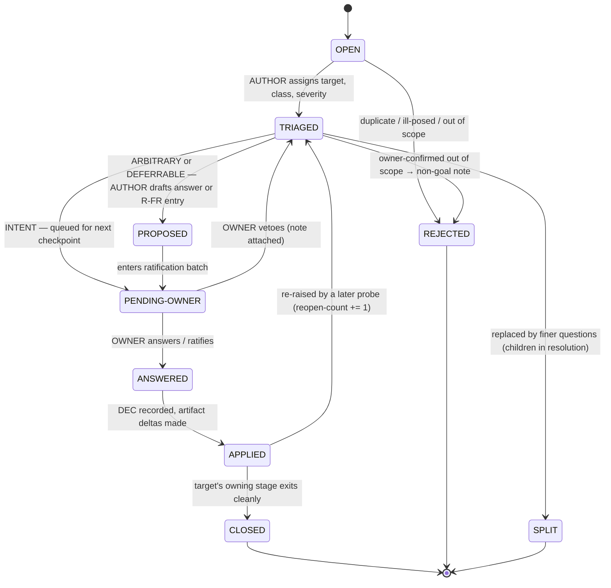
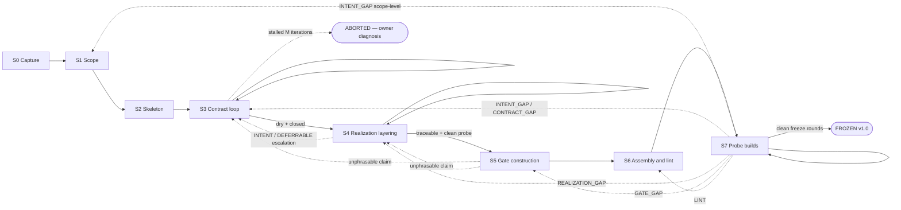

# The Idea→Spec Process

*Task-02 deliverable for [issue #22](https://github.com/lago-morph/idea-pipeline/issues/22).
Companions: [README.md](README.md) defines what a one-shot-complete spec is and the §3
checklist the output must pass; [artifact-model.md](artifact-model.md) defines what a spec
is made of — the sixteen artifacts this process produces, their dependency DAG, the
traceability rules T1–T7, and the element-ID/citation-tag scheme; [hardening/](hardening/)
(task-03) defines the executable checks whose failures this document routes. Compiled
2026-07-05.*

This document specifies the process that turns a raw idea — a few pages of intent, like
the numbered idea files at this repo's root — into a compiled, single-file spec that
passes the README §3 checklist. It gives the process the same treatment the gold specs
give systems: named roles with bounded authority, data structures with field-level
schemas, stages with entry/exit gates, deterministic activity steps, defect routing,
numeric loop/abort/freeze criteria, and its own definition of done (§10).

The design target is executability by a session with no prior context. At any moment
mid-run, four questions must be mechanically answerable:

| Question | Answered by |
|---|---|
| **Which stage am I in?** | the run ledger's `stage` field (§3.2) |
| **What do I do next?** | the current stage card's numbered activities (§6), starting from the first unmet exit criterion |
| **Is this stage done?** | the stage's numbered exit criteria, each individually checkable (§6) |
| **Where does this problem go?** | the question triage rules (§4.2) before gates exist; the defect routing table (§8) after |

Task-03's hardened checks execute inside this process: its deterministic and LLM-probe
checks are the mechanization of the S3 closure computations, the S6 lint suite, and the
S7 grading procedures. Its check definitions ([hardening/checks.md](hardening/checks.md))
control the *procedure* of each check; this document controls the *routing* of each
failure; the binding of check IDs to the stage gates below is the hardening README's §7
execution map.

Contents:

1. [Principles](#1-principles)
2. [Roles](#2-roles)
3. [The workspace](#3-the-workspace)
4. [Data structures](#4-data-structures)
5. [The stage graph and card format](#5-the-stage-graph-and-card-format)
6. [Stage cards S0–S7](#6-stage-cards-s0s7)
7. [Artifact production map](#7-artifact-production-map)
8. [Defect routing](#8-defect-routing)
9. [Numbers: constants, metrics, abort mechanics](#9-numbers-constants-metrics-abort-mechanics)
10. [Freeze, conformance, and post-freeze change](#10-freeze-conformance-and-post-freeze-change)
- [Appendix A. The pressure-test protocol](#appendix-a-the-pressure-test-protocol)

---

## 1. Principles

Six principles generate every design decision below. When a situation arises that the
stage cards do not cover, resolve it from these, then file a process defect (Appendix
A.6) so the gap gets closed in the next process version.

**P1 — Pre-run the dialogue.** One-shot building removes build-time interactivity.
Interactive agents recover underspecification by asking (+74% on underspecified issues —
Ambig-SWE, [arXiv:2502.13069](https://arxiv.org/abs/2502.13069)); a one-shot builder
cannot ask, so it silently guesses (HumanEvalComm,
[arXiv:2406.00215](https://arxiv.org/abs/2406.00215)). Therefore the entire clarification
dialogue must be pre-run at spec time, while there is still someone to ask: that dialogue
is S3's question loop, and the question record (§4.2) is its unit of work.

**P2 — The build is the test of the spec.** One-shot builds are cheap, so the spec is
iterated against real builds. Every build failure, cross-build divergence, and invented
decision is a *spec* defect until proven otherwise. Fixes land in the spec — never in
generated code. Builder output is graded, archived, and abandoned (S7).

**P3 — Freedom is declared, not leaked.** The WHAT loop (S3) closes before HOW authoring
(S4) begins. If realization work starts while contract questions are open, those
questions get answered *silently* by interface and pseudocode choices — the
WHAT-inside-HOW leak, which is exactly where the gold specs' audited defects cluster
(artifact-model §11, finding 3). A freedom that leaks into a HOW choice never reaches
owner triage and never becomes an R-FR entry with a bounding contract; extracting it
later is the most defect-dense operation in the corpus. The S3 card carries the full
argument where it binds; S4's entry criterion S4-E1 enforces the ordering.

**P4 — Ignorance is the measurement instrument.** An author cannot see their own curse
of knowledge; a fresh reader with zero author context can. PROBE and BUILDER sessions
measure what the document *alone* conveys — their questions, assumptions, inventions,
and divergences are the process's primary data. This is the same constraint regime
task-03 codifies for its Tier-L checks: ephemeral session, zero author context, pinned
charter, structured output.

**P5 — No unlogged deltas.** After an artifact's producing stage exits, every change to
it traces to a question or defect record through the routing table (§8.2). The metrics
are only meaningful if the queues are total: an unrecorded question cannot burn down,
and an unrecorded fix cannot be verified.

**P6 — Stated numbers, tunable numbers.** Every loop, abort, and freeze condition is
numeric, with the number stated and justified in one place (§9.1). The pressure test
(Appendix A) exists to tune those constants against reality — a pressure test can tune
a stated number, but not an unstated one.

---

## 2. Roles

Roles are **context regimes with authority boundaries**, not different intelligences:
the same model class can play AUTHOR, PROBE, and BUILDER; what changes is what the
session is permitted to know and to decide. OWNER is the exception — a human.

| Role | Kind | Lifetime | Context regime | Authority |
|---|---|---|---|---|
| **OWNER** | human | whole run | anything they choose | sole intent authority |
| **AUTHOR** | session | persistent across a run | full workspace | drafts, triages, applies, grades |
| **PROBE** | session | one probe run, then discarded | charter slice only (§4.7) | none — findings are data |
| **BUILDER** | session | one build, then discarded | compiled spec only | none — output is graded, then abandoned |

**OWNER** is the only role that can answer INTENT questions, disposition scope
assumptions (S1), ratify ARBITRARY and DEFERRABLE proposals, challenge gate-passing
behavior (S7), and approve freeze or abort. No other role may answer an INTENT question,
even provisionally — the single sanctioned exception is the pressure test's PROVISIONAL
rule (Appendix A.4), which exists to measure that very dependency.

**AUTHOR** is the persistent session that executes the process: maintains the ledger and
queues, drafts every artifact, runs triage, proposes answers to ARBITRARY questions and
drafts R-FR entries for DEFERRABLE ones (no force until ratified), applies decided
deltas, computes closures, dispatches probes and builders, and grades builds. AUTHOR
grading its own spec's builds is acceptable *because* G-AC boxes are mechanically
checkable by construction (T5) — grader identity cannot change a mechanical outcome; any
box where it could is itself a defect (S5 activity 2). AUTHOR may not answer INTENT
questions and may not edit a CONTROLLED artifact without a record (§3.3).

**PROBE** is a fresh, ephemeral session whose entire context is fixed by a charter
(§4.7). Its ignorance is the point (P4). A probe is never reused across iterations —
a probe that has seen an earlier draft is no longer ignorant. Three charters exist:
P-ASSUME (S1), P-QCOUNT (S3), P-IMPL (S4).

**BUILDER** is a one-shot build session: context is `dist/spec.md` and nothing else
(self-containedness is itself under test), no dialogue, one pass. It delivers an
implementation, an invention log, and a verbatim G-ST self-run transcript (§4.7). Its
code is archived and never fixed (P2).

### 2.1 Owner interaction contract

The owner is the scarcest resource; the process batches and bounds every touch.

- **Checkpoints.** S0 confirmation; S1 assumption disposition; one batch per S3
  iteration (INTENT questions + ratification of ARBITRARY/DEFERRABLE proposals,
  presented together); an S3-exit ratification sweep; rare escalations from S4/S5
  (each is evidence of a contract hole — see §8.2); one review per S7 round
  (divergence report + behavior acceptance); freeze approval; abort decision.
- **Batch shape.** Each INTENT question is presented with the AUTHOR's proposed answer
  and a one-line statement of stakes (what observably differs between plausible
  answers). Proposals speed the owner up but carry no force until adopted.
- **PENDING-OWNER.** Questions awaiting a checkpoint hold status `PENDING-OWNER`. A
  stage may not exit while a BLOCKER or MAJOR question is pending; the AUTHOR continues
  parallelizable work (other artifact sections) meanwhile.
- **Veto semantics.** Ratification is per-item. A vetoed proposal returns to `TRIAGED`
  with the owner's note; the owner may instead supply the answer directly (the record
  then resolves as OWNER-decided).

---

## 3. The workspace

### 3.1 Layout

One directory per spec run. Artifacts are authored as one file each — they are the
units of authorship and checking (artifact-model §2); the distributable single file is
compiled from them at S6.

```
<workspace-root>/<idea-slug>/
  ledger.md            # run ledger (§3.2) — the process state
  questions.md         # question queue: one table row per Q record (§4.2)
  decisions.md         # decision log: one row per DEC record (§4.4)
  defects.md           # build defect queue: one row per BD record (§4.6)
  metrics.md           # one metrics row per checkpoint (§4.9, §9.2)
  idea-record.md       # S0 output (§4.1)
  artifacts/
    A-VS.md  A-GL.md
    C-DM.md  C-BC.md  C-FM.md  C-QC.md
    R-AS.md  R-IS.md  R-RA.md  R-CD.md  R-FR.md
    G-AC.md  G-CM.md  G-ST.md
    X-DR.md  X-WE.md
  probes/
    probe-S1.1.md      # one file per probe run: charter + verbatim report
    probe-S3.1.md ...
    build-R1.1/ ...    # archived builder output per S7 build (never edited)
  dist/
    spec.md            # compiled single-file spec (S6 output; regenerated, never edited)
```

For production runs in this repo the workspace root is chosen by the executor (and
recorded in the ledger); the pressure test fixes it at
`spec-completeness/pressure-test/` (Appendix A.2).

### 3.2 The run ledger

The ledger is the process's own state record — the answer to "which stage am I in."
It is updated at every stage entry/exit, iteration boundary, and routed re-entry.

| Field | Type | Semantics |
|---|---|---|
| `idea` | String | slug + pointer to the source idea document |
| `run-id` | String | `<idea-slug>-<NN>`; a new run (e.g. after abort) increments NN |
| `stage` | Enum{S0…S7, FROZEN, ABORTED} | current stage; FROZEN/ABORTED are terminal for this run |
| `spec-version` | String | `v0.<n>` during iteration, bumped at every S6 recompile; `v1.0` at freeze |
| `iteration` | Map<Stage, Int> | completed iterations per looping stage (S1, S3, S4, S7 rounds) |
| `dry-streak` | Int | consecutive clean P-QCOUNT probes (S3-X1 counter) |
| `stall-streak` | Int | consecutive non-improving S3 iterations (abort counter, §9.3) |
| `clean-rounds` | Int | consecutive clean k_freeze S7 rounds (freeze counter) |
| `artifact-modes` | Map<ArtifactID, Enum{DRAFT, CONTROLLED, FROZEN}> | change-control state per artifact (§3.3) |
| `waivers` | List<String> | conscious waivers with justification (e.g. "G-CM waived: no variation axis") |
| `stage-history` | table | one row per stage entry/exit: stage, entered, exited, iterations, exit-evidence pointer |
| `harness-notes` | String | S7 build-target choices (language/env are the builder's, but the grading harness is recorded) |

### 3.3 Change control and ID conventions

Every artifact is in one of three modes:

- **DRAFT** — before its producing stage (§7) exits: the AUTHOR edits freely.
- **CONTROLLED** — after its producing stage exits: every delta must cite a `DEC-###`
  or `BD-###` record and arrives via a routed, scoped re-entry (§8.2). `decisions.md`
  must contain a row for every controlled delta — this is P5 made checkable. (One
  declared exception: A-GL's glossary half, which grows with the artifacts that
  introduce its terms until S4 exits — see §7.)
- **FROZEN** — after v1.0 (§10): deltas additionally require a version bump and the
  thaw protocol.

ID conventions, fixed across all runs: questions `Q-###`; decisions `DEC-###`; build
defects `BD-###`; process defects (pressure test only) `PD-###`; probe runs
`probe-S<stage>.<iteration>` (e.g. `probe-S3.4`); builds `build-R<round>.<n>`;
divergences `DIV-R<round>-<n>`; spec element IDs and citation tags exactly per
artifact-model §5 (`[#C-BC-012]`, `[realizes: …]`, `[freedom: …]`, `[checks: …]`).
IDs are assigned once and never reused; gaps stay gaps.

---

## 4. Data structures

Schema notation: `String`, `Int`, `Timestamp`, `Enum{A,B}`, `List<T>`, `Ref<T>` (an ID
pointing at a record or element), `?` suffix = optional. All records live as table rows
in the §3.1 files, greppable and diffable; task-03 tooling may later mechanize them, but
markdown tables are the v1 format because the executors are sessions.

### 4.1 Idea record

Produced by S0. The normalized entry point — calibrated to what raw ideas actually look
like in this repo: 73–113-line briefs with intent, current state, open questions, and
dependency notes, but no behavioral structure (see `01-*.md` … `12-*.md`).

| Field | Type | Semantics |
|---|---|---|
| `source` | String | file path / conversation pointer for the raw idea |
| `statement` | String | the idea in the owner's words (verbatim import is fine) |
| `intended-user` | String | who operates or benefits; one primary user, named concretely |
| `success-statement` | String | ONE observable success: a check a third party could run against the finished system and grade pass/fail |
| `imported-questions` | List<Ref<Q>> | pre-existing open questions carried in from the source document |
| `scale-note` | String? | rough size call (skill / tool / service / platform) — informs S6 mass expectations and pressure-test candidate choice, binds nothing |
| `owner` | String | the human who holds intent authority for this run |

The success statement is load-bearing: it matures into an A-VS goal (S1), selects the
primary C-BC flow (S3), and becomes G-ST's spine (S5). "Observable" means statable
without reference to internals — if it can only be checked by reading the code, it is
not a success statement yet.

### 4.2 Question record

The unit of work for the whole process (P1). One row per question, forever — questions
are never deleted, only moved through the lifecycle.

| Field | Type | Semantics |
|---|---|---|
| `id` | `Q-###` | stable, never reused |
| `text` | String | the question, self-contained enough to be answerable without the raiser present |
| `raised-by` | Enum{OWNER, AUTHOR, PROBE, BUILDER, IMPORT, CHECK} | IMPORT = carried in from the idea document; CHECK = minted by a closure/lint computation |
| `raised-in` | String | stage.iteration coordinate, e.g. `S3.2` |
| `target` | Ref<Artifact or element> | the artifact (or element ID) whose content answers it; `UNASSIGNED` allowed only before triage |
| `class` | Enum{INTENT, ARBITRARY, DEFERRABLE} | assigned at triage; semantics below |
| `severity` | Enum{BLOCKER, MAJOR, MINOR} | per the rubric (§4.3), assigned at triage by AUTHOR |
| `status` | Enum{OPEN, TRIAGED, PROPOSED, PENDING-OWNER, ANSWERED, APPLIED, CLOSED, REJECTED, SPLIT} | lifecycle below |
| `resolution` | Ref<DEC> \| Ref<R-FR entry> \| List<Ref<Q>> \| String | DEC for decided; R-FR for deferred; child list for SPLIT; reason for REJECTED |
| `reopen-count` | Int | times a later probe re-raised this after it was APPLIED |
| `notes` | String? | triage evidence, duplicate pointers |

**Question classes** — the triage decision, with the test for each:

- **INTENT** — the answer determines what the system observably *is or does for its
  user* in a way the stated goals do not already determine. Only the OWNER can answer.
  The answer lands in a C-artifact (or A-VS, if it is scope). *Test:* would the owner
  plausibly care which way this goes? If two answers both serve the stated goals but
  produce different products, it is INTENT.
- **ARBITRARY** — any self-consistent answer serves the stated goals equally; the only
  cost is leaving it undecided. AUTHOR proposes; OWNER batch-ratifies. Lands in
  whichever artifact owns the content. *Test:* could you defend either answer to the
  owner with "it genuinely doesn't matter, but it must be fixed"?
- **DEFERRABLE** — the implementer can choose better than the spec author, **and** a
  bounding contract can be written *now* such that any two compliant choices still pass
  the gate (T7). AUTHOR drafts the R-FR entry (choice + bounding contract citation +
  documentation obligation); OWNER ratifies it like a proposal. *Test:* can you write
  the bound today? **If you cannot state the bounding contract, it is not DEFERRABLE**
  — reclassify.

Precedence when unsure: **INTENT > ARBITRARY > DEFERRABLE.** Misclassifying INTENT as
ARBITRARY risks ratify-by-inattention — the owner rubber-stamps a batch and intent gets
decided by accident. Misclassifying in the other direction merely costs a batch slot.

**Lifecycle:**



**Dedupe and reopen rules.** Two questions are duplicates when they force the same
decision at the same locus (overlapping target, same forced choice). A new question
matching an *open* one is discarded with a pointer noted on the survivor. A new question
matching an *APPLIED* one reopens it (`APPLIED → TRIAGED`, `reopen-count += 1`) — the
applied answer evidently did not stick in the text. Reopen counts are a free measure of
answer quality; a record reopened twice gets escalated one severity level.

Worked example row (target idea: `08-browser-history.md`):

> `Q-014` · raised-by PROBE · raised-in S3.2 · target C-BC · class INTENT · severity
> BLOCKER · status PENDING-OWNER · resolution — · reopen 0 · text: "Does 'filters to
> IT/software/AI content' mean a fixed owner-curated domain allowlist, or automatic
> topic classification? The two produce observably different queues for the same
> history."

### 4.3 Severity rubric

The rubric is a classification function applied by the AUTHOR at triage — one
consistent grader across all iterations, so trends are comparable. The probe's
"forced guess" field (§4.7) is the evidence the grader uses.

| Severity | Test | Example (08-browser-history flavor) |
|---|---|---|
| **BLOCKER** | Two reasonable implementers would produce **observably different behavior** (visible through the public surface or the gate) | Is dedup of the same URL across devices global or per-device? The queue's counts differ. |
| **MAJOR** | The builder must invent a decision, but implementations **likely converge** (there is one idiomatic answer) | Where does the run store its intermediate state? (Everyone picks a local file/db; the bound matters, the choice doesn't.) |
| **MINOR** | Cosmetic; no observable consequence | Naming of the queue's markdown section headings. |

Two standing notes:

- **Divergence symmetry.** S7 runs the BLOCKER test *empirically*: an observed
  cross-build divergence on contracted behavior is a BLOCKER by definition — the two
  reasonable implementers actually existed and actually diverged. The rubric and the
  divergence classifier (§4.8) are the same instrument at different times.
- Severity describes blocking power **before** resolution; any class can carry any
  severity (an ARBITRARY question can be a BLOCKER — arbitrary ≠ unimportant).

### 4.4 Decision record

One row per resolved decision; the decision log is the sole authorization for
controlled-mode deltas (P5) and the feedstock for X-DR (S6).

| Field | Type | Semantics |
|---|---|---|
| `id` | `DEC-###` | stable |
| `resolves` | List<Ref<Q>> | questions this decision answers |
| `decided-by` | Enum{OWNER, RATIFIED, PROVISIONAL} | RATIFIED = AUTHOR proposal + owner batch-ratification; PROVISIONAL only inside the pressure test (A.4) |
| `decision` | String | the answer, in normative language ready for the artifact |
| `deltas` | List<String> | element-level changes: `<element-id> ADD|CHANGE|DELETE` (new elements get their ID here) |
| `rationale` | String | one line: why this answer — promotable to X-DR at S6 |
| `made-at` | String | stage.iteration |

Worked example row:

> `DEC-009` · resolves Q-014 · decided-by OWNER · decision: "Content filtering is
> topic classification; a curated domain allowlist exists only as the cold-start seed."
> · deltas: `C-BC-007 ADD, C-DM-004 CHANGE, A-GL(term: interest domain) ADD` ·
> rationale: "allowlist alone can't surface *new* interests, which is the point" ·
> made-at S3.2

### 4.5 Freedom Register entry (process view)

The R-FR artifact and its obligations are defined in artifact-model §2.2; this is the
field schema the process writes, plus one process-side addition (`origin`) that keeps
the question→freedom trace.

| Field | Type | Semantics |
|---|---|---|
| `id` | `R-FR-###` | element ID per artifact-model §5 |
| `choice` | String | the decision deliberately left to the implementer |
| `bounding-contract` | List<Ref<C-element>> | the interface/output contract/invariant any resolution must satisfy — **required**; an unboundable choice is not deferrable (§4.2) |
| `doc-obligation` | String | what the implementer must document about their choice |
| `extension-point` | String? | named, when the freedom exists to admit a known future feature |
| `origin` | Ref<Q> | the question whose deferral minted this entry |

Entry width is policed by T7: a freedom wide enough to flip a G-AC/G-ST outcome is too
wide — S7's divergence classifier detects exactly this case (§4.8, `FREEDOM_T7`).

### 4.6 Build defect record

Minted in S7 grading (and occasionally by S6 lint when a mechanical finding turns out
to be semantic). One row per defect; the routing table (§8) consumes `class`.

| Field | Type | Semantics |
|---|---|---|
| `id` | `BD-###` | stable |
| `found-in` | Ref<build \| DIV \| check> | `build-R2.3`, `DIV-R2-01`, or a lint check ID |
| `class` | Enum{INTENT_GAP, CONTRACT_GAP, REALIZATION_GAP, GATE_GAP, LINT} | semantics below; routing per §8.1 |
| `severity` | Enum{BLOCKER, MAJOR, MINOR} | same rubric (§4.3) |
| `evidence` | String | build output excerpt / divergence pointer / element IDs — enough to re-find the defect |
| `routed-to` | Enum{S1, S3, S4, S5, S6} | per the routing table |
| `resolution` | Ref<DEC>? | the decision (and deltas) that fixed it |
| `status` | Enum{OPEN, ROUTED, RESOLVED, VERIFIED} | VERIFIED = a subsequent round/check no longer reproduces it |

Class semantics (one line each; full routing in §8.1):

- **INTENT_GAP** — the missing decision was the owner's to make; includes the case
  where builds pass every gate and the owner rejects the behavior anyway.
- **CONTRACT_GAP** — observable behavior undetermined by Layers 0–1 + R-FR: builders
  diverged, or invented, where the contract should have spoken.
- **REALIZATION_GAP** — the contract speaks but Layer 2 fails to realize it: interface
  mismatch, undefined helper, missing default, broken T1/T2 chain.
- **GATE_GAP** — the gate failed as an instrument: a violation passed, a box is
  unverifiable, or gate and body disagree (T4: the body wins; the gate is wrong).
- **LINT** — mechanical hygiene violation whose fix is semantics-preserving; anything
  whose fix would change meaning gets reclassified (§8.2).

Worked example row:

> `BD-003` · found-in DIV-R2-01 · class CONTRACT_GAP · severity BLOCKER · evidence:
> "builds R2.1/R2.3 dedupe URLs case-insensitively, R2.2 exact-match; G-ST step 4
> queue counts differ; no C-BC rule governs URL normalization" · routed-to S3 ·
> resolution DEC-021 · status RESOLVED

### 4.7 Probe charters and reports

A probe run is a fresh session given exactly a **charter**: probe ID, type, the
verbatim context slice (file list — nothing else enters the session), the pinned
prompt template, and the output schema. The report is stored verbatim under `probes/`,
then normalized into records by the ingestion rule of the dispatching stage. The
templates, context slices, output schemas, k, and aggregation rules are pinned in the
hardening suite ([hardening/checks.md](hardening/checks.md) §3), one definition per
charter — P-ASSUME = check L-04, P-QCOUNT = check L-01, P-IMPL = check L-07 — and this
section keeps only what the process owns: dispatch rationale and ingestion.
Replication note (hardening §5.5's finding-vs-verdict rule): these are *finding*
probes, so inside a loop whose exit already demands consecutive clean runs (S1's one
clean probe, S3's `D_dry`, S4's one clean probe) each iteration dispatches k = 1 and
replication is sequential across iterations; a **verdict** probe (e.g. hardening
L-05's gate-decidability majority) is never run at k = 1.

**P-ASSUME** (S1 → hardening L-04). Slice rationale: re-probes within S1 also see the
current A-VS draft — declared scope is visible, so settled dispositions are not
re-raised (the same rationale as R-FR's inclusion in P-QCOUNT below). Ingestion: every
report row enters the S1 disposition worklist; the OWNER marks each IN (→ scope/goal
content) or OUT (→ non-goal with extension-point note in A-VS); UNKNOWN becomes an
INTENT question.

**P-QCOUNT** (S3 → hardening L-01). Slice rationale — one deliberate deviation from
the task-02 design sketch, which said "Layer 0–1 drafts only": **R-FR is included.**
It is the ledger of deliberate openness — T2 counts an R-FR entry as contract
closure — and a probe blind to it re-raises every settled deferral as noise, poisoning
the burn-down metric. The probe still sees no other Layer-2 artifact (none exists yet;
S4 has not run). Ingestion (S3 activity 6): dedupe per §4.2, mint Q records with
`raised-by: PROBE`, triage. The report's `forced-guess` column is the severity-grading
evidence.

**P-IMPL** (S4 → hardening L-07). Module selection rule, deterministic (owned here,
applied by L-07): probe the R-AS component with the highest count of distinct C-BC
citations (`[realizes:]` degree); tie-break to the component on the primary C-BC flow,
then lexical order. Iteration *j* probes the *j*-th ranked component (wrap around) so
successive probes broaden coverage. Ingestion (S4 activity 5): each invention-log row
becomes a Q record, triaged normally; a BLOCKER invention blocks S4 exit.

**BUILDER** (S7) — a role, not a probe type, but chartered the same way. Its charter
is process-owned (not superseded); its invention log uses L-07's schema. *Context
slice: `dist/spec.md` only.*

> Build the system specified in the attached document, in one pass. The document is
> the sole authority; you cannot ask questions. Where the document declares a choice
> implementation-defined, make it and document it as the document requires. Keep the
> same invention log as the implementation probe for any decision the document did not
> determine. When your build is complete, execute the document's smoke test (its G-ST
> section) against your build and report its output verbatim. Deliver: the
> implementation, the invention log, and the smoke-test transcript.

### 4.8 Divergence record

Produced by S7's cross-build analysis (activity 4). Divergence is the empirical form of
the BLOCKER test (§4.3).

| Field | Type | Semantics |
|---|---|---|
| `id` | `DIV-R<round>-<n>` | stable within the run |
| `locus` | List<Ref<element>> \| String | the element IDs (or G-ST step) where builds differ |
| `observations` | Map<build-id, String> | what each build observably did |
| `classification` | Enum{CONTRACTED_DIVERGENCE, FREEDOM_DIVERGENCE_OK, FREEDOM_T7} | see below |
| `defect` | Ref<BD>? | the BD minted, for the two defect classes |

- **CONTRACTED_DIVERGENCE** — builds differ on behavior the contract governs (or should
  govern and doesn't). Always a BD, class CONTRACT_GAP, severity BLOCKER by definition.
- **FREEDOM_DIVERGENCE_OK** — builds differ within a declared R-FR bound and each
  documented its choice per the entry's obligation. Not a defect; this is the register
  working. (A builder that exercised a freedom *without* documenting it fails the
  R-FR documentation G-AC box — it surfaces as a gate failure, not here.)
- **FREEDOM_T7** — builds differ within a declared freedom, but the divergence flips a
  gate outcome or escapes the stated bound: the entry is too wide (T7). BD, class
  CONTRACT_GAP, routed to S3 to narrow the entry.

### 4.9 Metrics row

One row appended to `metrics.md` at every checkpoint: each probe ingestion, each stage
exit, each S7 round. Columns are the metric names defined in §9.2 plus the coordinate
(`stage.iteration`, `spec-version`, timestamp). A metrics row is never revised — trends
are the product.

---

## 5. The stage graph and card format



Solid edges are the forward path and its loops; dashed edges are routed re-entries
(§8.2) and the abort path. After any routed fix, control returns through S6 (recompile
+ lint) before the next S7 round — rounds only ever grade a lint-clean compiled spec.

**Stage card format.** Every card below has exactly these fields, in this order:

1. **Purpose** — one paragraph.
2. **Executors** — roles that act in this stage.
3. **Entry criteria** — numbered `S<n>-E<k>`, checked once at each (re-)entry.
4. **Inputs** — what the stage consumes.
5. **Activities** — numbered, ordered steps; loops explicit.
6. **Outputs** — work products; artifacts this stage *produces* go CONTROLLED at exit.
7. **Exit criteria** — numbered `S<n>-X<k>`, conjunctive (all must hold), each
   individually checkable.
8. **Loop & guards** — what iterates; dry/stall/cap conditions with constants from §9.1.
9. **Metrics recorded** — names from §9.2.
10. **Routes in** — which routed records re-open this stage (§8).

The `S<n>-E<k>` / `S<n>-X<k>` labels are load-bearing: pressure-test process-defect
records (Appendix A.6) cite them, and routed re-entries re-verify only the `X` items
their deltas touch.

---

## 6. Stage cards S0–S7

### S0 — Capture

**Purpose.** Normalize a raw idea into an idea record with owner sign-off. Entry
expectations are calibrated to reality: the ideas this process will meet (this repo's
`01-*.md` … `12-*.md`) are short briefs — intent, current state, their own open
questions, dependency notes — with no behavioral structure. S0 demands only the minimum
that later stages cannot manufacture: whose intent this is, who it is for, and one
observable statement of success.

**Executors.** OWNER, AUTHOR.

**Entry criteria.**
- S0-E1: An idea exists in some prose form, and a human owner is identified.

**Inputs.** The raw idea document or conversation.

**Activities.**
1. Initialize the workspace and ledger (§3); `stage = S0`, `spec-version = v0.1`.
2. Draft the idea record (§4.1): statement (verbatim import allowed), intended user,
   and one observable success statement.
3. Import every pre-existing open question from the source document as a Q record
   (`raised-by: IMPORT`, `status: OPEN`, `target: UNASSIGNED`). The repo's idea files
   all carry an "Open Questions" section — that section is a free head start on the
   queue, not decoration.
4. Owner checkpoint: confirm or correct the three fields. Confirming the success
   statement is an INTENT act — the AUTHOR may draft it, only the OWNER can adopt it.

**Outputs.** `idea-record.md`; seeded question queue; ledger initialized.

**Exit criteria.**
- S0-X1: `statement`, `intended-user`, and `success-statement` are filled; the
  success statement is observable (§4.1's test: checkable by a third party without
  reading internals).
- S0-X2: The OWNER has confirmed statement, intended user, and success statement.
- S0-X3: Every open-question bullet in the source document exists as a Q record.

**Loop & guards.** None — single pass; owner corrections cycle inline.

**Metrics recorded.** `imported_q`, `wall_clock(S0)`.

**Routes in.** None. A later scope-level INTENT_GAP routes to S1, not S0. If the owner
repudiates the success statement itself after S0, that is not a routed fix — it is a
new run (`run-id` increments; artifacts carry over as inputs).

### S1 — Scope

**Purpose.** Fix the boundary before anything is drafted: everything a fresh reader
would assume in scope gets an explicit IN/OUT disposition from the owner, and the
dispositions become A-VS — goals as principles, non-goals each mapped to an extension
point, boundary notes, and the external-dependency register. The instrument is the
**assumption probe**: the author cannot enumerate their own unstated assumptions, but
an ignorant reader enumerates them for free (P4).

**Executors.** AUTHOR, PROBE (P-ASSUME), OWNER.

**Entry criteria.**
- S1-E1: S0 exited (S0-X1..X3 hold).

**Inputs.** Idea record; imported questions.

**Activities.**
1. Dispatch P-ASSUME (§4.7) against the idea record alone; archive the report.
2. Build the disposition worklist: probe assumptions ∪ AUTHOR's own known assumptions ∪
   assumptions latent in imported questions (dedupe).
3. Owner checkpoint: disposition every row — **IN** (becomes scope/goal content and,
   later, contract targets) or **OUT** (becomes a non-goal with an extension-point
   note); genuinely unsettled rows become INTENT questions (they block S1 exit at
   BLOCKER/MAJOR severity). Each disposition is a DEC row (`decided-by: OWNER`).
4. Draft A-VS per artifact-model §2.2: problem statement; goals as named principles
   (the success statement becomes one); non-goals with extension points; boundary
   notes for predictable scope confusion; the dependency register — every external
   document/system with scope-of-reliance, version pin or discovery procedure, and a
   conflict-resolution rule; reference implementations marked inspiration-only or
   pinned-oracle.
5. Triage imported questions now targetable at A-VS; leave the rest for S3.
6. If any disposition materially changed the idea's boundary, dispatch a fresh
   P-ASSUME against the updated idea record + A-VS draft and repeat from 2.

**Outputs.** A-VS (→ CONTROLLED at exit); disposition decisions in the log.

**Exit criteria.**
- S1-X1: The latest P-ASSUME report contains **zero undispositioned assumptions**
  (constant: 1 clean probe suffices — justification in §9.1).
- S1-X2: A-VS is complete per artifact-model §2.2 — every section has content, and
  every dependency-register row has a scope-of-reliance and a conflict rule.
- S1-X3: No open BLOCKER or MAJOR question targets A-VS.

**Loop & guards.** Probe → disposition → redraft, until S1-X1. No stall guard: if the
owner cannot disposition assumptions, the idea has no boundary yet — that surfaces
within one or two passes as an S1-X3 block, and the conversation it forces *is* the fix.

**Metrics recorded.** `assumptions_total`, `assumptions_undispositioned` (per probe),
`owner_touches(S1)`, `iterations(S1)`, `wall_clock(S1)`.

**Routes in.** Scope-level INTENT_GAP (§8.1): the new feature/exclusion is
dispositioned, A-VS gets the delta, and a cascade check runs — a scope change that
strands existing contract elements re-opens S3 scoped to them (T2 would catch the
strays regardless; checking at routing time is cheaper).

### S2 — Skeleton

**Purpose.** Make incompleteness visible and countable from day one. Every artifact is
instantiated as a file whose every mandated section contains either real content or
enumerated open questions — **no blanks**. From this point forward, "how incomplete is
the spec" is a query over the question queue, not an impression. S2 also fixes the
document conventions (A-GL) before the first contract sentence exists, because
retrofitting a notation or keyword regime onto drafted text is pure waste and a proven
defect source (artifact-model §11, finding 7).

**Executors.** AUTHOR.

**Entry criteria.**
- S2-E1: S1 exited.

**Inputs.** Idea record, A-VS, question queue.

**Activities.**
1. Author A-GL's conventions half: the normative-keyword regime (house default:
   RFC-2119 uppercase keywords **plus** a symphony-style `Implementation-defined`
   custom keyword carrying the R-FR documentation obligation), the type-notation
   legend (house default: unified-llm §3-style portable types), and seed term
   definitions harvested from the idea record and A-VS. Defaults are defaults — the
   AUTHOR may choose otherwise, but the choice must be recorded in A-GL either way.
2. Instantiate all sixteen artifact files under `artifacts/`, sections exactly per
   artifact-model §2.2's contents lists. Every section gets content or at least one
   explicit `Q-###` bullet (minting new Q records as needed, `raised-by: AUTHOR`).
   G-CM is instantiated only if a variation axis is already visible in A-VS
   (per-provider realization, optional features, platform targets); otherwise record
   the waiver in the ledger — the trigger is re-evaluated at S5.
3. Assign a target to every remaining `UNASSIGNED` question.
4. Begin element-ID discipline: every normative element created from now on carries a
   `[#…]` ID at its defining line (artifact-model §5).

**Outputs.** A-GL — conventions half complete and fixed at exit; the glossary half
stays DRAFT, growing with the artifacts that introduce its terms, until S4 exits (§7).
Fifteen skeleton files (DRAFT); an enlarged, fully-targeted question queue — the
day-one incompleteness census.

**Exit criteria.**
- S2-X1: All sixteen artifact files exist (or fifteen + a logged G-CM waiver).
- S2-X2: Zero blank sections — every §2.2-mandated section contains content or ≥1
  `Q-###` reference (mechanically greppable).
- S2-X3: A-GL's keyword regime and notation legend are complete.
- S2-X4: Every open question has a target artifact.

**Loop & guards.** None — single pass.

**Metrics recorded.** `open_q` by artifact and severity (the census), `wall_clock(S2)`.

**Routes in.** LINT-class convention defects only (e.g. a notation inconsistency found
late); anything semantic belongs to the owning artifact's stage.

*Why A-GL here and not S1:* conventions are author bureaucracy requiring no owner
input, so they would waste an S1 owner touch; but they must precede all drafting. The
slot between scope agreement and contract drafting is exactly right.

### S3 — Contract loop (WHAT)

**Purpose.** The core loop. Close the contract: every question a builder would need
answered is either answered in the contract artifacts (C-DM, C-BC, C-FM, C-QC) or
declared open in R-FR with a bounding contract — **before any HOW exists**. This is P1
executed and P3 enforced: the clarification dialogue runs here, against PROBE ignorance,
with OWNER authority, until the question well runs dry.

*Why S3 must close before S4 begins:* the moment realization text exists, it starts
answering contract questions silently — an interface signature implies an operation
contract, a pseudocode branch implies failure semantics, a default implies a behavior.
Those implied answers never pass through triage, never reach the owner, and never get
the R-FR treatment if they were meant to be free (P3). The gold-spec decompositions
show where that road ends: the corpus's audited defects cluster precisely in
WHAT-inside-HOW zones (artifact-model §9, §11 finding 3). Freedom must be *declared*
(an R-FR entry with a bound) rather than *leaked* (an accidental property of whatever
the realization author typed first).

**Executors.** AUTHOR (draft, triage, apply), PROBE (P-QCOUNT, one fresh probe per
iteration), OWNER (one checkpoint per iteration).

**Entry criteria.**
- S3-E1: S2 exited.
- S3-E2: No open BLOCKER question targets A-VS or A-GL (Layer-0 stability — the
  contract cannot quantify over an unsettled scope or notation).

**Inputs.** Skeletons, question queue, A-VS, A-GL.

**Activities** (iteration *i*):
1. **Draft.** Extend C-DM → C-BC → C-FM → C-QC in dependency order (artifact-model §3),
   resolving open questions the AUTHOR can answer: ARBITRARY answers drafted as
   proposals, DEFERRABLE deferrals drafted as R-FR entries, INTENT questions surfaced
   with proposed answers and stakes. Keep Layer 1 pure (T3): no interface names, wire
   formats, defaults, or pseudocode — if a behavior cannot be stated without naming an
   interface, C-DM is missing a concept.
2. **Owner checkpoint.** Present the INTENT batch and the ratification batch (§2.1).
3. **Apply.** For every ANSWERED question: DEC row, artifact deltas, element IDs on new
   elements. Every new normative term gets its A-GL definition in the same iteration.
   Ratified deferrals land in R-FR with `origin` set.
4. **Closure computation** (CHECK): compute `enum_closure`, `transition_closure`,
   `failure_closure` (§9.2). Every incomplete enum, unresolved state×event cell, and
   undefined operation×failure-class cell mints a Q record (`raised-by: CHECK`),
   severity per the rubric.
5. **Probe.** Compile the probe packet (current A-VS, A-GL, C-*, R-FR text) and
   dispatch a fresh P-QCOUNT (§4.7).
6. **Ingest.** Dedupe the report against the queue (§4.2 rules), mint new Q records,
   triage them (class, severity, target).
7. **Account.** Append the metrics row; update `dry-streak` and `stall-streak`;
   evaluate exit, stall, and cap conditions (§9.1, §9.3).

The probe runs *after* apply, so each probe measures the post-delta document; the
iteration boundary is the ingested probe report.

**Outputs.** C-DM, C-BC, C-FM, C-QC, R-FR (all → CONTROLLED at exit).

**Exit criteria.**
- S3-X1: **Dry** — the last `D_dry = 2` consecutive P-QCOUNT probes each yielded zero
  new (non-duplicate) BLOCKER or MAJOR questions.
- S3-X2: `enum_closure = transition_closure = failure_closure = 1.0`.
- S3-X3: No open BLOCKER or MAJOR question targets any Layer-0/1 artifact or R-FR.
- S3-X4: Every R-FR entry has a bounding-contract citation and a documentation
  obligation (T7 fields non-empty).
- S3-X5: No question remains in `PROPOSED` or `PENDING-OWNER` (the ratification sweep
  is complete).

**Loop & guards.** Iterate 1–7 while any exit criterion is unmet.
- **Stall/abort** (the pressure-test signal): with `W_i` = open BLOCKER+MAJOR count at
  the end of iteration *i*, if `W_i ≥ W_{i-1}` for `M_abort = 3` consecutive
  iterations, stop and return to the OWNER with the question backlog as the diagnosis —
  the idea is not ready (§9.3). Ledger → ABORTED.
- **Cap**: at `I_S3max = 8` iterations, convene the owner regardless of trend (§9.1) —
  the usual verdict is that the idea is really several ideas.

**Metrics recorded.** `new_q` by severity per probe, `open_q` burn-down by severity,
`enum_closure`, `transition_closure`, `failure_closure`, `reopens`, `owner_touches(S3)`,
`iterations(S3)`, `wall_clock(S3)`.

**Routes in.** INTENT_GAP and CONTRACT_GAP (§8.1). Scoped re-entry runs activities
2–4 for the routed records only, then re-verifies the touched closures and flags gate
sync (§8.2). **Guard:** if a scoped re-entry mints any new BLOCKER question beyond the
routed set, the contract was not actually dry — fall back to the full loop
(`dry-streak = 0`).

### S4 — Realization layering (HOW)

**Purpose.** Realize the closed contract: architecture, interface surface, reference
algorithms, defaults — every HOW element citing the WHAT it realizes (T1), every WHAT
element realized or declared free (T2). Then prove implementability the only way that
counts: an ignorant probe implements a representative module from the drafts and
reports every decision it had to invent.

**Executors.** AUTHOR, PROBE (P-IMPL, one per iteration), OWNER (only via escalation —
an INTENT question raised here is evidence of a contract hole, see §8.2).

**Entry criteria.**
- S4-E1: S3 exited (S3-X1..X5 hold) — the P3 ordering, enforced.
- S4-E2: Layer-0/1 artifacts and R-FR are CONTROLLED (A-GL per its §3.3 exception:
  conventions fixed, glossary still growing until this stage exits).

**Inputs.** All Layer-0/1 artifacts, R-FR, question queue, X-WE skeleton.

**Activities** (iteration *j*):
1. Author R-AS: components with one-line responsibilities, each citing the C-BC/C-QC
   obligations it discharges; interaction diagram; porting seams citing C-QC
   portability constraints.
2. Walk the **T2 worklist** — every Layer-1 element must end this stage either realized
   or declared free: author R-IS (signatures, tool/endpoint blocks, grammars, wire
   formats — every type traceable to C-DM or the A-VS dependency register), then R-RA
   (step-numbered witnesses for C-BC rules; pseudocode may call only helpers defined in
   R-RA/R-IS or obligations in C-BC — T6), then R-CD (every knob defaulted at its point
   of definition; resolution chains as total orders; `Implementation-defined` defaults
   pointing at their R-FR entries).
3. Author X-WE: at least one complete, realistic, copy-pasteable input per format
   surface; an input→output pair at every parsing boundary. These are written now
   because they exercise R-IS syntax, and they are G-ST's larval stage (artifact-model
   §11, finding 9).
4. **Traceability computation** (CHECK): `t1_orphans`, `t2_dangling`,
   `defaults_closure` (§9.2); every violation mints a Q record.
5. **Probe.** Dispatch P-IMPL per the module-selection rule (§4.7); ingest the
   invention log — every invention becomes a Q record, triaged normally: ARBITRARY →
   answer lands in the owning R-artifact; DEFERRABLE → R-FR via scoped S3 re-entry
   (R-FR is S3-owned; the record trail is the re-entry); INTENT → escalate (§8.2).
6. **Account.** Metrics row; evaluate exit.

**Outputs.** R-AS, R-IS, R-RA, R-CD, X-WE (all → CONTROLLED at exit).

**Exit criteria.**
- S4-X1: `t1_orphans = 0` and `t2_dangling = 0` — bidirectional traceability holds.
- S4-X2: `defaults_closure = 1.0`.
- S4-X3: The latest P-IMPL invention log contains zero BLOCKER inventions (constant:
  1 clean probe — justification in §9.1).
- S4-X4: No open BLOCKER or MAJOR question targets a Layer-2 artifact or X-WE.
- S4-X5: Helper closure — every helper invoked in R-RA pseudocode resolves to a
  definition in R-RA/R-IS or an obligation in C-BC (the greppable slice of T6).
- S4-X6: X-WE coverage — every R-IS format surface has ≥1 complete input; every
  parsing boundary has ≥1 input→output pair.

**Loop & guards.** Iterate while unmet; each iteration probes the next-ranked module
(§4.7), so coverage broadens rather than re-testing one seam. No stall guard: S4
questions are answerable by the AUTHOR (anything INTENT-shaped escalates out), so the
worklist shrinks monotonically; if it doesn't, the S3 guard fires via the escalations.

**Metrics recorded.** `inventions` by severity per probe, `t1_orphans`, `t2_dangling`,
`defaults_closure`, `iterations(S4)`, `wall_clock(S4)`.

**Routes in.** REALIZATION_GAP (§8.1): fix the element, recompute T1/T2 over the
touched elements, flag gate sync if the public surface changed.

### S5 — Gate construction

**Purpose.** Convert every normative claim into a mechanical check. The gate is
generated *from* the body's citations, not written free-hand (artifact-model §11,
finding 4) — and it is a forcing function on body precision: **a claim that resists a
mechanical check is itself defective** and routes back to S3/S4 for rewrite. The
deliverable is the oracle that makes a one-shot build a bounded search (README §4.1
hypothesis 1).

**Executors.** AUTHOR, OWNER (ratifies the primary-flow choice if more than one
candidate exists; otherwise no touch).

**Entry criteria.**
- S5-E1: S4 exited; all Layer-0/1/2 artifacts CONTROLLED.

**Inputs.** All normative artifacts, X-WE, the S0 success statement (via its A-VS goal).

**Activities.**
1. Inventory every normative element (grep the `[#…]` IDs across Layers 0–2).
2. G-AC: one checkbox per normative claim, phrased so a test could assert it, tagged
   `[checks: …]`. **Resistance rule:** if a box cannot be phrased mechanically, do not
   write a judgment box (T5) — mint a Q record (severity MAJOR at minimum) against the
   *claim* and route it to its owning stage (S3 or S4) for rewrite; count it in
   `routed_back_claims`.
3. One G-AC box per R-FR entry's documentation obligation ("the implementation
   documents its choice per R-FR-nnn").
4. Re-evaluate the G-CM trigger (a variation axis declared in A-VS, R-IS per-variant
   realization, or R-FR optional features). If triggered: build the axis × shared-
   requirement parity matrix and/or named profiles, per-variant deltas as ordinary
   G-AC boxes. If not: confirm the S2 waiver in the ledger.
5. G-ST: an executable end-to-end script through the public surface covering the
   **primary C-BC flow** — the flow that realizes the S0 success statement (the
   continuity thread: success statement → A-VS goal → C-BC flow → G-ST). Concrete
   inputs and expected values promoted from X-WE wherever possible; every ASSERT
   tagged `[checks: …]`.
6. Coverage computation (CHECK): `gate_coverage`, `checkable_rate` (§9.2).

**Outputs.** G-AC, G-CM (or confirmed waiver), G-ST (→ CONTROLLED at exit).

**Exit criteria.**
- S5-X1: `gate_coverage = 1.0` — every normative element is cited by ≥1 gate item (T5a).
- S5-X2: `checkable_rate = 1.0` — no box needs judgment to evaluate (T5b; decided by
  hardening check L-05, with D-23 as the cheap lexical screen).
- S5-X3: Every G-ST ASSERT carries a `[checks:]` citation; every R-FR documentation
  obligation has its box.
- S5-X4: No open BLOCKER or MAJOR question targets a gate artifact.
- S5-X5: G-ST drives the system exclusively through the R-IS public surface (no
  internal reach-ins).

**Loop & guards.** Work the inventory until closed. Routed-back claims (activity 2)
are scoped S3/S4 re-entries; their rewritten elements re-enter the inventory. No
numeric guard: the worklist is finite and shrinks with every pass; a claim that
bounces twice escalates to the owner checkpoint (it usually conceals an INTENT
question).

**Metrics recorded.** `gate_coverage`, `checkable_rate`, `routed_back_claims`,
`wall_clock(S5)`.

**Routes in.** GATE_GAP (§8.1): missing box, unverifiable box, or gate-vs-body
conflict (T4: the body wins; the gate is repaired — and if the intended behavior is
contracted nowhere, the body element is created first via S3/S4; the gate never
creates obligations).

### S6 — Assembly & lint

**Purpose.** Compile the sixteen artifacts into the single distributable file in the
gold specs' shape, generate the derived views, quarantine rationale, and run the
deterministic hygiene suite. Zero tolerance: lint findings are either fixed
(semantics-preserving) or reclassified and routed (anything else).

**Executors.** AUTHOR.

**Entry criteria.**
- S6-E1: S5 exited.

**Inputs.** All sixteen artifacts, decision log, ledger.

**Activities.**
1. Compile `dist/spec.md` per artifact-model §6.1's slot ordering, applying the §6.2
   attachment rule (realization fragments may sit adjacent to the contract elements
   they realize, keeping their IDs and tags — tags survive compilation verbatim).
2. Generate derived views (§6.3): linked ToC, config cheat-sheet from R-CD,
   consolidated reference appendices. Derived views are marked derived and are
   regenerated every compile, never hand-edited.
3. Compile X-DR from the decision log: promote the `rationale` lines worth keeping
   (rejected alternatives, trade-offs, "why not X") into the quarantined annex. Sweep
   the normative artifacts for inline rationale and move it here (T4 hygiene: annex
   text carries zero force, so rationale left in the body is a latent contradiction).
4. **Lint** (the deterministic suite — procedures per the hardening README §7 S6 row,
   including its rule that every D/DL check re-runs over the compiled file):
   - T3 layer purity: no Layer-2 vocabulary (interface names, wire literals, defaults,
     pseudocode) inside C-artifacts (check D-16);
   - T6 reference closure: every pseudocode helper, config key, record field, normative
     term, and external name resolves to its owning definition (checks D-06…D-09);
   - T7 hedge words: any HW-LEX hit outside R-FR — the canonical, versioned lexicon is
     check D-12's — is fixed or converted to a declared freedom (check D-12);
   - tag syntax: every ID/citation matches artifact-model §5's grep surface; IDs unique
     (check D-09);
   - question hygiene: every question record of **any** severity is terminal (CLOSED,
     REJECTED, or SPLIT) — every MINOR is resolved, deferred to R-FR, or REJECTED with
     a logged reason by owner consent, and no record idles at APPLIED (process-owned;
     a queue query, not a text check);
   - X-DR force check: no normative keywords in annex text (check D-29).
5. Mass check (artifact-model §6.4): the 1,400–2,200-line envelope is calibrated to
   system-scale gold specs; for skill- or tool-scale targets the lower bound does not
   bind — the signal to heed is *proportion* (a C-FM or G-AC thin relative to the body
   it serves), and any deviation is justified in the ledger, not ignored.
6. Bump `spec-version`; record the compile in the ledger.

**Outputs.** `dist/spec.md`; X-DR (→ CONTROLLED); lint report; updated ledger.

**Exit criteria.**
- S6-X1: `lint_errors = 0`.
- S6-X2: Every question record is terminal (CLOSED, REJECTED, or SPLIT) — in
  particular `open_q = 0` at every severity, and nothing idles at APPLIED.
- S6-X3: All derived views regenerated in this compile.
- S6-X4: Mass within the envelope or the deviation justified in the ledger.
- S6-X5: X-DR contains no normative force (activity 4's final check passes).

**Loop & guards.** Fix → re-lint until S6-X1. A lint finding whose fix would change
meaning is reclassified to its true class and routed (§8.2) — S6 never silently
legislates semantics.

**Metrics recorded.** `lint_errors` (first pass and final), `mass_lines`,
`wall_clock(S6)`.

**Routes in.** LINT (§8.1) — mechanical fixes land here directly.

### S7 — Probe builds

**Purpose.** The empirical gate (P2): *k* ignorant builders, one shot each, spec-only
context; grade every build against the spec's own gates; compare builds against each
other for divergence. Every failure, divergence, and BLOCKER invention is a spec defect
to classify and route. Freeze when reality stops finding defects — two consecutive
clean rounds at full k, the second a pure replication on unchanged text.

**Executors.** BUILDER ×k, AUTHOR (dispatch, grading, divergence analysis, routing),
OWNER (round review).

**Entry criteria.**
- S7-E1: S6 exited — the round grades a lint-clean compiled spec, always.
- S7-E2: Grading harness noted in the ledger (how G-ST will be executed against each
  build; language/environment remain the builder's choice per the spec's freedoms).

**Inputs.** `dist/spec.md` at a pinned `spec-version`; G-AC, G-CM, G-ST (as compiled).

**Activities** (round *r*):
1. Pin `spec-version` for the round; the text is immutable until the round completes.
2. Dispatch *k* BUILDERs (`k_iter = 3` on improvement rounds; `k_freeze = 5` on
   freeze-candidate and replication rounds), independent, no shared context, charter
   per §4.7.
3. Grade each build: execute G-ST verbatim; walk every G-AC box; fill every applicable
   G-CM cell. `pass(b)` = all three clean. Archive each build under
   `probes/build-R<r>.<n>/` — graded, then never touched (P2).
4. **Divergence analysis:** pairwise across builds — G-ST transcripts, gate outcomes,
   and invention-log joins (same decision locus, different choice). Mint DIV records
   and classify (§4.8).
5. Mint BD records: every failed box, every CONTRACTED_DIVERGENCE and FREEDOM_T7,
   every BLOCKER invention → BD with class, severity, evidence, route (§8.1).
6. Owner review: present the round summary and divergence report. The owner may
   challenge behavior that passed — "passes but wrong" is the INTENT_GAP + GATE_GAP
   pair (§8.3), and catching it here is the review's purpose.
7. Route and fix: scoped re-entries per §8.2; gate sync for every touched element;
   then S6 recompile + lint; bump `spec-version`.
8. Ledger and metrics: round row, `pass_rate`, `div_defects`, `clean-rounds` update.

**Outputs.** No artifacts. BD/DIV records, archived builds, round metrics — and at the
end, the freeze tag.

**Exit criteria** (freeze — see §9.1 for the constants and §10 for semantics):
- S7-X1: A round at `k_freeze = 5` with `pass_rate = 1.0` and `div_defects = 0`
  (freeze-candidate round), **followed by** a replication round at `k_freeze = 5` on
  the byte-identical `spec-version` (possible precisely because a clean round applies
  no deltas) that is also clean. `clean-rounds = R_freeze = 2` → tag `v1.0`, all
  artifacts → FROZEN, ledger → FROZEN.
- S7-X2 (alternative exit): OWNER-approved suspension (park the run; ledger notes why).

**Loop & guards.** Improvement rounds at `k_iter = 3` repeat until a round is clean;
a clean k_iter round promotes to a freeze-candidate round at `k_freeze = 5` (the k=3
result is supporting evidence, not counted toward `R_freeze` — §9.1). Any defect at
any point resets `clean-rounds` to 0. **Cap:** at `R_S7max = 6` total rounds, convene
the owner: recurring same-class BDs mean the routed stage's fixes are not landing —
that is a process defect (Appendix A.6 taxonomy applies even outside the pressure
test), not a build-luck problem.

**Metrics recorded.** `pass_rate`, `div_defects`, `inventions` (mean and BLOCKER
count), `bd_by_class`, `owner_touches(S7)`, `iterations(S7)` (= rounds),
`wall_clock(S7)`.

**Routes in.** None — S7 is the router's source. Post-freeze defects use the thaw
protocol (§10).

---

## 7. Artifact production map

Every artifact from artifact-model.md is **produced by exactly one stage** — the stage
whose exit criteria gate its completeness and flip it to CONTROLLED. After that, it
changes only via routed records (§8); the "revised by" column names the defect classes
whose routes touch it. Production order follows the reverse topological order of the
artifact-model §3 dependency DAG, as required.

| Artifact | Produced by | Gated by | Revised by (routes) |
|---|---|---|---|
| A-VS Vision & Scope | S1 | S1-X1..X3 | INTENT_GAP (scope-level) via S1 |
| A-GL Glossary & Conventions | S2 | S2-X3 (conventions half; the glossary half stays DRAFT and controls at S4 exit) | while DRAFT, term additions ride the drafting of the artifacts that introduce them (activity rule: new term → same-iteration definition); after S4, term additions cite the DEC that introduces the term; convention defects → LINT via S6 |
| C-DM Domain Model | S3 | S3-X1..X5 | INTENT_GAP / CONTRACT_GAP via S3 |
| C-BC Behavioral Contract | S3 | S3-X1..X5 | INTENT_GAP / CONTRACT_GAP via S3 |
| C-FM Failure Model | S3 | S3-X1..X5 | INTENT_GAP / CONTRACT_GAP via S3 |
| C-QC Quality Constraints | S3 | S3-X1..X5 | INTENT_GAP / CONTRACT_GAP via S3 |
| R-FR Freedom Register | S3 | S3-X4 | CONTRACT_GAP (incl. FREEDOM_T7 narrowing) via S3; new deferrals from S4/S5/S7 arrive as scoped S3 re-entries |
| R-AS Architecture Sketch | S4 | S4-X1 | REALIZATION_GAP via S4 |
| R-IS Interface Surface | S4 | S4-X1..X5 | REALIZATION_GAP via S4 |
| R-RA Reference Algorithms | S4 | S4-X1..X5 | REALIZATION_GAP via S4 |
| R-CD Configuration & Defaults | S4 | S4-X2 | REALIZATION_GAP via S4 |
| X-WE Worked Examples | S4 | S4-X6 | REALIZATION_GAP via S4; promotion into G-ST at S5 |
| G-AC Acceptance Checklist | S5 | S5-X1..X4 | GATE_GAP via S5 (incl. gate-sync obligations) |
| G-CM Conformance Matrix & Profiles | S5 (iff triggered; else waived S2, re-checked S5) | S5-X1, S5-X4 | GATE_GAP via S5 |
| G-ST Smoke Test | S5 | S5-X3, S5-X5 | GATE_GAP via S5 |
| X-DR Design Rationale | S6 | S6-X5 | LINT via S6 (rationale is compiled from the decision log; its source of truth is `decisions.md`) |

Two boundary notes. The idea record (§4.1) is a pre-model work product, deliberately
outside the sixteen. R-FR being produced in S3 — one layer "early" for a Layer-2
artifact — is a considered choice: a freedom is *declared* during contract triage (the
DEFERRABLE outcome), and T2 treats register entries as contract closure; producing the
register anywhere later would mean the WHAT loop cannot close (S3-X3 counts on it).
The artifact-model DAG is respected: R-FR's own dependencies (C-DM, C-BC, C-QC) are
S3-internal, and its dependents (R-CD → R-FR) come at S4.

---

## 8. Defect routing

### 8.1 The routing table

All five build-defect classes, with their signatures and destinations. "Gate sync"
means: after the fix, re-establish T5 coverage over every touched element (new/changed
elements get boxes; deleted ones lose them) — a scoped S5 obligation that rides along
automatically.

| Class | Definition | Signature evidence (typical detector) | Routed to | Fix protocol | Gate sync |
|---|---|---|---|---|---|
| **INTENT_GAP** | The missing decision was the owner's to make | BUILDER invented a choice only the owner could settle (S7 invention log); OWNER rejects gate-passing behavior (S7 review); post-S3 INTENT question (any probe) | **S3** — scope-level cases (a feature/exclusion, not a behavior) go to **S1** first, then cascade | Owner checkpoint answers; DEC + C-artifact (or A-VS) delta; closure recompute on touched elements | yes — always (new contract ⇒ new boxes) |
| **CONTRACT_GAP** | Observable behavior undetermined by Layers 0–1 + R-FR | CONTRACTED_DIVERGENCE across builds; FREEDOM_T7 (entry too wide); BLOCKER invention on observable behavior; late closure hole | **S3** | Triage → answer or narrow the R-FR entry; DEC + delta; closure recompute | yes |
| **REALIZATION_GAP** | Contract speaks; Layer 2 fails to realize it | Interface mismatch between builds and G-ST; undefined helper/field hit at build time; missing default forced an invention; T1/T2 breakage | **S4** | Realize or repair the element with citations; T1/T2 recompute over touched elements | if the public surface changed |
| **GATE_GAP** | The gate failed as an instrument | Build violates owner-intended behavior yet passes all gates; unverifiable/subjective box discovered; gate-vs-body conflict | **S5** — and if the violated behavior is contracted nowhere, **S3 (or S4) first**: the gate never creates obligations (T4) | Repair/add boxes citing the body; on conflict the body wins and the gate is corrected | n/a (this *is* the sync) |
| **LINT** | Mechanical hygiene violation, semantics-preserving fix | S6 suite findings: dangling reference, hedge word, tag/ID violation, unquarantined rationale, mass anomaly | **S6** | Fix directly; **reclassification rule** below | no |

**Reclassification rule.** A LINT finding whose fix would change meaning is not LINT.
A dangling config key might be a typo (LINT) — or a missing C-DM field (symphony's
"configured assignee": CONTRACT_GAP). The router asks one question: *does the minimal
fix alter what a conforming implementation is?* If yes, reclassify and route to the
owning stage. S6 never silently legislates semantics.

### 8.2 Routing mechanics

**Scoped re-entry.** Routing a record to a stage re-opens that stage *scoped to the
record*: only the activities needed to resolve it run, and only the exit criteria its
deltas touch are re-verified (e.g. a CONTRACT_GAP re-entry re-runs S3 activities 2–4
for that record, recomputes closure over the touched enum/machine/operation, and does
not re-run the global probe loop). The ledger logs the re-entry as
`S<k> (scoped: BD-nnn)` without changing the headline `stage` field.

**Escape guard.** If a scoped re-entry mints any new BLOCKER question beyond the
routed set, scope has been exceeded: the stage re-opens fully (for S3, `dry-streak`
resets to 0). Cheap fixes stay cheap only while they are actually contained.

**The records-only delta rule** (P5, restated operationally). CONTROLLED artifacts
change exclusively inside a scoped re-entry, and every delta line in the artifact
history cites its `DEC-###`/`BD-###`. An edit without a record is a process violation —
the pressure test hunts for exactly this failure mode (Appendix A.6).

**INTENT-after-S3 rule.** Any INTENT-class question raised after S3 exit — by P-IMPL,
by gate construction, by a builder — is *by definition* evidence of a contract gap
(the contract was supposed to have pre-run this dialogue, P1). It routes to S3 as
INTENT_GAP; it is never answered in place, whatever stage noticed it.

**Recompile rule.** Any delta anywhere → S6 recompile + lint before the next S7 round
(S7-E1). Rounds never grade stale or dirty text.

**Sequencing.** When one S7 round yields defects in several classes, apply routes in
layer order — S1/S3 first, then S4, then S5, then S6 — so downstream fixes see settled
upstream text (the same reverse-topological discipline that orders production).

### 8.3 Detection map

Where each class typically surfaces (the routing table's "detector" column,
inverted — useful when working out what a given instrument can and cannot catch):

- **S7 grading + divergence analysis** — all five classes; the only detector for
  INTENT_GAP-by-owner-rejection and for divergence-borne CONTRACT_GAPs.
- **S7 owner review** — the "passes but wrong" case, which is always a *pair*:
  INTENT_GAP (contract the behavior) + GATE_GAP (the gate had no box able to fail).
  Route both; fixing only the gate half leaves the next builder guessing again.
- **S6 lint** — LINT natively, plus reclassifications out (§8.1).
- **S5 construction** — GATE_GAP's "unphrasable box" variant, which is really a body
  defect and routes to S3/S4 (the resistance rule, S5 activity 2).
- **Probes (S1/S3/S4)** — pre-gate instruments: they raise *questions*, not defects;
  the question lifecycle (§4.2) handles them without touching this table.

---

## 9. Numbers: constants, metrics, abort mechanics

### 9.1 Constants

Every gate constant, in one place. These are v1 values: stated so the pressure test
can tune them (P6). Change one by editing this table and citing the pressure-test
evidence — nowhere else in the document does a bare number appear without a name.

| Constant | Value | Gate | Justification |
|---|---|---|---|
| `D_dry` | 2 consecutive clean P-QCOUNT probes | S3-X1 | One dry probe can be a sampling artifact of a single reader's blind spots; two independent ignorant readers finding nothing is strong evidence the well is empty. Three would buy little — S7's builds re-test the same property with k-fold replication. |
| `M_abort` | 3 consecutive non-improving iterations | S3 stall (§9.3) | One plateau is legitimate (a big answer opens a cluster of sub-questions); two can be one cluster still unwinding; three consecutive means answers spawn questions at ≥ replacement rate — the signature of unstable intent, which more iteration cannot fix. |
| `I_S3max` | 8 iterations | S3 cap | The repo's ideas are 73–113-line briefs; even the large ones should dry within a handful of iterations at one probe each. Eight non-stalled iterations without dryness means the scope is too big for one spec — the owner conference's usual verdict is "split the idea." |
| S1 clean probes | 1 | S1-X1 | The assumption space is far smaller than the question space, and S3's probes re-cover scope continuously (a scope hole surfaces as questions). A second S1 probe buys less than a first S3 iteration. |
| S4 clean probes | 1 | S4-X3 | A P-IMPL is the most expensive probe (it builds a module). Its failure mode — undetected invention — is exactly what S7 re-tests k-fold on every round; paying for a second clean P-IMPL duplicates that coverage at a worse price. |
| `k_iter` | 3 builds / improvement round | S7 activity 2 | The smallest k where divergence analysis is non-trivial (three pairwise comparisons) — enough to find defects cheaply while the spec is still churning. |
| `k_freeze` | 5 builds / freeze round | S7 activity 2, S7-X1 | README §4.2's floor for one-shot experiments: outcomes are high-variance; below five, a clean round is more luck than evidence. |
| `R_freeze` | 2 consecutive clean k_freeze rounds | S7-X1 | The second round replicates on byte-identical text (a clean round applies no deltas, making this possible). Ten consecutive passing builds bound the true per-build pass rate at ≥ ~0.74 with 95% confidence (0.05^(1/10)); good enough given that freeze is a tag, not a warranty — post-freeze defects still route (§10). A clean `k_iter` round only *promotes* to a freeze round; it never counts toward `R_freeze` (three builds carry too little evidence to freeze on). |
| `R_S7max` | 6 rounds | S7 cap | Six rounds ≈ 18–30 builds — an ablation-study-sized budget for a single spec. Beyond it, failures are structural (fixes not landing = a process defect), not stochastic; more rounds is gambling, not converging. |
| Reopen escalation | 2 reopens → +1 severity | §4.2 | A question whose applied answer failed to stick twice is, empirically, harder than its grade; escalation forces it into the blocking set rather than letting it churn. |

### 9.2 Metric definitions

All metrics, with formulas and recording checkpoints. Names are used verbatim in the
stage cards, the ledger, and the pressure-test report — one vocabulary end to end.

| Metric | Formula | Recorded at |
|---|---|---|
| `imported_q` | count of Q records with `raised-by: IMPORT` | S0 exit |
| `assumptions_total` / `assumptions_undispositioned` | rows in the latest P-ASSUME report / rows still lacking an IN/OUT disposition | each S1 probe ingestion |
| `open_q(sev)` | count of Q records at severity *sev* in a non-terminal, non-APPLIED status (OPEN, TRIAGED, PROPOSED, PENDING-OWNER, ANSWERED) | every checkpoint |
| `new_q(sev)` | Q records minted from the current probe report after dedupe, by severity | each probe ingestion |
| `reopens` | Σ `reopen-count` across the queue | every checkpoint |
| `enum_closure` | fully-enumerated enums ÷ enums declared in C-DM | S3 iterations |
| `transition_closure` | (state, event) cells with a transition or a declared impossibility ÷ Σ per machine (states × events) | S3 iterations |
| `failure_closure` | (operation, failure-class) cells with defined behavior or explicit N/A ÷ (C-BC operations × C-FM classes) | S3 iterations |
| `defaults_closure` | configurable C-DM fields with an R-CD default or a `[freedom:]` tag ÷ configurable fields | S4 iterations |
| `t1_orphans` | Layer-2 elements carrying no `[realizes:]` citation | S4 iterations |
| `t2_dangling` | Layer-1 elements cited by no Layer-2 element and no R-FR entry | S4 iterations |
| `inventions(sev)` | invention-log entries by severity, per P-IMPL probe or per BUILDER | S4 iterations, S7 rounds |
| `gate_coverage` | normative elements cited by ≥1 `[checks:]` ÷ normative elements | S5, and after every gate sync |
| `checkable_rate` | mechanically-checkable G-AC boxes ÷ boxes | S5 |
| `routed_back_claims` | claims bounced from S5 to S3/S4 under the resistance rule | S5 |
| `lint_errors` | findings from the S6 suite (first pass and final) | S6 |
| `mass_lines` | line count of `dist/spec.md` | S6 |
| `pass_rate` | builds with `pass(b)` true ÷ k | each S7 round |
| `div_defects` | count of CONTRACTED_DIVERGENCE + FREEDOM_T7 records | each S7 round |
| `bd_by_class` | BD records minted, by class | each S7 round |
| `owner_touches(stage)` | checkpoints that actually consumed owner time | stage exit |
| `iterations(stage)` | completed iterations (S7: rounds) | stage exit |
| `wall_clock(stage)` | elapsed working time | stage exit |

Check-level metrics the hardening suite introduces (`divergence_rate`, `trace_match`,
`kill_rate`, the closure sub-ratios, …) are defined once in each check's block in
[hardening/checks.md](hardening/checks.md); this table remains the registry for
process-level metrics only, and where both name a metric (`enum_closure`,
`gate_coverage`, …) the formula here is authoritative and the check cites it.

### 9.3 Abort mechanics (the burn-down contract)

Let `W_i = open_q(BLOCKER) + open_q(MAJOR)` at the end of S3 iteration *i* (measured
after apply and probe ingestion — the §4.9 metrics row). The burn-down contract is:
W may spike early, while discovery outpaces resolution — but the spike must break.

- **Stall detection.** `stall-streak` increments when `W_i ≥ W_(i-1)` (first
  comparison at i = 2), resets on any strict decrease. At
  `stall-streak = M_abort = 3`: **abort**. An early discovery spike costs streak
  points by design — the earliest possible abort is after iteration 4, and a spike
  that hasn't broken by then is not discovery anymore; it is the diagnosis.
- **What abort is.** Not failure — diagnosis. The ledger goes ABORTED and the OWNER
  receives the diagnosis packet: the question queue sorted by class and severity, the
  burn-down table, and the current drafts. **The backlog is the diagnosis**: a pile of
  unresolved INTENT questions says the owner hasn't decided what this is yet; a pile
  of ARBITRARY questions nobody can rank says the idea lacks a success statement worth
  ranking against; clusters around one artifact localize the trouble (a C-DM cluster =
  the domain isn't understood; a C-FM cluster = the failure story was never thought
  through).
- **What happens next.** The owner reworks the idea (often: splits it — the I_S3max
  justification applies), and re-entry is a **new run**: fresh `run-id`, S0 entry,
  with the old workspace as input material. Old Q records may be imported like any
  other pre-existing questions; nothing is silently carried as settled.

---

## 10. Freeze, conformance, and post-freeze change

**Freeze semantics.** S7-X1 tags the compiled spec `v1.0`; every artifact flips to
FROZEN; the ledger's terminal row records the freeze evidence (the two clean rounds'
metrics rows). `dist/spec.md` at the tag is the deliverable a one-shot harness consumes.
Freeze is a tag, not a warranty (§9.1's `R_freeze` note): it asserts that ten
consecutive ignorant builds passed the spec's own gates without contracted divergence —
no more, no less.

**Thaw protocol.** A post-freeze defect (found by a production build, a reader, or a
later pressure test) is a BD like any other: classify, route, fix via scoped re-entry,
recompile. The version bump declares the blast radius, and the re-verification burden
follows it:

- **Minor thaw** — deltas confined to Layer 2, gates, or annex (`v1.0 → v1.1`):
  re-freeze requires one clean round at `k_iter` plus a clean S6 lint. The contract is
  untouched, so the behavior space hasn't moved; the cheap round guards the seams.
- **Major thaw** — any C-artifact or A-VS delta, or an R-FR entry narrowed
  (`v1.x → v2.0-rc`): the contract — including the declared freedom space, which is
  part of what a conforming implementation is — changed, so the behavior space
  re-opened; re-freeze requires the full S7-X1 discipline (`R_freeze` × `k_freeze`).
  No shortcut: this is the same asymmetry that makes S3 close before S4.

**Process conformance — the process's own definition of done.** An execution of this
process is a *conforming run* iff:

1. The ledger and the four queues (`questions`, `decisions`, `defects`, `metrics`)
   exist and are total — every question, decision, defect, and checkpoint that
   occurred is recorded (P5).
2. Role context regimes were respected — no probe or builder saw anything beyond its
   charter slice; no INTENT question was answered by anyone but the OWNER (sole
   exception: Appendix A.4's labeled provisionals).
3. Every stage transition in the ledger cites the exit-criteria evidence it passed on,
   and gates were evaluated with §9.1's constants (or successors justified by a
   pressure-test report).
4. Every CONTROLLED-mode delta cites its record (the records-only rule, §8.2).
5. Metrics rows exist for every checkpoint §9.2 names.

A run that produced a frozen spec while violating these is *not* a conforming run —
its freeze evidence cannot be trusted, which is the only thing freeze asserts.

---

## Appendix A. The pressure-test protocol

*The runbook for evaluating this process against a real idea from this repo. Written
to be executed by a fresh session with no other context. This appendix is to
process.md what S7 is to a product spec: ignorant execution, graded against stated
criteria, with every defect recorded and routed into the next version.*

### A.1 What is being tested

The **process**, not the product. The run produces a spec workspace as a side effect,
but the deliverable is the evidence file: per-stage metrics, and above all **process
defect (PD) records** — every point where the executor couldn't tell what to do next,
an exit criterion was ambiguous, a data structure didn't fit, or a stated constant was
mis-calibrated. A mediocre spec with a rich, honest PD yield is a *successful*
pressure test; a beautiful spec produced by silently improvising around the process is
a failed one.

### A.2 Setup

1. Read, in order: this file (`spec-completeness/process.md`) top to bottom;
   `spec-completeness/artifact-model.md` §2 (artifact definitions), §4 (traceability
   rules), §5 (IDs and tags), §6 (compilation); `spec-completeness/README.md` §3 (the
   checklist the output must pass) and §4.2 (the grading idea S7 reuses); then the
   chosen idea file (A.3).
2. Create a branch `pressure-test/<idea-slug>` off `main`.
3. Create the workspace at `spec-completeness/pressure-test/<idea-slug>-<NN>/` using
   the §3.1 layout verbatim (`NN` = 01 for the first attempt). Initialize `ledger.md`
   (§3.2) with `stage = S0`, plus one extra file this protocol adds:
   `process-defects.md` (schema in A.6).
4. Record the session's start time; wall-clock per stage is a first-class measurement.

### A.3 Target selection

Rule: the small target must be concrete enough to spec — a nameable user and a
nameable success statement — with minimal external dependency surface, so the test
exercises the *process* rather than a research project. Defaults, from this repo's
numbered ideas:

- **Small (mandatory): `08-browser-history.md`.** Self-described as "the most
  independent project in the portfolio — no hard dependencies"; single user; an
  obvious observable success statement; and it already carries four open questions to
  import at S0. Its S1 will be genuinely informative (scope assumptions about devices,
  privacy, and refresh cadence abound).
- **Alternative small: `01-batch-job-skill.md`** — choose it instead when you want to
  stress the A-VS **dependency register** specifically: it leans on two external repos
  (`poc-github-ai-sandbox`, `ai-skills`), so S1 must produce real scope-of-reliance
  and conflict-resolution entries. Note the executing session needs at least read
  access to those repos' documentation to resolve register questions; without it,
  expect (and record) PENDING-OWNER pile-ups — which is itself data.
- **Large (optional): `12-agent-os.md`.** Run it only after a small run has produced a
  process v2; its predictable yield is the S3 cap firing (`I_S3max`) and the "split
  the idea" verdict — worth having on record once, but not first.

### A.4 Owner protocol (and the PROVISIONAL rule)

The owner for this repo's ideas is the repo owner. Batch INTENT questions and
ratification sets per §2.1, posted as a single comment per checkpoint on the
pressure-test PR (open it as a draft at S0 for exactly this purpose; reference issue
#22).

Pressure tests run inside sessions; owners have latency. The **PROVISIONAL rule** — the
only sanctioned exception to owner-exclusive INTENT authority (§2):

1. If a checkpoint gets no owner response within the working session, the AUTHOR may
   adopt a provisional answer: DEC row with `decided-by: PROVISIONAL`, the label
   carried into the artifact text as `[PROVISIONAL: DEC-nnn]`.
2. Provisional decisions are second-class: they satisfy stage-exit criteria for the
   test run, but the run's report must list every one still unratified at the end.
3. When the owner does respond: a confirmation upgrades the DEC to OWNER; an overturn
   is recorded, its deltas re-routed — and **counted**. `provisionals_total` vs
   `provisionals_overturned` is the protocol's measure of how owner-dependent the
   process really is (a high overturn rate means batching INTENT to checkpoints is
   too coarse — a process finding, not an owner failing).

### A.5 Execution script

1. Execute S0 → S6 exactly per the §6 stage cards — activities in order, exit
   criteria evaluated as written, constants from §9.1 as written. Do not improve the
   process mid-run; that contaminates the measurement.
2. **The STOP rule.** The moment you cannot tell what to do next, or an exit
   criterion is ambiguous under your circumstances, or a record won't fit its schema,
   or a route is unclear: stop, file a PD record (A.6) quoting the passage, make an
   explicit ruling (write down the interpretation you are adopting), then continue
   under that ruling. Never silently improvise — the improvisation *is* the data, and
   an unrecorded one is data destroyed.
3. Record at every stage exit: `iterations`, `new_q`/`open_q` by severity,
   `owner_touches`, `wall_clock` — the §9.2 names, in `metrics.md`, exactly as a
   production run would.
4. Aborts are valid outcomes. If S3 stalls per §9.3, execute the abort protocol
   (diagnosis packet and all) and proceed to A.8 — an abort exercises more of the
   process than a smooth run does.
5. S7 is optional (A.7). S0→S6 completion is the mandatory scope.

### A.6 Process defect records

Kept in `process-defects.md`, one row per stop. This is the run's primary yield.

| Field | Type | Semantics |
|---|---|---|
| `id` | `PD-###` | stable |
| `where` | String | stage + step, citing the labels: `S3 activity 4`, `S5-X2`, `§8.2 escape guard` |
| `symptom` | Enum — see below | what kind of process failure this is |
| `doc-says` | String | the passage (quoted or cited) that failed you |
| `reality-needed` | String | what the situation actually required |
| `ruling` | String | the interpretation adopted to continue |
| `proposed-fix` | String | the v2 change that would have prevented the stop |
| `severity` | Enum{BLOCKER, MAJOR, MINOR} | rubric analog: **BLOCKER** = could not proceed without inventing process; **MAJOR** = proceeded, but another executor would plausibly rule differently (the two-implementers test, applied to the process); **MINOR** = friction |

`symptom` enumeration (complete):

| Symptom | Meaning |
|---|---|
| `NEXT_UNCLEAR` | couldn't tell which activity comes next |
| `EXIT_AMBIGUOUS` | an exit criterion admits two readings |
| `SCHEMA_MISFIT` | a real situation wouldn't fit a §4 record schema |
| `ROUTING_UNCLEAR` | the routing table/mechanics didn't determine a destination |
| `CRITERION_UNMEASURABLE` | a criterion or metric couldn't actually be computed |
| `CONSTANT_MISCALIBRATED` | a §9.1 value fired clearly too early/late |
| `COST_PATHOLOGY` | a step's cost is wildly out of proportion to its yield |
| `OTHER` | anything else (candidate for a new symptom in v2) |

Example: *PD-004 · where S3 activity 4 · symptom CRITERION_UNMEASURABLE · doc-says
"failure_closure = cells with defined behavior ÷ (operations × failure classes)" ·
reality-needed "C-BC draft has no enumerated operation list yet at iteration 1, so the
denominator is undefined" · ruling "computed over operations named so far; flagged
ratio as provisional" · proposed-fix "define the operation inventory as a C-BC
authoring obligation before the first closure computation" · severity MAJOR.*

### A.7 Optional S7 leg

Run only if S6 exited clean and session budget remains. One round minimum at
`k_iter = 3`, cheapest available builder sessions, grading exactly per the S7 card.
Purpose here is to pressure-test the *grading and routing machinery* (BD minting,
divergence classification, routing-table coverage), not to reach freeze — do not chase
`R_freeze` on a first pressure test.

### A.8 The report

Write `report.md` at the workspace root, sections fixed:

1. **Run summary** — idea, run-id, stages reached, terminal state (S6-complete /
   aborted-at / S7-rounds-run), total wall clock.
2. **Per-stage metrics** — the §9.2 names, one table; plus the S3 burn-down table
   (`W_i` per iteration).
3. **Question-queue final census** — counts by class × severity × status;
   provisional count and overturn count (A.4).
4. **Process defects** — the full PD table, BLOCKERs first.
5. **Constants recalibration** — one row per §9.1 constant: value, observed behavior
   in this run, verdict (keep / raise / lower, with the evidence row cited).
6. **Verdict** — did the process answer the four questions in the header table at
   the top of this document, at every moment? Where not, the PD ids.
7. **Ranked v2 changes** — every `proposed-fix`, deduped, ordered by severity then
   frequency; each phrased as an edit to a named section of this document.

### A.9 Definition of done (for the pressure test itself)

- [ ] S0→S6 executed to completion **or** a §9.3 abort executed in full (either
      terminal state is a pass for the *test*)
- [ ] Every stop has a PD record — zero silent improvisations
- [ ] `metrics.md` has a row for every checkpoint reached, in §9.2 vocabulary
- [ ] `report.md` complete, all seven sections
- [ ] All provisionals listed with ratification status (A.4)
- [ ] Branch pushed; PR opened referencing issue #22, containing the workspace and
      the report; ranked v2 changes filed (PR description or linked issue)
- [ ] **Not required:** that the produced spec be good, or frozen. Required instead:
      that every gate was evaluated honestly — a gamed gate invalidates the
      measurement (§10 conformance, applied to the test run)

### A.10 Budget expectations

Calibration for a small idea (08-scale), so deviations register as findings rather
than surprises: S0+S1+S2 together should fit comfortably in a fraction of a session
(S1 is one or two probe cycles); S3 is the bulk — expect 3–5 iterations, each one
probe + one owner batch; S4 1–2 iterations; S5+S6 one pass each plus fix cycles.
Hitting `I_S3max = 8` on a small idea is itself a CONSTANT_MISCALIBRATED or
scope-splitting finding — record it, don't push through it. If the session ends
mid-run, the ledger is the resume point: a successor session re-enters at the
ledger's `stage` with the queues as written — and whether that resume actually works
is itself part of what this protocol tests (the header table's four questions, asked
cold).


