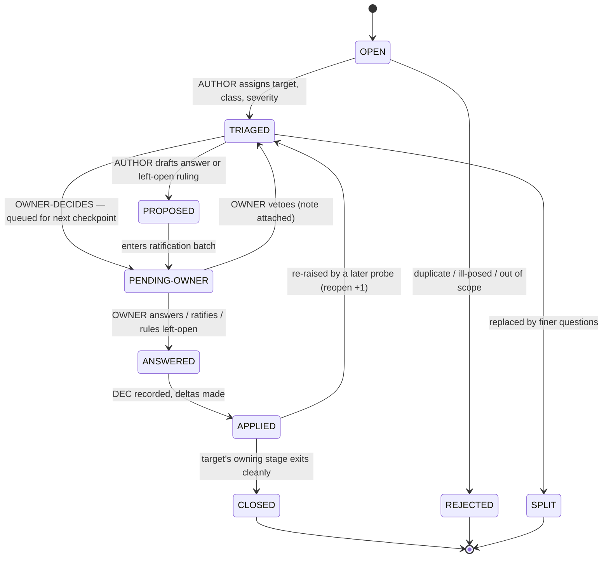
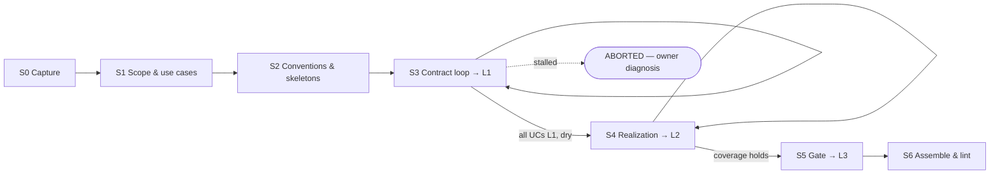
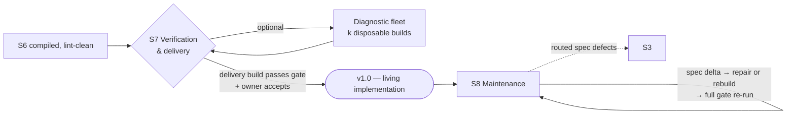

# The Idea→Spec→System Process

*Reshaped 2026-07-06 per the owner's review decisions, recorded as
[ADR-0001](../docs/adr/0001-use-cases-are-the-driving-artifact.md) through
[ADR-0005](../docs/adr/0005-documentation-deliverables-default-on-deferrable.md).
Companion: [`artifact-model.md`](artifact-model.md) (aligned) defines the spec model
this process produces — use case documents, shared sections, maturity levels L0–L3,
and consistency rules C1–C10. The original process (task-02, issue #22) is in git
history.*

**Alignment note.** [`README.md`](README.md) §3 and [`hardening/`](hardening/) are
**not yet realigned** — that is review round two. Where they conflict with this
document, this document and the ADRs control.

This document specifies the process that turns a raw idea — a few pages of intent,
like this repo's numbered idea files — into a spec whose use cases a human has
approved, whose consistency a linter has verified, and which an AI agent can
implement; and then keeps spec and implementation corresponding as both change. It
covers the whole life: authoring (S0–S6), verification and delivery (S7), and
maintenance (S8).

At any moment mid-run, four questions must be mechanically answerable:

| Question | Answered by |
|---|---|
| **Which stage am I in?** | the run ledger's `stage` field (§3.2) |
| **What do I do next?** | the current stage card's numbered activities (§6), starting from the first unmet exit criterion |
| **Is this stage done?** | the stage's numbered exit criteria, each individually checkable |
| **Where does this problem go?** | question triage (§4.2) before gates exist; the defect routing table (§8) after |

Contents:

1. [Principles](#1-principles)
2. [Roles](#2-roles)
3. [The workspace](#3-the-workspace)
4. [Records](#4-records)
5. [The stage graph and card format](#5-the-stage-graph-and-card-format)
6. [Stage cards S0–S8](#6-stage-cards-s0s8)
7. [Artifact production map](#7-artifact-production-map)
8. [Defect routing](#8-defect-routing)
9. [Numbers: constants, metrics, abort mechanics](#9-numbers-constants-metrics-abort-mechanics)
10. [Delivery, versioning, and re-verification](#10-delivery-versioning-and-re-verification)
- [Appendix A. The pressure-test protocol](#appendix-a-the-pressure-test-protocol)

---

## 1. Principles

**P1 — Pre-run the dialogue.** An implementing agent that cannot ask questions will
silently guess. The entire clarification dialogue is therefore run at spec time,
while there is someone to ask: that dialogue is the S3 question loop, and the
question record (§4.2) is its unit of work.

**P2 — Builds are evidence; keeping them is tactical** *(ADR-0004)*. A build that
fails, diverges, or invents decisions is evidence about the spec. Whether any given
implementation is kept and repaired or discarded and rebuilt is a per-change,
economic decision — never a process assumption. The spec is the source of truth; an
implementation that does not correspond to it has defects; having defects does not
mean starting over.

**P3 — No silent openness** *(ADR-0003)*. Every choice an implementation needs is
either decided in the spec or **explicitly left open by the owner**, on record, with
the implementer obligated to document what it picked. A choice that is open but not
on record is a defect. Hedge words outside a left-open citation are defects (rule
C6).

**P4 — Ignorance is the measurement instrument.** An author cannot see their own
curse of knowledge; a fresh reader with zero author context can. Probes and builders
measure what the documents alone convey — their questions, assumptions, and
inventions are the process's primary data.

**P5 — No unlogged deltas.** After an artifact goes CONTROLLED, every change to it
cites a decision or defect record. The metrics are only meaningful if the queues are
total.

**P6 — Stated numbers, tunable numbers.** Every loop, abort, and gate condition is
numeric, stated and justified in one place (§9.1), so the pressure test can tune
them.

**P7 — Humans review use cases; machines review the joins** *(ADR-0001/0002)*. Owner
checkpoints present use case documents and, late in the run, the compiled spec —
never the normalized internals. Consistency between co-located and shared content is
the linter's job, not the reviewer's.

---

## 2. Roles

Roles are context regimes with authority boundaries, not different intelligences.
OWNER is the exception — a human.

| Role | Kind | Lifetime | Context regime | Authority |
|---|---|---|---|---|
| **OWNER** | human | whole run | anything they choose | sole intent authority |
| **AUTHOR** | session | persistent across a run | full workspace | drafts, triages, applies, assembles, grades |
| **PROBE** | session | one probe run, then discarded | charter slice only (§4.7) | none — findings are data |
| **BUILDER** | session | one build | compiled spec only | none — output is graded; kept or discarded per §6 S7 |
| **REPAIRER** | session | one change | compiled spec @version, the change's records, the living implementation, the gate | none — output is graded by full gate re-run |

**OWNER** answers intent questions, dispositions scope assumptions, approves the use
case index and each use case's content, ratifies proposals, issues left-open rulings,
accepts or rejects delivered behavior, and chooses rebuild vs repair when the call is
not obvious. No other role may answer an intent question (single exception: the
pressure test's labeled provisionals, Appendix A).

**AUTHOR** executes the process: maintains the ledger and queues, drafts use cases
and shared sections, computes closures, dispatches probes/builders/repairers, and
assembles the gate. The AUTHOR may not answer intent questions and may not edit a
CONTROLLED artifact without a record.

**PROBE** is a fresh, ephemeral session whose entire context is fixed by a charter.
A probe is never reused across iterations. Three charters: P-ASSUME (S1), P-QCOUNT
(S3), P-IMPL (S4).

**BUILDER** implements the compiled spec in one pass, keeps an invention log, and
runs the smoke test. Used in S7 for the delivery build and for optional diagnostic
fleets.

**REPAIRER** applies a spec delta to the living implementation as a minimal change,
then re-runs the full gate. Its inventions are questions like anyone else's.

### 2.1 Owner interaction contract

The owner is the scarcest resource; every touch is batched and bounded.

- **Checkpoints.** S0 confirmation; S1 assumption dispositions + use case index
  approval + deliverables selection; one batch per S3 iteration (intent questions,
  ratifications, and left-open rulings, presented together **on the use case
  documents they affect**); S5 primary-use-case ratification if more than one
  candidate; S7 behavior acceptance per round; S8 change approvals.
- **Batch shape.** Each intent question arrives with the AUTHOR's proposed answer
  and a one-line statement of stakes (what observably differs between plausible
  answers). Proposals carry no force until adopted.
- **PENDING-OWNER.** Questions awaiting a checkpoint hold status `PENDING-OWNER`; a
  stage may not exit while a BLOCKER or MAJOR question is pending.
- **Veto semantics.** Ratification is per-item; a vetoed proposal returns to
  `TRIAGED` with the owner's note.

---

## 3. The workspace

### 3.1 Layout

One directory per spec run, mirroring [artifact-model §2](artifact-model.md#2-the-shape-of-a-spec):

```
<workspace-root>/<idea-slug>/
  ledger.md                 # run ledger (§3.2)
  idea-record.md            # S0 output (§4.1)
  records/
    questions.md            # question queue (§4.2)
    decisions.md            # decision log, incl. left-open decisions (§4.4)
    defects.md              # defect queue (§4.5)
    duplication.md          # duplication register (rule C9)
    metrics.md              # one row per checkpoint (§4.9)
  use-cases/
    index.md                # actors + goals, one line each
    UC-001-<slug>.md ...    # one document per use case (artifact-model §3)
  shared/
    vision-scope.md  glossary.md
    domain-model.md  behavior.md  failures.md  quality.md
    architecture.md  interfaces.md  algorithms.md  configuration.md
  gate/
    checklist.md  profiles.md  smoke-test.md
  probes/
    probe-S1.1.md ...       # one file per probe run: charter + verbatim report
    build-R1.1/ ...         # builder output per S7 build
  dist/
    spec.md                 # compiled single file (regenerated, never edited)
```

The living implementation lives in the project's own repository, recorded in the
ledger — not inside the spec workspace.

### 3.2 The run ledger

| Field | Type | Semantics |
|---|---|---|
| `idea` | String | slug + pointer to the source idea document |
| `run-id` | String | `<idea-slug>-<NN>`; a new run increments NN |
| `stage` | Enum{S0…S8, ABORTED} | current stage; S8 is standing after delivery |
| `spec-version` | String | `v0.<n>` during authoring; `v1.0` at delivery; then per §10 |
| `iteration` | Map<Stage, Int> | completed iterations per looping stage |
| `dry-streak` | Int | consecutive clean P-QCOUNT probes (S3 exit counter) |
| `stall-streak` | Int | consecutive non-improving S3 iterations (abort counter, §9.3) |
| `uc-levels` | Map<UC-ID, Enum{L0,L1,L2,L3}> | honestly scored maturity per use case |
| `deliverables` | table | documentation selection per ADR-0005: type → include / defer(reason) |
| `impl-repo` | String? | where the living implementation lives, once one exists |
| `artifact-modes` | Map<file, Enum{DRAFT, CONTROLLED}> | change-control state |
| `waivers` | List<String> | conscious waivers with justification (e.g. "profiles waived: no variation axis") |
| `stage-history` | table | stage, entered, exited, iterations, exit-evidence pointer |
| `harness-notes` | String | how the smoke test is executed against builds |

### 3.3 Change control and ID conventions

Artifact modes: **DRAFT** (producing stage not yet exited; AUTHOR edits freely) and
**CONTROLLED** (every delta cites a `DEC-###` or `BD-###` and arrives via a routed,
scoped re-entry). After delivery (v1.0), CONTROLLED additionally requires the
version-bump discipline of §10. One declared exception: the glossary grows with the
artifacts that introduce its terms until S4 exits.

IDs, fixed across runs: questions `Q-###`; decisions `DEC-###`; defects `BD-###`;
process defects `PD-###` (pressure test); probes `probe-S<stage>.<iteration>`;
builds `build-R<round>.<n>`; divergences `DIV-R<round>-<n>`; use cases and spec
elements per [artifact-model §7](artifact-model.md#7-ids-and-tags-the-machine-layer).
IDs are assigned once and never reused.

---

## 4. Records

Schema notation: `String`, `Int`, `Enum{A,B}`, `List<T>`, `Ref<T>`, `?` = optional.
Records live as table rows in the §3.1 files.

### 4.1 Idea record

Produced by S0, calibrated to this repo's idea files (short briefs with intent,
current state, open questions, dependency notes).

| Field | Type | Semantics |
|---|---|---|
| `source` | String | file path / conversation pointer for the raw idea |
| `statement` | String | the idea in the owner's words |
| `intended-users` | List<String> | the kinds of users, named concretely (seeds the use case index) |
| `success-statement` | String | ONE observable success a third party could grade pass/fail |
| `first-success` | String? | the newcomer's first meaningful success — the tutorial's destination (ADR-0005); may arrive at S1 |
| `imported-questions` | List<Ref<Q>> | open questions carried in from the source document |
| `scale-note` | String? | rough size call; binds nothing |
| `owner` | String | the human who holds intent authority |

The success statement is load-bearing: it matures into a goal (S1), selects the
**primary use case** (S3), and becomes the smoke test's spine (S5).

### 4.2 Question record

The unit of work for the whole process (P1). Questions are never deleted, only moved
through the lifecycle.

| Field | Type | Semantics |
|---|---|---|
| `id` | `Q-###` | stable |
| `text` | String | self-contained enough to answer without the raiser present |
| `raised-by` | Enum{OWNER, AUTHOR, PROBE, BUILDER, REPAIRER, IMPORT, CHECK} | CHECK = minted by a closure/lint computation |
| `raised-in` | String | stage.iteration coordinate |
| `target` | Ref<use case or shared element> | what the answer lands in; `UNASSIGNED` only before triage |
| `class` | Enum{OWNER-DECIDES, AUTHOR-PROPOSES, LEFT-OPEN-CANDIDATE} | assigned at triage; semantics below |
| `severity` | Enum{BLOCKER, MAJOR, MINOR} | rubric §4.3 |
| `status` | Enum{OPEN, TRIAGED, PROPOSED, PENDING-OWNER, ANSWERED, APPLIED, CLOSED, REJECTED, SPLIT} | lifecycle below |
| `resolution` | Ref<DEC> \| List<Ref<Q>> \| String | decision for answered; children for SPLIT; reason for REJECTED |
| `reopen-count` | Int | times re-raised after APPLIED |

**Question classes** — the triage decision:

- **OWNER-DECIDES** — the answer determines what the system observably is or does
  for its user in a way the stated goals do not already determine. Only the owner
  answers. *Test:* would the owner plausibly care which way this goes?
- **AUTHOR-PROPOSES** — any self-consistent answer serves the stated goals equally, but one
  must be fixed. AUTHOR proposes; owner batch-ratifies. *Test:* "it genuinely
  doesn't matter, but it must be pinned."
- **LEFT-OPEN-CANDIDATE** — the AUTHOR believes the implementer can choose better
  than the spec, **and** the options are indistinguishable to the acceptance
  criteria. The owner may then issue a **left-open ruling** (§4.4) — or decide it
  after all. *Test:* can you state today why the acceptance criteria cannot tell
  compliant options apart? If not, reclassify.

Precedence when unsure: **OWNER-DECIDES > AUTHOR-PROPOSES > LEFT-OPEN-CANDIDATE.**
Misclassifying downward risks intent being decided by inattention; misclassifying
upward merely costs a batch slot.

**Lifecycle:**



**Dedupe and reopen.** Duplicates force the same decision at the same locus; a new
match against an *open* question is discarded with a pointer; against an *APPLIED*
one it reopens (`reopen-count += 1`). Two reopens escalate severity one level.

Worked example (target idea `08-browser-history.md`):

> `Q-014` · raised-by PROBE · raised-in S3.2 · target UC-002 · class OWNER-DECIDES ·
> severity BLOCKER · status PENDING-OWNER · text: "Does 'filters to IT/software/AI
> content' mean a fixed owner-curated domain allowlist, or automatic topic
> classification? The two produce observably different queues for the same history."

### 4.3 Severity rubric

| Severity | Test | Example |
|---|---|---|
| **BLOCKER** | Two reasonable implementers would produce observably different behavior | Is dedup of the same URL across devices global or per-device? The queue's counts differ. |
| **MAJOR** | The implementer must invent a decision, but implementations likely converge | Where intermediate state is stored (everyone picks a local file/db). |
| **MINOR** | Cosmetic; no observable consequence | Section heading names in an output file. |

S7 runs the BLOCKER test empirically: an observed cross-build divergence on
contracted behavior is a BLOCKER by definition. Severity is independent of class —
an AUTHOR-PROPOSES question can be a BLOCKER.

### 4.4 Decision record

The sole authorization for controlled-mode deltas (P5) and the feedstock for the
rationale annex and the explanation docs (ADR-0005).

| Field | Type | Semantics |
|---|---|---|
| `id` | `DEC-###` | stable |
| `kind` | Enum{DECIDED, LEFT-OPEN} | LEFT-OPEN = the owner's explicit ruling not to decide (ADR-0003) |
| `resolves` | List<Ref<Q>> | questions this decision answers |
| `decided-by` | Enum{OWNER, RATIFIED, PROVISIONAL} | PROVISIONAL only inside the pressure test |
| `decision` | String | DECIDED: the answer, in normative language. LEFT-OPEN: the choice left to the implementer |
| `why-safe` | String | LEFT-OPEN only: why acceptance criteria cannot distinguish compliant options (rule C6) |
| `doc-obligation` | String | LEFT-OPEN only: what the implementer must document about its choice |
| `alternatives` | String? | what was considered and rejected, one line each — explanation-doc feedstock |
| `deltas` | List<String> | element-level changes: `<id> ADD\|CHANGE\|DELETE` |
| `rationale` | String | one line: why this answer |
| `made-at` | String | stage.iteration |

Worked examples:

> `DEC-009` · kind DECIDED · resolves Q-014 · decided-by OWNER · decision: "Content
> filtering is topic classification; a curated domain allowlist exists only as the
> cold-start seed." · alternatives: "allowlist-only (can't surface new interests);
> hybrid with manual override (deferred to a later use case)" · deltas: `UC-002.S2
> CHANGE, C-DM-004 CHANGE` · rationale: "allowlist alone can't surface *new*
> interests, which is the point" · made-at S3.2

> `DEC-017` · kind LEFT-OPEN · resolves Q-021 · decided-by OWNER · decision: "Queue
> state storage is the implementer's choice." · why-safe: "acceptance criteria
> observe the queue only through the CLI; file vs sqlite is indistinguishable" ·
> doc-obligation: "state the storage mechanism and its location in the
> implementation README" · made-at S3.3

### 4.5 Defect record

Minted in S6 lint, S7 grading, and S8 maintenance. The routing table (§8) consumes
`class`.

| Field | Type | Semantics |
|---|---|---|
| `id` | `BD-###` | stable |
| `found-in` | Ref<build \| DIV \| check \| field report> | where the evidence came from |
| `class` | Enum{INTENT_GAP, CONTRACT_GAP, REALIZATION_GAP, GATE_GAP, LINT, IMPL_DIVERGENCE} | semantics below |
| `severity` | Enum{BLOCKER, MAJOR, MINOR} | same rubric |
| `evidence` | String | enough to re-find the defect |
| `routed-to` | Enum{S1, S3, S4, S5, S6, IMPL} | per §8 |
| `resolution` | Ref<DEC>? | the decision/deltas that fixed it |
| `status` | Enum{OPEN, ROUTED, RESOLVED, VERIFIED} | VERIFIED = no longer reproduces |

Class semantics:

- **INTENT_GAP** — the missing decision was the owner's; includes gate-passing
  behavior the owner rejects.
- **CONTRACT_GAP** — observable behavior undetermined by the use cases + shared
  contract + left-open rulings: implementers diverged or invented where the spec
  should have spoken.
- **REALIZATION_GAP** — the contract speaks but the realization fails it: interface
  mismatch, undefined helper, missing default.
- **GATE_GAP** — the gate failed as an instrument: a violation passed, a criterion is
  unverifiable, or gate and body disagree (the body wins).
- **LINT** — mechanical hygiene violation with a semantics-preserving fix.
- **IMPL_DIVERGENCE** *(new, ADR-0004)* — the spec already determines the behavior
  and the implementation does not conform. Fixed in the implementation; no spec
  delta.

The router's question (§8): *does the minimal fix change what a conforming
implementation is?* Yes → a spec-side class. No, the spec already determines it →
IMPL_DIVERGENCE.

### 4.6 Probe charters

A probe run is a fresh session given exactly a charter: probe ID, the verbatim
context slice (a file list — nothing else enters the session), the pinned prompt
template, and the output schema. Reports are archived verbatim under `probes/`.

- **P-ASSUME** (S1). Context: the idea record (plus the vision & scope draft on
  re-probes). Output: every assumption a fresh reader makes about what is in and out
  of scope, and every user goal they expect the system to serve. Ingestion: the
  disposition worklist (S1 activity 3) — the goal guesses double as use case
  candidates.
- **P-QCOUNT** (S3). Context: vision & scope, glossary, the use case set, the shared
  contract sections, and the decision log's left-open rulings (so settled deferrals
  are not re-raised as noise). Output: every question the reader would need answered
  before implementing, each with a forced-guess note. Ingestion: dedupe, mint Q
  records, triage.
- **P-IMPL** (S4). Context: the compiled draft. Task: implement one module — the
  component with the highest count of distinct scenario-step citations; iteration
  *j* probes the *j*-th ranked component. Output: an invention log. Ingestion: every
  invention becomes a question.
- **BUILDER** (S7). Context: `dist/spec.md` only. Task: build the system in one
  pass; where the document says a choice is left open, make it and document it as
  the document requires; keep an invention log; run the smoke test and report its
  output verbatim.
- **REPAIRER** (S8). Context: `dist/spec.md` at the pinned version, the change's
  decision/defect records, the living implementation, and the gate. Task: apply the
  minimal change that restores correspondence; run the full gate; report the
  transcript and any inventions.

### 4.7 Divergence record

Produced by S7 diagnostic rounds (and S8 when parallel repairs are ever compared).

| Field | Type | Semantics |
|---|---|---|
| `id` | `DIV-R<round>-<n>` | stable within the run |
| `locus` | List<Ref<element>> \| String | where builds differ |
| `observations` | Map<build-id, String> | what each build observably did |
| `classification` | Enum{CONTRACTED_DIVERGENCE, LEFT_OPEN_OK, LEFT_OPEN_TOO_WIDE} | below |
| `defect` | Ref<BD>? | minted for the two defect classes |

- **CONTRACTED_DIVERGENCE** — builds differ on behavior the contract governs (or
  should govern). Always a CONTRACT_GAP BLOCKER.
- **LEFT_OPEN_OK** — builds differ within a left-open ruling and each documented its
  choice. Not a defect; the ruling working as intended.
- **LEFT_OPEN_TOO_WIDE** — the divergence flips a gate outcome, so the acceptance
  criteria *can* distinguish the options: the ruling's `why-safe` claim is false.
  CONTRACT_GAP, routed to S3 to decide or narrow it.

### 4.8 Metrics row

One row appended to `records/metrics.md` at every checkpoint: probe ingestions,
stage exits, S7 rounds, S8 changes. Columns are §9.2's metric names plus the
coordinate (stage.iteration, spec-version, timestamp). Rows are never revised.

---

## 5. The stage graph and card format

Authoring:



Delivery and maintenance:



Routed re-entries (dashed in spirit): any defect routes to its owning stage per §8,
runs scoped, and returns through S6 (recompile + lint) before the next build or
repair is graded.

**Stage card format.** Purpose · Executors · Entry criteria (`S<n>-E<k>`) · Inputs ·
Activities (numbered) · Outputs · Exit criteria (`S<n>-X<k>`, conjunctive) · Loop &
guards · Metrics · Routes in.

---

## 6. Stage cards S0–S8

### S0 — Capture

**Purpose.** Normalize a raw idea into an idea record with owner sign-off: whose
intent, who it is for, one observable success.

**Executors.** OWNER, AUTHOR.

**Entry criteria.** S0-E1: an idea exists in prose; a human owner is identified.

**Activities.**
1. Initialize workspace and ledger; `stage = S0`, `spec-version = v0.1`.
2. Draft the idea record (§4.1): statement, intended users, success statement,
   first-success if the owner has one in mind.
3. Import every pre-existing open question as a Q record (`raised-by: IMPORT`).
4. Owner checkpoint: confirm or correct the fields; adopting the success statement
   is an intent act.

**Outputs.** `idea-record.md`; seeded question queue; ledger.

**Exit criteria.**
- S0-X1: statement, intended users, and success statement filled; the success
  statement is observable (checkable by a third party without reading internals).
- S0-X2: owner confirmed all three.
- S0-X3: every open-question bullet in the source exists as a Q record.

**Loop & guards.** None — single pass.

**Metrics.** `imported_q`, `wall_clock(S0)`.

**Routes in.** None. If the owner later repudiates the success statement, that is a
new run, not a routed fix.

### S1 — Scope & use case discovery

**Purpose.** Fix the boundary and the goal inventory before anything is drafted.
The assumption probe enumerates what a fresh reader assumes in scope *and which user
goals they expect served*; the owner dispositions both. Output: vision & scope, the
use case index, and an L0 sketch per use case — the owner's first real review
surface (P7).

**Executors.** AUTHOR, PROBE (P-ASSUME), OWNER.

**Entry criteria.** S1-E1: S0 exited.

**Activities.**
1. Dispatch P-ASSUME against the idea record; archive the report.
2. Build the disposition worklist: probe assumptions ∪ probe goal-guesses ∪ AUTHOR's
   known assumptions ∪ assumptions latent in imported questions.
3. Owner checkpoint: disposition every row — IN (scope/goal content) or OUT
   (non-goal with extension point); unsettled rows become OWNER-DECIDES questions.
   Each disposition is a DEC row.
4. Draft vision & scope: problem, goals as principles (the success statement becomes
   one), non-goals with extension points, boundary notes, the dependency register.
5. Draft the **use case index**: actors (from intended users + dispositions), one
   line per goal. Draft an **L0 sketch** for every indexed use case (identity +
   narrative).
6. Owner checkpoint: approve the index ("these are the things it does, for these
   people") and record the **deliverables selection** (ADR-0005): each documentation
   type include or defer-with-reason. Confirm or supply the first-success statement
   (the tutorial's destination) unless tutorials are deferred.
7. If dispositions materially changed the boundary, re-probe (fresh P-ASSUME against
   idea record + vision draft) and repeat from 2.

**Outputs.** `shared/vision-scope.md` (→ CONTROLLED); `use-cases/index.md` (→
CONTROLLED); L0 sketches (DRAFT); deliverables selection in the ledger.

**Exit criteria.**
- S1-X1: latest P-ASSUME report has zero undispositioned assumptions (1 clean probe
  suffices, §9.1).
- S1-X2: vision & scope complete per artifact-model §5, including the dependency
  register and the deliverables selection.
- S1-X3: the index is owner-approved; every indexed use case has an L0 sketch;
  every index row serves a stated goal.
- S1-X4: no open BLOCKER or MAJOR question targets vision & scope or the index.

**Loop & guards.** Probe → disposition → redraft until S1-X1. No stall guard: if
the owner cannot disposition, the idea has no boundary yet, and the conversation it
forces is the fix.

**Metrics.** `assumptions_total`, `assumptions_undispositioned`, `uc_count`,
`owner_touches(S1)`, `iterations(S1)`, `wall_clock(S1)`.

**Routes in.** Scope-level INTENT_GAP: disposition the new feature/exclusion, delta
vision & scope and the index, and check whether existing use cases or shared
elements are stranded (re-open S3 scoped to them if so).

### S2 — Conventions & skeletons

**Purpose.** Fix document conventions before the first contract sentence, and make
incompleteness countable: every use case file and shared section exists with real
content or explicit question references — no blanks. From here, "how incomplete is
the spec" is a query over the question queue.

**Executors.** AUTHOR.

**Entry criteria.** S2-E1: S1 exited.

**Activities.**
1. Author the glossary's conventions half: keyword regime, type-notation legend;
   seed term definitions from the idea record and vision & scope.
2. Instantiate every use case file with the artifact-model §3 section skeleton (L0
   content carried in; every empty section gets ≥1 `Q-###` bullet). Instantiate
   shared-section skeletons the same way. Instantiate `gate/profiles.md` only if a
   variation axis is already visible; otherwise record the waiver.
3. Assign a target to every `UNASSIGNED` question.
4. Begin ID discipline: every element defined from now on carries its `[#…]` tag.

**Outputs.** Glossary conventions (fixed); skeletons (DRAFT); a fully-targeted
question queue — the day-one incompleteness census.

**Exit criteria.**
- S2-X1: all use case files and shared sections exist (or carry a logged waiver).
- S2-X2: zero blank sections — content or ≥1 `Q-###` reference (greppable).
- S2-X3: keyword regime and notation legend complete.
- S2-X4: every open question has a target.

**Loop & guards.** None — single pass.

**Metrics.** `open_q` by target and severity; `wall_clock(S2)`.

**Routes in.** LINT-class convention defects only.

### S3 — Contract loop (use cases to L1)

**Purpose.** The core loop. Drive every in-scope use case to L1: structured
scenarios, resolved extensions, resolving data references, explicit guarantees,
checkable acceptance criteria — with every question a reader would need answered
either answered or explicitly left open by the owner (P1, P3). The owner reviews
**use case documents**, not normalized internals (P7).

**Executors.** AUTHOR (draft, triage, apply), PROBE (P-QCOUNT, one per iteration),
OWNER (one checkpoint per iteration).

**Entry criteria.**
- S3-E1: S2 exited.
- S3-E2: no open BLOCKER targets vision & scope, the index, or the glossary
  conventions.

**Activities** (iteration *i*):
1. **Draft.** Extend the domain model, then use case scenarios/extensions/data/
   criteria, then shared behavior/failures/quality as reach demands (the split rule:
   content used by ≥2 use cases moves to shared and is referenced). Keep contract
   purity (C2). New shared terms get glossary definitions in the same iteration.
2. **Owner checkpoint.** Present, per affected use case: OWNER-DECIDES questions
   with proposed answers and stakes; AUTHOR-PROPOSES answers for ratification; LEFT-OPEN-CANDIDATE
   rulings with drafted `why-safe` and `doc-obligation`.
3. **Apply.** DEC rows; deltas; IDs on new elements; left-open citations placed at
   the choice sites.
4. **Closure computation** (CHECK): `enum_closure`, `transition_closure`,
   `extension_coverage` (§9.2). Every hole mints a question.
5. **Probe.** Dispatch a fresh P-QCOUNT against the current packet (§4.6).
6. **Ingest.** Dedupe, mint, triage.
7. **Account.** Metrics row; update `dry-streak`, `stall-streak`, `uc-levels`;
   evaluate exit/stall/cap.

**Outputs.** Use cases at L1; `shared/domain-model.md`, `behavior.md`,
`failures.md`, `quality.md` (all → CONTROLLED at exit).

**Exit criteria.**
- S3-X1: **Dry** — the last `D_dry = 2` consecutive P-QCOUNT probes yielded zero new
  non-duplicate BLOCKER or MAJOR questions.
- S3-X2: `enum_closure = transition_closure = extension_coverage = 1.0`.
- S3-X3: every in-scope use case is at L1 (honest scores, rule C10).
- S3-X4: every left-open decision has `why-safe` and `doc-obligation` filled.
- S3-X5: no question in `PROPOSED` or `PENDING-OWNER`.

**Loop & guards.**
- **Stall/abort:** with `W_i` = open BLOCKER+MAJOR count after iteration *i*, if
  `W_i ≥ W_{i-1}` for `M_abort = 3` consecutive iterations, stop; ledger → ABORTED;
  the sorted backlog is the diagnosis (§9.3).
- **Cap:** at `I_S3max = 8` iterations, convene the owner; the usual verdict is
  "split the idea."

**Metrics.** `new_q(sev)` per probe, `open_q(sev)` burn-down, closures,
`uc_l1_rate`, `reopens`, `owner_touches(S3)`, `iterations(S3)`, `wall_clock(S3)`.

**Routes in.** INTENT_GAP and CONTRACT_GAP. Scoped re-entry runs activities 2–4 for
the routed records, recomputes touched closures, and flags gate sync. If a scoped
re-entry mints any new BLOCKER beyond the routed set, the contract was not dry —
full loop resumes (`dry-streak = 0`).

### S4 — Realization (use cases to L2)

**Purpose.** Realize the contract: architecture, interfaces, algorithms,
configuration — every system-side step mapped, every touched knob defaulted, every
element serving something (C5). Then prove implementability with an ignorant probe.

**Executors.** AUTHOR, PROBE (P-IMPL), OWNER (only via escalation).

**Entry criteria.**
- S4-E1: S3 exited (the ordering that prevents contract questions being answered
  silently by realization choices).
- S4-E2: contract-side files CONTROLLED (glossary exception, §3.3).

**Activities** (iteration *j*):
1. Author the architecture sketch: components citing the obligations they discharge;
   porting seams citing quality constraints.
2. Walk the coverage worklist: interfaces (signatures, tool/endpoint blocks,
   grammars, wire formats), then algorithms (witnesses for deterministic
   procedures), then configuration (defaults at point of definition; resolution
   chains as total orders; left-open defaults citing their rulings).
3. Annotate each use case's steps with their step→surface mapping (the L2
   annotation).
4. Fill Examples sections: ≥1 input→output pair per format boundary per use case;
   shared format inputs in `shared/` examples where they span use cases.
5. **Coverage computation** (CHECK): `step_map_coverage`, `element_serving_rate`,
   `defaults_closure` (§9.2); violations mint questions.
6. **Probe.** Dispatch P-IMPL (§4.6); every invention becomes a question —
   OWNER-DECIDES inventions escalate (they are contract holes; §8).
7. Account; update `uc-levels`.

**Outputs.** `shared/architecture.md`, `interfaces.md`, `algorithms.md`,
`configuration.md` (→ CONTROLLED); use cases at L2.

**Exit criteria.**
- S4-X1: `step_map_coverage = 1.0` and `element_serving_rate = 1.0` (C5 both ways).
- S4-X2: `defaults_closure = 1.0`.
- S4-X3: latest P-IMPL invention log has zero BLOCKER inventions (1 clean probe,
  §9.1).
- S4-X4: every in-scope use case at L2; no BLOCKER/MAJOR open against realization.
- S4-X5: helper closure — every pseudocode helper resolves (C1's greppable slice).
- S4-X6: example coverage per activity 4.

**Loop & guards.** Iterate while unmet; successive probes broaden module coverage.
No stall guard: realization questions are AUTHOR-answerable (intent-shaped ones
escalate out).

**Metrics.** `inventions(sev)` per probe, coverage rates, `uc_l2_rate`,
`iterations(S4)`, `wall_clock(S4)`.

**Routes in.** REALIZATION_GAP: fix the element, recompute coverage over touched
elements, flag gate sync if the public surface changed.

### S5 — Gate (use cases to L3)

**Purpose.** Assemble the oracle. Per-use-case acceptance criteria plus
shared-element criteria become the system checklist; the primary use case becomes
the smoke test; variation axes become profiles. A claim that resists a mechanical
check is a body defect and routes back (the resistance rule).

**Executors.** AUTHOR, OWNER (ratifies the primary use case if more than one
candidate).

**Entry criteria.** S5-E1: S4 exited; contract and realization CONTROLLED.

**Activities.**
1. Inventory every normative element (`[#…]` grep) and every acceptance criterion.
2. Assemble `gate/checklist.md`: every use case criterion, plus criteria for shared
   invariants/machines/constraints, each item tagged `[checks: …]`. **Resistance
   rule:** an item that cannot be phrased mechanically is not written as a judgment
   item — a question is minted against the claim and routed (S3/S4); count it in
   `routed_back_claims`.
3. One checklist item per left-open decision: "implementation documents its choice
   per DEC-NNN."
4. Re-evaluate the profiles trigger (variation axis in vision & scope, per-variant
   realization, or optional features): build the axis × requirement matrix / named
   profiles, or confirm the waiver.
5. Author `gate/smoke-test.md`: executable end-to-end script through the public
   surface covering the **primary use case** (success statement → primary use case →
   smoke test), vectors promoted from Examples, every ASSERT tagged.
6. Coverage computation (CHECK): `gate_coverage`, `checkable_rate` (§9.2).

**Outputs.** `gate/*` (→ CONTROLLED); use cases at L3.

**Exit criteria.**
- S5-X1: `gate_coverage = 1.0` (C7: every criterion and shared normative element
  covered; every goal served by gated use cases).
- S5-X2: `checkable_rate = 1.0`.
- S5-X3: every smoke ASSERT carries `[checks:]`; every left-open decision has its
  documentation item.
- S5-X4: every in-scope use case at L3; no BLOCKER/MAJOR open against the gate.
- S5-X5: the smoke test drives the system exclusively through the public surface.

**Loop & guards.** Work the inventory until closed; a claim that bounces twice
escalates to the owner (it usually conceals an intent question).

**Metrics.** `gate_coverage`, `checkable_rate`, `routed_back_claims`,
`wall_clock(S5)`.

**Routes in.** GATE_GAP: missing/unverifiable item or gate-vs-body conflict (the
body wins; if the intended behavior is contracted nowhere, S3/S4 first — the gate
never creates obligations).

### S6 — Assembly & lint

**Purpose.** Compile the one distributable file, generate derived views, export
documentation feedstock, and run the deterministic lint suite (C1–C10's mechanical
slice). Zero tolerance: findings are fixed (semantics-preserving) or reclassified
and routed.

**Executors.** AUTHOR.

**Entry criteria.** S6-E1: S5 exited.

**Activities.**
1. Compile `dist/spec.md` per artifact-model §8 (use cases in slot 3; attachment
   rule; tags survive verbatim).
2. Generate derived views: ToC, config cheat-sheet, consolidated references —
   marked derived, regenerated every compile.
3. Compile the rationale annex from the decision log; sweep normative text for
   stray rationale. Export the **full decision log** (including `alternatives` and
   left-open rulings) as documentation feedstock (ADR-0005) for the deliverables
   selected in the ledger.
4. **Lint**: reference closure (C1); contract purity (C2); scenario–machine
   consistency (C3); extension coverage (C4); hedge words outside left-open
   citations (C6); re-run of the S4/S5 coverage computations over the compiled
   file (C5, C7); tag syntax and ID uniqueness; duplication register complete —
   every registered duplicate has a covering check and no unregistered duplicates
   detected (C9); level-claim honesty (C10); annex force check (C8).
5. Question hygiene: every question terminal (CLOSED, REJECTED, or SPLIT).
6. Mass check per artifact-model §8; deviations justified in the ledger.
7. Bump `spec-version`; record the compile.

**Outputs.** `dist/spec.md`; rationale annex; docs feedstock; lint report.

**Exit criteria.**
- S6-X1: `lint_errors = 0`.
- S6-X2: every question terminal; nothing idles at APPLIED.
- S6-X3: all derived views regenerated in this compile.
- S6-X4: mass within envelope or justified.

**Loop & guards.** Fix → re-lint until clean. A finding whose fix would change
meaning is reclassified and routed — S6 never silently legislates semantics.

**Metrics.** `lint_errors` (first pass, final), `mass_lines`, `wall_clock(S6)`.

**Routes in.** LINT.

### S7 — Verification & delivery

**Purpose.** Get a conforming implementation and an owner who accepts its behavior.
Two instruments, chosen tactically (P2): an optional **diagnostic fleet** of
disposable parallel builds (the cheapest known way to expose where the spec lets
reasonable implementers diverge), and the **delivery build**, which is kept and
becomes the living implementation.

**Executors.** BUILDER ×k, AUTHOR (dispatch, grading, divergence analysis, routing),
OWNER (mode choice; behavior acceptance).

**Entry criteria.**
- S7-E1: S6 exited (rounds always grade a lint-clean compiled spec).
- S7-E2: grading harness noted in the ledger.

**Activities** (round *r*):
1. Pin `spec-version` for the round.
2. **Mode choice (owner, first round; AUTHOR may recommend):**
   - *Diagnostic fleet* — dispatch `k_diag = 3` independent disposable BUILDERs;
     grade each; pairwise divergence analysis; mint DIV and BD records; these builds
     are archived and never repaired. Recommended for a brand-new spec, or after a
     major contract change, when cheap evidence of contract gaps is worth more than
     the tokens. The evidence-grade setting (5 builds, twice, on unchanged text)
     exists for when the owner wants strong one-shot-completeness evidence — never
     required.
   - *Delivery build* — dispatch one BUILDER whose output is kept.
3. Grade the delivery build: execute the smoke test verbatim; walk every checklist
   item; fill every applicable profile cell; audit left-open documentation items.
4. **Owner review:** what the build observably does, per use case — transcripts and
   outputs, not descriptions. "Passes all gates" is not evidence; gate-passing
   behavior the owner rejects is the INTENT_GAP + GATE_GAP pair (§8).
5. Route defects (spec-side per §8; IMPL_DIVERGENCE → fix the delivery build in
   place — it is not disposable); after any spec delta, S6 recompile, then re-grade.
6. Ledger and metrics.

**Outputs.** The delivery build → the **living implementation** (adopted into its
own repo, recorded in the ledger); DIV/BD records; round metrics.

**Exit criteria.**
- S7-X1: the delivery build passes the full gate (smoke test, checklist, applicable
  profile cells, left-open documentation audit) **and** the owner accepts the
  behavior per use case. Tag `spec-version = v1.0`; ledger stage → S8.
- S7-X2 (alternative): owner-approved suspension (park the run; ledger notes why).

**Loop & guards.** Iterate grade → route → recompile → re-grade. **Cap:** at
`R_S7max = 6` rounds, convene the owner — recurring same-class defects mean the
routed stage's fixes are not landing, which is a process defect, not build luck.

**Metrics.** `pass_rate` (fleet), `div_defects`, `inventions`, `bd_by_class`,
`owner_rejections`, `iterations(S7)`, `wall_clock(S7)`.

**Routes in.** None — S7 is a router source.

### S8 — Maintenance (standing)

**Purpose.** The steady state (ADR-0004): keep spec and living implementation
corresponding as both change, at small-change cost. Inputs: change requests, field
feedback, and defects found in use.

**Executors.** OWNER (approves changes), AUTHOR (records, routes, recompiles),
REPAIRER or BUILDER (per the tactical call).

**Entry criteria.** S8-E1: v1.0 delivered; living implementation recorded.

**Activities** (per change):
1. **Record.** The change arrives as a question ("should it…?"), a defect ("it
   doesn't…"), or new intent ("I also want…"). Mint the record.
2. **Trace feedback first** (ADR-0003 payoff): if the complaint is "that's not what
   I want" about behavior the spec permits, check the left-open rulings — a ruling
   whose latitude produced the unwanted behavior is the defect (`LEFT_OPEN_TOO_WIDE`
   → decide or narrow it). If the spec determines the behavior and the
   implementation deviates, it is IMPL_DIVERGENCE — no spec delta.
3. **Spec delta** (when the spec side changes): scoped re-entry per §8 routing;
   affected use cases re-approved by the owner if their scenarios changed; S6
   recompile + lint; version bump per §10.
4. **Tactical call — repair or rebuild** (owner decides when non-obvious; default
   is repair):
   - *Repair* when the blast radius is bounded: dispatch a REPAIRER with the delta's
     records; minimal change; full gate re-run proves correspondence.
   - *Rebuild* when the change invalidates the implementation's architecture, when
     accumulated repairs have made the implementation worse than regeneration, or
     when the owner wants fresh diagnostic evidence — then S7 runs again for the new
     delivery build (optionally with a diagnostic fleet first).
5. **Documentation repair** (ADR-0005): the selected documentation types are updated
   with the same change, from the same records.
6. **Verify.** Full gate re-run on the resulting implementation. Green gate + owner
   acceptance (for behavior-visible changes) closes the change; metrics row.

**Outputs.** Updated spec version; updated living implementation; updated docs;
closed records.

**Exit criteria.** None — standing. Each change closes individually per activity 6.

**Loop & guards.** A change whose repair fails the gate twice escalates to the
owner with the rebuild option priced descriptively (what's involved, not
wall-clock). Recurring IMPL_DIVERGENCE in the same area suggests the spec is
under-determined there — mint the CONTRACT_GAP.

**Metrics.** `changes_closed`, `repair_vs_rebuild`, `gate_rerun_pass`,
`bd_by_class(S8)`, `left_open_feedback_hits`, `wall_clock(change)`.

**Routes in.** Everything post-delivery.

---

## 7. Artifact production map

Every file is produced by exactly one stage — the stage whose exit flips it to
CONTROLLED. After that, changes arrive only via routed records.

| File(s) | Produced by | Revised by (routes) |
|---|---|---|
| `idea-record.md` | S0 | new run only |
| `shared/vision-scope.md`, `use-cases/index.md` | S1 | scope-level INTENT_GAP via S1 |
| `shared/glossary.md` | S2 (conventions; glossary half grows until S4 exit) | LINT via S6; term additions ride their introducing decisions |
| `use-cases/UC-*.md` | S3 to L1; annotated to L2 in S4; gated to L3 in S5 | INTENT_GAP / CONTRACT_GAP via S3; REALIZATION_GAP (mapping) via S4; GATE_GAP (criteria) via S5 |
| `shared/domain-model.md`, `behavior.md`, `failures.md`, `quality.md` | S3 | INTENT_GAP / CONTRACT_GAP via S3 |
| `shared/architecture.md`, `interfaces.md`, `algorithms.md`, `configuration.md` | S4 | REALIZATION_GAP via S4 |
| `gate/checklist.md`, `profiles.md`, `smoke-test.md` | S5 | GATE_GAP via S5 (assembly re-run) |
| `dist/spec.md`, rationale annex, docs feedstock | S6 (regenerated every compile) | LINT via S6 |
| living implementation + documentation | S7 (delivery build) | S8 (repair or rebuild) |

Left-open decisions are minted wherever their question was triaged (usually S3);
`records/*` files are append-mostly and never CONTROLLED.

---

## 8. Defect routing

### 8.1 The routing table

"Gate sync" = after the fix, re-run checklist assembly over every touched element.

| Class | Definition | Typical detector | Routed to | Gate sync |
|---|---|---|---|---|
| **INTENT_GAP** | The missing decision was the owner's | builder/repairer invented an owner-level choice; owner rejects gate-passing behavior | **S3** (scope-level cases → **S1** first) | always |
| **CONTRACT_GAP** | Observable behavior undetermined by use cases + shared contract + left-open rulings | contracted divergence across fleet builds; `LEFT_OPEN_TOO_WIDE`; BLOCKER invention on observable behavior | **S3** | always |
| **REALIZATION_GAP** | Contract speaks; realization fails it | interface mismatch; undefined helper; missing default forced an invention | **S4** | if public surface changed |
| **GATE_GAP** | The gate failed as an instrument | violation passed; unverifiable item; gate-vs-body conflict (body wins) | **S5** (body element first via S3/S4 if the behavior is contracted nowhere) | n/a — this is the sync |
| **LINT** | Mechanical, semantics-preserving fix | S6 suite findings | **S6** | no |
| **IMPL_DIVERGENCE** | Spec determines it; implementation deviates | gate re-run failure whose minimal fix is in code | **IMPL** (repair the implementation; no spec delta) | no |

**Reclassification rule.** The router asks: *does the minimal fix alter what a
conforming implementation is?* A dangling config key might be a typo (LINT) or a
missing domain-model field (CONTRACT_GAP). A failed gate item might be a spec hole
(spec-side) or a code bug (IMPL_DIVERGENCE). S6 never silently legislates; IMPL
never silently absorbs a spec gap.

### 8.2 Routing mechanics

- **Scoped re-entry.** A routed record re-opens its stage scoped to the record: only
  the activities needed, only the exit criteria its deltas touch. Ledger logs
  `S<k> (scoped: BD-nnn)`.
- **Escape guard.** If a scoped re-entry mints any new BLOCKER beyond the routed
  set, the stage re-opens fully (for S3, `dry-streak = 0`).
- **Records-only deltas** (P5). CONTROLLED files change only inside scoped
  re-entries, every delta citing its record.
- **Intent-after-S3 rule.** Any owner-level question raised after S3 exit — by
  P-IMPL, gate assembly, a builder, or a repairer — is by definition a contract gap
  (the dialogue was supposed to be pre-run, P1). It routes to S3; it is never
  answered in place.
- **Recompile rule.** Any spec delta → S6 recompile + lint before the next grading
  or repair.
- **Sequencing.** Multi-class rounds apply routes in order S1/S3 → S4 → S5 → S6 →
  IMPL, so downstream fixes see settled upstream text.

---

## 9. Numbers: constants, metrics, abort mechanics

### 9.1 Constants

Stated once, tunable by pressure-test evidence (P6).

| Constant | Value | Gate | Justification |
|---|---|---|---|
| `D_dry` | 2 consecutive clean P-QCOUNT probes | S3-X1 | One dry probe can be one reader's blind spots; two independent ignorant readers finding nothing is strong evidence. |
| `M_abort` | 3 consecutive non-improving iterations | S3 stall | One plateau is legitimate; three consecutive means answers spawn questions at ≥ replacement rate — unstable intent, which more iteration cannot fix. |
| `I_S3max` | 8 iterations | S3 cap | This repo's ideas are short briefs; eight non-stalled iterations without dryness means the scope is several ideas. |
| S1 clean probes | 1 | S1-X1 | The assumption space is small and S3's probes re-cover scope continuously. |
| S4 clean probes | 1 | S4-X3 | P-IMPL is the most expensive probe; its failure mode is re-tested by every build and repair. |
| `k_diag` | 3 builds | S7 diagnostic fleet | The smallest k where divergence analysis is non-trivial (three pairwise comparisons). Evidence-grade option: 5 builds × 2 rounds on unchanged text, when the owner wants strong one-shot evidence — never required (ADR-0004). |
| `R_S7max` | 6 rounds | S7 cap | Beyond it, failures are structural (fixes not landing), not stochastic. |
| Reopen escalation | 2 reopens → +1 severity | §4.2 | A question whose applied answer failed to stick twice is harder than its grade. |
| Repair escalation | 2 failed gate re-runs → owner + rebuild option | S8 | Two failed repairs on one change suggest the repair path is fighting the architecture. |

### 9.2 Metric definitions

| Metric | Formula | Recorded at |
|---|---|---|
| `imported_q` | Q records with `raised-by: IMPORT` | S0 exit |
| `assumptions_total` / `assumptions_undispositioned` | rows in latest P-ASSUME / rows lacking a disposition | S1 probe ingestions |
| `uc_count` | rows in the index | S1 exit |
| `open_q(sev)` | Q records at severity *sev* in non-terminal, non-APPLIED status | every checkpoint |
| `new_q(sev)` | Q records minted from the current probe after dedupe | probe ingestions |
| `reopens` | Σ reopen-count | every checkpoint |
| `enum_closure` | fully-enumerated enums ÷ enums declared | S3 iterations |
| `transition_closure` | resolved (state, event) cells ÷ total, per shared machine | S3 iterations |
| `extension_coverage` | steps with extensions resolved ÷ total steps, across in-scope use cases | S3 iterations |
| `uc_l1_rate` / `uc_l2_rate` / `uc_l3_rate` | use cases at ≥ that level ÷ in-scope use cases | stage iterations |
| `step_map_coverage` | system-side steps mapped to surface elements ÷ total | S4 iterations |
| `element_serving_rate` | realization elements serving ≥1 step or shared obligation ÷ total | S4 iterations |
| `defaults_closure` | knobs touched by use cases with a default or left-open citation ÷ total | S4 iterations |
| `inventions(sev)` | invention-log entries, per probe/builder/repairer | S4, S7, S8 |
| `gate_coverage` | criteria + shared normative elements covered by the assembled checklist ÷ total | S5, after gate syncs |
| `checkable_rate` | mechanically checkable items ÷ items | S5 |
| `routed_back_claims` | claims bounced by the resistance rule | S5 |
| `lint_errors` | S6 suite findings (first pass, final) | S6 |
| `mass_lines` | line count of `dist/spec.md` | S6 |
| `pass_rate` | fleet builds passing ÷ k | S7 diagnostic rounds |
| `div_defects` | CONTRACTED_DIVERGENCE + LEFT_OPEN_TOO_WIDE records | S7 rounds |
| `bd_by_class` | defect records minted, by class | S7 rounds, S8 changes |
| `changes_closed` | S8 changes closed per activity 6 | S8 changes |
| `owner_rejections` | behavior-acceptance rejections | S7 rounds, S8 changes |
| `repair_vs_rebuild` | tactical calls, per kind | S8 |
| `gate_rerun_pass` | full gate re-runs passing ÷ re-runs | S8 |
| `left_open_feedback_hits` | feedback items tracing to a left-open ruling | S8 |
| `owner_touches(stage)` / `iterations(stage)` / `wall_clock(stage)` | as named | stage exits |

### 9.3 Abort mechanics (the burn-down contract)

Let `W_i` = open BLOCKER + MAJOR count after S3 iteration *i*. W may spike early
while discovery outpaces resolution — but the spike must break. `stall-streak`
increments when `W_i ≥ W_{i-1}`, resets on any strict decrease; at `M_abort = 3`,
abort. Abort is diagnosis, not failure: the owner receives the queue sorted by class
and severity, the burn-down table, and the drafts. A pile of OWNER-DECIDES questions
says the owner hasn't decided what this is; clusters on one use case localize the
trouble; re-entry is a new run with the old workspace as input.

---

## 10. Delivery, versioning, and re-verification

**Delivery (v1.0).** S7-X1: the delivery build passes the full gate and the owner
accepts the behavior. The compiled spec at that tag and the living implementation
are the deliverables, together with the documentation selected in the ledger.
Delivery asserts exactly that — not that the spec is defect-free; S8 exists.

**Version bumps** declare blast radius; re-verification follows it:

| Change touches | Bump | Re-verification |
|---|---|---|
| Implementation only (IMPL_DIVERGENCE fix) | none (implementation's own versioning) | full gate re-run |
| Realization or gate sections | `v1.x` patch/minor | S6 lint + full gate re-run on the repaired implementation |
| Use case scenarios, shared contract, vision/scope, or a left-open ruling narrowed | `v2.0-rc`-style major | S6 lint + full gate re-run **+ owner re-acceptance of the affected use cases**; a diagnostic fleet is the owner's option, not a requirement (ADR-0004) |

The full gate re-run is the standing correspondence proof: it is cheap, it exercises
the spec's own oracle, and it is exactly what the one-shot completeness bar bought —
a spec complete enough to build from cold is complete enough to verify a repair
against.

**Process conformance.** A run is conforming iff: (1) the ledger and queues are
total (P5); (2) role context regimes were respected — no probe or builder saw beyond
its charter, no intent question answered by anyone but the owner (pressure-test
provisionals excepted); (3) every stage transition cites its exit evidence; (4)
every CONTROLLED delta cites a record; (5) metrics rows exist for every checkpoint.

---

## Appendix A. The pressure-test protocol

*The runbook for evaluating this process against a real idea from this repo,
executed by a fresh session with no other context. The deliverable is the evidence,
not the spec.*

**A.1 What is being tested.** The process. The run produces a spec workspace as a
side effect; the deliverable is per-stage metrics plus **process-defect records**
(`PD-###`): every point where the executor couldn't tell what to do next, an exit
criterion was ambiguous, a record schema didn't fit, or a constant was
mis-calibrated. A mediocre spec with a rich, honest PD yield is a successful
pressure test; a beautiful spec produced by silently improvising around the process
is a failed one.

**A.2 Setup.** Read this file top to bottom, then
[artifact-model.md](artifact-model.md) §3–§8, then the chosen idea file. Branch
`pressure-test/<idea-slug>`; workspace at
`spec-completeness/pressure-test/<idea-slug>-<NN>/` per §3.1, plus
`process-defects.md`. Record wall-clock per stage.

**A.3 Target selection.** Small (default): `08-browser-history.md` — independent,
single user, obvious success statement, four importable questions, and a multi-goal
surface that exercises the use case index. Alternative: `01-batch-job-skill.md` to
stress the dependency register. Large (only after a small run): `12-agent-os.md`.

**A.4 The PROVISIONAL rule.** The pressure test runs without the owner in the loop.
Where the process demands an owner decision, the executor answers **in a clearly
labeled provisional capacity**: `decided-by: PROVISIONAL`, with the stakes note
filled in. Every provisional is a standing owner touch the real process would have
made — count them (`owner_touches` still increments) and flag any whose answer felt
genuinely contestable as `PD` evidence that the batch would have been expensive.
Provisionals never survive into a production run.

**A.5 Execution.** Run S0 → S6 exactly as carded, including probes (fresh sessions,
charter slices only). S7 runs in diagnostic mode with `k_diag` builds; grade and
analyze divergence; do not proceed to delivery/S8 (there is no owner to accept).
Stop after the S7 diagnostic round and compile the report.

**A.6 Process-defect record.** `PD-###` · stage/criterion cited (`S3-X2`, card
activity number, or record field) · what happened · what the executor did instead ·
proposed process fix. Every silent improvisation is a PD by definition.

**A.7 Report.** Per-stage metrics table; the PD list; the constants table (§9.1)
annotated with observed values vs stated; the diagnostic round's divergence
analysis; and a one-page "what to change in process.md" summary. File as
`spec-completeness/pressure-test/<idea-slug>-<NN>/report.md`.
