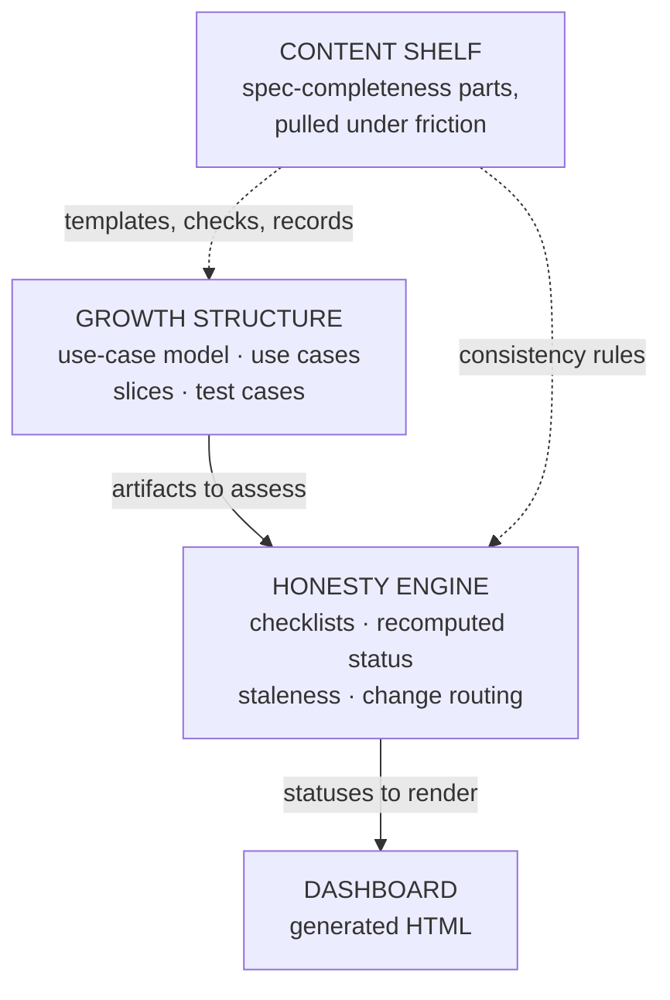
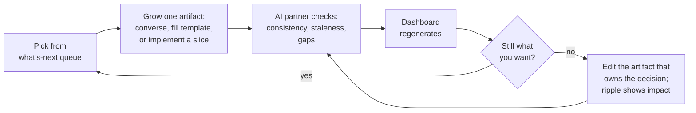

# Growing specifications you can see — the plan

> **What this is:** a plan for arriving at a usable way to grow an idea into a
> self-consistent specification — use cases, test cases, docs — with an AI
> partner doing assistance and consistency checking, and a visual dashboard
> showing what is done, what is stale, and what is next. **What it is not:**
> the method itself. Nothing here binds; every step is friction-gated and
> reversible. Where it decides, the decision is labeled and yours.

Drafted 2026-07-14 from a working conversation. Inputs: the spec-completeness
work in this repo, the agent-method glossary, and the Use-Case 3.0 guide
(Jacobson, Spence, de Mendonca, 2024).

---

## 1. What you asked for, distilled

Your ask, restated as things a finished version could be checked against:

1. **Guided authoring.** Sitting down to work, you always know what the next
   useful action is, and there is a template or a conversation shape for it.
2. **Incremental growth.** A specification starts as a sketch and grows toward
   completeness in small, valuable steps — with prototyping mixed in, not
   deferred to the end.
3. **AI partnership.** The AI partner drafts, checks consistency, computes
   status, and routes changes; you decide intent and approve content.
4. **Self-consistency you don't verify by eye.** Cross-artifact agreement is
   checked mechanically or by an AI pass, not by you re-reading everything.
5. **Comprehensive, automatable test cases** grow with the spec, not after it.
6. **Excellent user documentation** grows from the same source material.
7. **Visible maturity.** A visual surface shows each component's state, what
   is stale, what remains, and which work is yours vs. the AI partner's.
8. **Evolvable.** The method itself is expected to change as you discover what
   you actually want.

Choices you made when asked (2026-07-14):

| Question | Your call |
|---|---|
| Where does this live? | Plan first; deciding the home is an early step, not a precondition |
| Starting weight | Lightweight core; add rigor only where friction demands it |
| Authoring feel | All four — read as a progression: conversation + templates now → skills → eventually a real tool |
| First visual surface | Generated self-contained HTML dashboard |

## 2. What already exists, and what each piece contributes

Three bodies of work feed this. None of them is the answer alone.

| Source | Take from it | Leave (for now) |
|---|---|---|
| **Use-Case 3.0** (the Jacobson guide) | The growth structure: use-case model for the big picture; basic flow + alternate flows as the map; **slices** (end-to-end paths plus their test cases) as the unit of incremental delivery; lifecycle states as progress markers; "just enough, just in time" | Team ceremonies, backlog mechanics, multi-team scaling |
| **agent-method glossary** | The honesty engine: artifacts carry named **checklists**; statuses are recomputed, never asserted; edits make dependent answers **stale**; change enters through the artifact that owns the decision | Nothing to leave — but nothing beyond the vocabulary exists there yet, by design |
| **spec-completeness** (this repo) | A shelf of proven parts to pull from under friction: the use case document form, consistency rules, question/decision records, left-open rulings, hardening checks, documentation homes, the compiled single-file spec | The full stage pipeline and its drive-everything-to-complete-before-implementing shape — it contradicts "grow slowly, prototype in the middle" |

The tension worth stating plainly: spec-completeness answers *"what does a
finished spec look like so an agent can implement it in one shot"* and is
sequenced accordingly. Your ask is the opposite temperament — grow, implement
a slice, learn, grow again. Use-Case 3.0 supplies exactly that temperament,
and the guide's own words justify the smallest possible start: the first
slice can be *"a single end-to-end test case and an experimental solution with
hard coded values and no error handling."* That is your prototype, made
legitimate instead of off-the-books.

## 3. The design bet (opinion, clearly marked)

**This is my recommendation, not something the documents force:** combine the
three sources as layers with distinct jobs.

- The **growth structure** says what artifacts exist and how they grow:
  a use-case model, one document per use case, slices carved from flows, test
  cases attached to slices. This is the part you author and review.
- The **honesty engine** says how state is known: every artifact carries small
  named checklists; status is derived from recorded answers; an edit marks
  dependent answers stale. This is the part the AI partner maintains and the
  dashboard renders. It is the agent-method vocabulary applied, which also
  means this effort doubles as that method's first real trial — worth noting,
  not deciding, here.
- The **content shelf** is spec-completeness demoted from process to parts
  bin. Nothing from it is adopted up front; section 7 maps frictions to the
  part that relieves them.

**Vocabulary recommendation** (your sign-off needed, section 8): display
progress using the Use-Case 3.0 lifecycle names, implemented underneath as
named checklists. A use case shows *Goal established → Flow structure
understood → Basic flow enabled → Sufficient flows fulfilled → All flows
fulfilled*; a slice shows *Identified → Defined → Analyzed → Prepared →
Implemented → Verified*. Each displayed state is true exactly when its
checklist is satisfied — corpus words on the surface, recomputable honesty
underneath. Note the use-case states measure the *implemented system*, not
just the documents: "Basic flow enabled" means the software does it. That is
what makes prototyping a first-class move instead of a detour.

## 4. What a working session looks like (the target loop)

A session in prose: you open the dashboard, not the files. The what's-next
queue shows, say, *"UC-2 basic flow drafted but two steps have unresolved
alternates — resolve or defer"* and *"slice 1.1 test cases written, ready to
implement."* You pick one. If it's authoring, you talk it through and the AI
partner updates the documents; if it's implementing, you or the AI implements
the slice against its test cases. Either way the AI re-runs checks, statuses
recompute, staleness ripples to whatever your changes touched, and the
dashboard shows the new shape. The last question of every session is the one
the agent-method glossary says can never be automated: *is this still what I
want?* — answered by you, against yourself, not against any artifact.

## 5. Maturity you can see — the dashboard

One self-contained HTML file, regenerated from the workspace by a script, no
server. Views, each answering one question:

| View | The question it answers |
|---|---|
| **Use-case map** | What does the system do, for whom — and how far along is each use case? (actors + use cases, colored by lifecycle state) |
| **Growth board** | Which slices exist and what state is each in? (columns Identified → Verified) |
| **What's-next queue** | What is actionable right now — split into *yours* (intent decisions, approvals) and *the AI partner's* (drafting, checking, implementing) |
| **Staleness view** | What did the last edit invalidate, and how far did the ripple reach? |
| **Coverage strip** | Which slices have automated test cases passing; which use cases have their documentation grown? |

The views arrive sample-first: the use-case map alone, reviewed by you,
before the rest exist.

## 6. The plan — iterations 0 through 6

No calendar estimates; each iteration states what it is, what's involved, and
the signal that it's done. Exit signals are observations, not dates. Order of
iterations 2–4 can flex if friction says so.

### Iteration 0 — Settle the ground

Three decisions before any artifact exists, all yours (detail in section 8):
the **home** (which repo/directory the workspace and tooling live in), the
**pilot idea** (one small greenfield idea to grow for real — the numbered
ideas in this repo are candidates), and **vocabulary sign-off** (one page:
the term table this effort will use, reconciling the three sources).

*Involved:* conversation and one committed page. *Done when:* home and pilot
named; vocabulary page committed; you'd bet the vocabulary survives a month.

### Iteration 1 — Grow one spec on paper

The method with zero machinery: a workspace directory, four templates
(use-case model page, use case document, slice card with its test cases,
supporting-info page for terms and system-wide constraints), and
conversation-driven authoring — you talk, the AI partner keeps the files.
Alongside the workspace, a **friction log**: every moment the method rubbed —
missing template, unanswerable question, unclear next step — one line each.

*Involved:* template drafting (small — the use case document form on the
shelf is the starting point, lightened), then real authoring sessions on the
pilot idea. *Done when:* the pilot has a use-case model, at least one use
case with a basic flow and alternates sketched, and a first slice defined
with written test cases — and the friction log has honest entries.

### Iteration 2 — See it

The dashboard generator, smallest version: one script reading the workspace,
emitting the HTML file. Use-case map view first, alone, for your review;
remaining views only after the first one proves it renders how you think.

*Involved:* small custom script; no server, no framework commitment worth
arguing about yet. *Done when:* you consult the dashboard instead of
re-reading files to know where things stand.

### Iteration 3 — Check it

The AI partner's consistency duties become explicit. Start with roughly five
checks pulled off the shelf, deterministic where possible, an AI reading pass
where not: every name used resolves to one definition; every basic-flow step
has its alternates resolved, deferred, or marked not-applicable; every slice
has at least one test case; every displayed lifecycle state is backed by its
checklist (no claimed states); edits mark dependent checklist answers stale.
Check results feed the dashboard's staleness and what's-next views.

*Involved:* small custom checks plus wiring into the generator. *Done when:*
deliberately breaking the workspace (rename an entity, orphan a slice) lights
up the dashboard where it should.

### Iteration 4 — Implement a slice (prototyping arrives)

The first slice gets implemented and its test cases automated — possibly as
the guide's "hard coded values, no error handling" experiment. The rule that
makes prototyping safe: whatever implementing teaches you routes back as an
edit to the use case or supporting info that owns the decision — never as a
silent divergence. Documentation starts here too, smallest form: each use
case's how-to guide grows as its slices reach Verified.

*Involved:* real implementation work, test automation, and the first exercise
of change routing. *Done when:* one slice is Verified by automated tests, and
at least one upstream edit exists that implementation taught you.

### Iteration 5 — Reduce friction with skills

Only once the loop is stable by hand: Claude Code skills encoding it —
a next-step skill that reads the workspace and proposes the queue, a check
skill, authoring skills for new use cases and slices. The friction log from
iterations 1–4 is the requirements list for what the skills must smooth.

*Involved:* mostly writing down what you already do; configure-existing-tools
territory. *Done when:* a session runs start to finish through the skills
without re-explaining the method.

### Iteration 6 — The tool decision

The dashboard-plus-checks tooling will by now be a small real application
with its own users (you) and goals. Explicit decision point, not a
commitment: grow that tool as a project *specified by its own method* —
dogfood — or keep it as scripts and spend the energy on the pilot instead.

*Involved:* a decision, then whatever it implies. *Done when:* decided, with
the reason recorded.

**Standing rule across all iterations:** each one ends with the friction log
distilled and the root question asked — *is this still what you want?* The
method changes when the answer says so. That is the "help me discover what I
really want" mechanism, made routine instead of aspirational.

## 7. Growth rules — pulling rigor off the shelf

The lightweight core will leak. When it does, don't invent — pull the part
spec-completeness already worked out. Trigger on symptoms:

| When this happens | Pull this from the shelf |
|---|---|
| The same question gets re-asked and re-answered across sessions | The question record: questions live in a queue with statuses, never only in chat |
| An answer contradicts an earlier answer and nobody noticed | The decision log: decisions recorded with rationale and alternatives, cited by later edits |
| The AI (or you) silently picks something that was actually open | Left-open rulings: every open choice is either decided or explicitly left open, on record, with what the implementer must document |
| Spec text and implemented behavior drift apart | The definition-of-done idea: acceptance criteria per use case, assembled into a checklist an implementation must pass |
| Two parts of the spec say conflicting things and eyeballs missed it | More consistency rules from the shelf's set of ten (conflict detection, layer purity, covered duplication) |
| A slice hand-off to an implementing agent fails on missing context | The compiled single-file spec: one generated document carrying everything the implementer needs |
| Docs go stale or read as an afterthought | The documentation homes: how-to from use cases, tutorial from the first-success goal, reference from supporting info, explanation from the decision log |

The reverse rule also holds, from the agent-method glossary: sometimes the
honest fix is *deleting* upstream structure — a checklist item that never
catches anything, a template section always left empty. Removal is a logged,
reviewable event, same as addition.

## 8. Decisions that are yours

| Decision | Options on the table | My lean (opinion) | Rewind cost if wrong |
|---|---|---|---|
| **Home** | New top-level directory here; own repo; under agent-method | Here first — moving a directory later is cheap; the agent-method question below matters more than location | Low — `git mv` or a repo transplant |
| **agent-method relationship** | This effort *is* that method's first trial (it exercises checklists/staleness for real) vs. independent-with-lessons-flowing-back | Name it a trial informally; make it official only in an agent-method session, jointly, per that repo's own rules | Low — it's a label until promoted there |
| **Pilot idea** | The numbered ideas in this repo, or the pilot you already have in mind for agent-method | Yours alone to name — reserved to the source-of-intent role | — |
| **Vocabulary** | Use-Case 3.0 state names over checklists (recommended in section 3) vs. the shelf's L0–L3 levels vs. fresh names | The recommendation as written — corpus words, honest mechanics | Medium — renames cost re-reading everything once |
| **Dashboard tech** | Plain generated HTML (recommended) vs. app framework now | Plain HTML until iteration 6 forces the question | Low — the generator's input format is the real interface |

## 9. What I don't know (honest disclosure)

- **The candidate requirements in agent-method are quarantined and I have not
  read them.** If this plan contradicts something parked there, that surfaces
  when you do joint markup in that repo — flag it then.
- **The shelf is unproven in battle.** spec-completeness has a pressure-test
  protocol but, as far as this repo shows, it has never been run. Parts
  pulled from it may need adjustment on first contact.
- **Use-Case 3.0 assumes a team.** The single-human-plus-AI-partner
  adaptation — you as every stakeholder, the AI as co-writer and checker — is
  our invention, not the guide's. The guide's conversation-triggering
  principle needs a deliberate substitute: the AI partner asking you the
  questions a co-writer would (the shelf's ignorant-reader probes are one
  ready-made form of this, on the shelf if wanted).
- **The known failure mode is over-building** — it is why agent-method
  restarted. This plan's defense is structural (friction-gated growth, the
  standing deletion rule, sample-first tooling), but the defense is only as
  good as the discipline of writing the friction log honestly.
